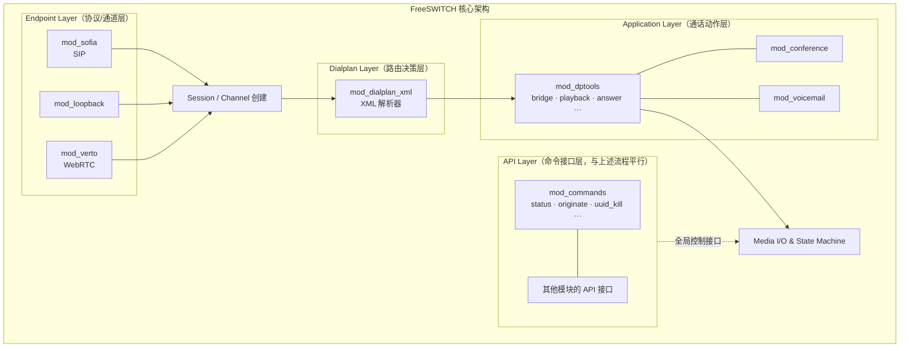

# FreeSWITCH 四类核心扩展点

## Endpoint · Application · API · Dialplan —— 定位区别、选型指南与隐性陷阱

---

## 1. 概述：模块化架构与扩展点体系

FreeSWITCH 采用高度模块化的架构，通过 `switch_loadable_module_interface_t` 统一管理所有可加载模块。核心提供四类最常用的扩展接口（Interface），分别对应通话生命周期的不同阶段与不同的调用上下文：



**核心设计理念**：Endpoint 负责「如何建立通话」（协议适配），Dialplan 负责「接下来做什么」（路由决策），Application 负责「具体怎么做」（通话动作执行），API 负责「对外提供命令」（全局控制接口）。

**重要前提**：这四类接口并非互斥。同一个模块可以同时注册多种接口。例如 `mod_lcr` 同时提供了 Application、Endpoint 和 Dialplan 三种接口。

---

## 2. 四类扩展点详细辨析

### 2.1 Endpoint（端点 / 协议适配层）

#### 定义与定位

Endpoint 是 FreeSWITCH 与外部通信协议或设备的适配层，实现 `switch_endpoint_interface_t` 接口。它是 FreeSWITCH 与外部世界的「网关」，每个 Endpoint 对应一种通信协议或通道类型。核心并不需要理解 SIP——它只理解通用的 Endpoint/Channel 接口；`mod_sofia` 在该接口与 SIP/Sofia-SIP 协议栈之间做翻译。这种分离正是 FreeSWITCH 能够支持 SIP 以外的多种 Endpoint 的根本原因。

Endpoint 的核心职责包括：（1）将外部协议转换为 FreeSWITCH 内部的 Session/Channel 模型；（2）处理入站呼叫（创建 A-leg）和出站呼叫（创建 B-leg）；（3）实现音视频帧的 `read_frame` / `write_frame`；（4）处理协议级别的信令状态转换。

#### 运行上下文

Endpoint **拥有** Session。它通过 `switch_core_session_request()` 创建 `switch_core_session_t`，并在 Session 线程（`switch_core_session_thread()`）加上可选的协议处理线程中执行。每个活跃 Session 通常对应一个线程（或通过线程池复用）。Endpoint 持有 Session 读写锁，协议层可能有独立锁（如 Sofia-SIP 的 nua 锁）。

**Channel 状态机生命周期**：

```
CS_NEW → CS_INIT → CS_ROUTING → CS_EXECUTE → [CS_EXCHANGE_MEDIA / CS_PARK / ...]
    → CS_HANGUP → CS_REPORTING → CS_DESTROY
```

FreeSWITCH 核心拥有并驱动状态机，Endpoint 通过回调接收状态转换通知。

#### 典型接口 / 回调函数

Endpoint 需要提供两张回调表：

**I/O 操作表** (`switch_io_routines_t`)：

| 回调 | 职责 |
|------|------|
| `outgoing_channel()` | 出站呼叫时创建 B-leg Session，初始化协议连接 |
| `read_frame()` | 从协议/设备读取音视频帧给核心 |
| `write_frame()` | 将核心的音视频帧发送给协议/设备 |
| `kill_channel()` | 通话挂断时清理协议连接、释放资源 |
| `send_dtmf()` | 向远端发送 DTMF 信号 |
| `receive_message()` | 处理核心发来的 answer、progress、hold 等信令消息 |

**状态处理表** (`switch_state_handler_table_t`)：

| 回调 | 触发时机 |
|------|---------|
| `on_init` | 状态转换到 `CS_INIT`，初始化 Session 私有数据 |
| `on_routing` | 状态转换到 `CS_ROUTING`，触发 Dialplan 查询 |
| `on_execute` | 状态转换到 `CS_EXECUTE`，执行 Dialplan 中的 Applications |
| `on_hangup` | 状态转换到 `CS_HANGUP`，清理资源 |
| `on_destroy` | 状态转换到 `CS_DESTROY`，最终资源释放 |

#### 典型代表模块

| 模块 | 协议 | 说明 |
|------|------|------|
| **mod_sofia** | SIP/SIPS | 生产级 SIP 实现，基于 Sofia-SIP 协议栈 |
| **mod_loopback** | 内部环回 | 将呼叫重新路由回 Dialplan，用于内部转接 |
| **mod_verto** | WebRTC | JSON-RPC + WebSocket 传输的 WebRTC 端点 |
| **mod_gsmopen** | GSM | 通过 GSM 调制解调器收发呼叫 |
| **mod_skinny** | Cisco Skinny | Cisco IP 电话协议支持 |

#### 适用场景

✅ 需要支持新的通信协议（如自定义 TCP/UDP 协议、H.323）；需要与特定硬件设备集成；需要自定义媒体传输方式；一个物理连接需要承载多个逻辑通道。

❌ 仅在现有协议上添加功能 → 用 Application；仅改变路由逻辑 → 用 Dialplan；仅提供命令接口 → 用 API。

---

### 2.2 Application（应用 / 通话动作层）

#### 定义与定位

Application 是在**现有 Session 上下文中**执行的可重用功能单元，实现 `switch_application_interface_t` 接口。它总是由 Dialplan 引擎调用（通过 `<action application="xxx" data="..."/>`），在当前 Session 的线程中运行，可以完整访问当前 Channel 的所有资源。

Application 的职责是实现具体的通话动作：桥接、播放、录音、会议、语音邮件等。它不创建 Session，而是**使用**传入的 Session。

#### 运行上下文

Application 运行在 **Session 线程**中（与 Endpoint 的 `on_execute` 回调同一线程）。它接收 `switch_core_session_t *` 参数，隐式持有 Session 锁。生命周期从 Application 开始执行到返回（或被中断）。Application 内部可以创建工作线程，但主执行体是同步的。

**关键区别**：Application 的执行函数签名是 `void (*)(switch_core_session_t *session, const char *data)`，它**必须**有一个 Session。

执行流程：Dialplan 条件匹配 → 引擎调用 `app_function(session, args)` → Application 执行（可读写 Channel 变量、播放/录制媒体、桥接等） → Application 返回 → Dialplan 继续下一个 action。

#### 典型接口 / 回调函数

```c
/* 注册宏 */
SWITCH_ADD_APP(app_interface, "bridge", "Bridge the call",
    "Bridges the current call to another endpoint",
    bridge_function, "<dialstring>", SAF_NONE);

/* 执行函数签名 */
static void bridge_function(switch_core_session_t *session, const char *data) {
    switch_channel_t *channel = switch_core_session_get_channel(session);
    /* 通过 session 访问 channel，操作媒体、变量、状态 */
}
```

#### 典型代表模块

| 模块 | 提供的 Applications | 用途 |
|------|-------------------|------|
| **mod_dptools** | answer, bridge, playback, record, set, transfer, hangup, sleep, park | 核心通话操作工具箱 |
| **mod_conference** | conference | 多方会议 |
| **mod_voicemail** | voicemail | 语音邮件 |
| **mod_fifo** | fifo | 呼叫排队 |
| **mod_dptools** | execute_on_answer, bind_meta_app | 事件驱动的应用触发 |

#### 适用场景

✅ 需要在通话进行中执行操作（播放语音、录音、DTMF 收集、桥接）；需要访问当前 Channel 的变量和媒体流；需要实现可复用的通话业务逻辑。

❌ 需要一个不依赖通话的全局命令 → 用 API；需要定义新的通信协议 → 用 Endpoint。

---

### 2.3 API（命令接口层）

#### 定义与定位

API 是 FreeSWITCH 对外提供的命令接口，实现 `switch_api_interface_t`。它可以从 `fs_cli`、Event Socket Library (ESL)、脚本、或其他模块中调用。**API 不一定需要 Session 上下文**——它是一个全局命令通道。

API 命令分为两种调用模式：`api`（同步/阻塞）和 `bgapi`（异步/非阻塞，在后台线程执行，通过 `BACKGROUND_JOB` 事件返回结果）。

#### 运行上下文

API 函数运行在**调用者的线程**中（`fs_cli` 线程、ESL 线程等），**不隐式持有任何 Session**。如果 API 需要操作某个通话，必须通过 UUID 显式定位 Session（`switch_core_session_locate(uuid)`）。

**执行函数签名**：`switch_status_t (*)(const char *cmd, switch_core_session_t *session, switch_stream_handle_t *stream)`。注意：虽然签名中有 `session` 参数，但对于大多数 API 调用这个参数为 NULL。`stream` 用于写回命令输出。

```c
SWITCH_ADD_API(api_interface, "status", "Show system status",
    status_function, "");

static switch_status_t status_function(const char *cmd,
    switch_core_session_t *session, switch_stream_handle_t *stream) {
    stream->write_function(stream, "UP %d year(s)...\n", uptime);
    return SWITCH_STATUS_SUCCESS;
}
```

#### 典型代表模块

| 模块 | 提供的 API 命令 | 用途 |
|------|----------------|------|
| **mod_commands** | status, version, originate, uuid_kill, uuid_bridge, show channels, hupall | 核心系统管理命令 |
| **mod_sofia** | sofia status, sofia profile xxx restart | SIP Profile 管理 |
| **mod_dptools** | strepoch, strftime, eval | 工具类命令 |

#### 适用场景

✅ 提供不依赖当前通话的全局管理命令（查询状态、发起呼叫、杀死通道）；为外部系统（ESL 客户端、Web 管理界面）提供控制接口；批量操作或系统运维命令。

❌ 需要直接操作当前通话的媒体流 → 用 Application；需要实现新协议 → 用 Endpoint。

---

### 2.4 Dialplan（路由决策层）

#### 定义与定位

Dialplan 是路由规则的**解析引擎**，实现 `switch_dialplan_interface_t`。它决定一个入站呼叫「接下来应该执行哪些 Application」。Dialplan 本身不执行通话动作，只负责**匹配条件、生成执行计划**（一系列 Application 调用的有序列表）。

最常用的是 `mod_dialplan_xml`，它解析 XML 格式的路由规则（context → extension → condition → action）。此外还有 `mod_dialplan_asterisk`（兼容 Asterisk 格式）和自定义 Dialplan 模块。

#### 运行上下文

Dialplan 在 Session 进入 `CS_ROUTING` 状态时被调用，运行在 Session 线程中。它接收 Session 信息（如 caller_id、destination_number 等 Channel 变量）用于条件匹配，输出一个 Application 执行列表。Dialplan 的执行是**短暂且同步的**——匹配完条件后立即返回，不应做任何耗时操作。

```xml
<context name="default">
  <extension name="example">
    <condition field="destination_number" expression="^1001$">
      <action application="answer"/>
      <action application="playback" data="ivr/ivr-welcome.wav"/>
      <action application="bridge" data="user/1001@default"/>
    </condition>
  </extension>
</context>
```

#### 典型代表模块

| 模块 | 格式 | 说明 |
|------|------|------|
| **mod_dialplan_xml** | XML | 标准 XML 格式，支持正则匹配，可通过 `reloadxml` 热加载 |
| **mod_dialplan_asterisk** | extensions.conf | 兼容 Asterisk 拨号计划格式 |
| 自定义 Dialplan | C 模块 | 可实现动态路由（如从数据库查询） |

#### 适用场景

✅ 定义呼叫路由规则（基于号码、时间、来源等条件）；编排现有 Application 的执行顺序；实现简单的 IVR 菜单逻辑；需要热加载的路由变更。

❌ 需要实现新的通话功能 → 写 Application；需要复杂的状态管理或算法 → 写 Application 或脚本；需要系统管理命令 → 用 API。

---

## 3. 对比总结

| 维度 | Endpoint | Application | API | Dialplan |
|------|----------|-------------|-----|----------|
| **是否需要 Session** | ✅ 创建并拥有 | ✅ 使用（不创建） | ❌ 通常无 Session | ✅ 在 Session 上下文中被调用 |
| **线程模型** | Session 线程 + 协议线程 | Session 线程（同步） | 调用者线程（fs_cli/ESL 线程） | Session 线程（短暂执行） |
| **能否直接操作媒体** | ✅ 完全控制（read/write frame） | ✅ 通过 Session 操作（playback/record/media bug） | ❌ 需通过 UUID 间接操作 | ❌ 不操作媒体 |
| **生命周期** | 完整 Channel 状态机（CS_NEW → CS_DESTROY） | 从执行到返回 | 从调用到返回 | 从匹配到返回（极短） |
| **调用方式** | 被核心状态机驱动 | 被 Dialplan 或 `execute` 调用 | `fs_cli` / ESL / `api` / `bgapi` | 被核心在 CS_ROUTING 阶段调用 |
| **注册宏** | `SWITCH_ENDPOINT_INTERFACE` | `SWITCH_ADD_APP` | `SWITCH_ADD_API` | `SWITCH_DIALPLAN_INTERFACE` |
| **典型模块** | mod_sofia, mod_loopback | mod_dptools, mod_conference | mod_commands | mod_dialplan_xml |
| **开发复杂度** | ★★★★★（最复杂） | ★★★☆☆ | ★★☆☆☆ | ★★☆☆☆（XML）/ ★★★☆☆（C 模块） |

---

## 4. 选型指南

### 什么时候该写 Endpoint？

**仅在需要引入全新的通信协议或通道类型时。** 这是四类扩展中最复杂的，需要实现完整的状态机回调、媒体 I/O、信令处理。典型场景：对接非 SIP 的通信协议（自定义 TCP/UDP、H.323）、集成特定硬件设备（GSM 调制解调器、模拟电话线）、实现特殊的媒体传输通道。

**判断标准**：如果你的需求涉及「在 FreeSWITCH 和外部世界之间建立一种新的通信方式」，才需要 Endpoint。

### 什么时候该写 Application？

**需要在通话过程中执行新的可复用操作时。** 如果现有 Application（bridge/playback/record 等）无法满足需求，且你的功能需要访问当前 Session 的媒体流或 Channel 变量，就应该写 Application。典型场景：自定义 IVR 逻辑、语音识别集成、特殊录音处理、实时音频分析。

**判断标准**：如果功能需要「在一个活跃通话的上下文中做某件事」，用 Application。

### 什么时候该用 API？

**需要提供不依赖于特定通话的命令接口时。** API 适合系统管理、状态查询、批量操作、外部系统集成。典型场景：查询系统状态、主动发起呼叫（originate）、通过 UUID 操控已有通道、为 Web 管理界面提供控制端点。

**判断标准**：如果功能是「对 FreeSWITCH 全局的操作」或「给外部系统提供一个命令」，用 API。

### 什么时候只写 Dialplan？

**仅需编排现有 Application 的执行顺序时。** Dialplan（尤其是 XML Dialplan）适合路由决策、条件分支、编排现有功能。对于中等复杂度的逻辑，可以在 Dialplan 中调用 Lua/JavaScript 脚本，避免写 C 模块。

**判断标准**：如果需求只是「在什么条件下执行什么现有操作」，只写 Dialplan 即可。

---

## 5. 常见选型错误与隐性问题

### 5.1 在 API 回调中操作 Session → 死锁

**错误模式**：在 API 函数中通过 `switch_core_session_locate(uuid)` 获取 Session 后执行耗时操作，或在持有模块全局锁的同时获取 Session 锁。

**症状**：FreeSWITCH 进程挂起，`fs_cli` 无响应，所有新呼叫无法建立。`gdb` 附加后可看到两个线程互相等待对方持有的锁。

**原因**：`switch_core_session_locate()` 会自动获取 Session 的读锁。如果调用者已持有模块全局锁（`globals.mutex`），而 Session 线程正在等待该全局锁，就会形成 **ABBA 死锁**：

```
Thread A (API): globals.mutex → session_lock（等待）
Thread B (Session): session_lock → globals.mutex（等待）
```

FreeSWITCH 官方 issue 记录了 `mod_callcenter` 中一个经典案例：一个线程持有 `cc.mutex` 等待 `loadable_modules.mutex`，另一个线程反向等待。

**规避建议**：

- 在持有模块全局锁时，仅复制需要的数据（如 UUID），然后**释放全局锁后**再调用 `switch_core_session_locate()`
- `switch_core_session_locate()` 获得的 Session 必须尽快通过 `switch_core_session_rwunlock()` 释放
- 建立并遵守统一的锁获取顺序
- 绝不在持有任何锁的情况下调用可能获取其他锁的 FreeSWITCH API

### 5.2 在 Application 中执行阻塞操作 → Session 线程饥饿

**错误模式**：在 Application 的执行函数中进行阻塞 I/O：HTTP 请求、DNS 查询、慢速数据库查询、NFS 文件访问、无超时的 socket 操作。

**症状**：通话挂起、音频中断（单向或双向无声）、无法正常挂机、Session 无法释放导致「伪内存泄漏」。大量通话时系统响应严重下降。

**原因**：Application 在 Session 线程中**同步执行**。阻塞操作会直接阻塞该 Session 的整个状态机，包括：媒体帧的定时读写（导致音频中断）、挂机信号的处理（导致 Session 无法释放）、`switch_core_session_alloc()` 分配的内存在 Session 存活期间不会释放（看起来像内存泄漏）。

**规避建议**：

- 所有 I/O 操作设置合理超时
- 耗时操作（HTTP/DB）异步化：用独立工作线程 + 队列，Application 只负责入队和等待结果（带超时）
- 使用 `bgapi` 替代 `api` 执行可能耗时的命令
- 考虑用事件驱动模型（`switch_event_fire()` + 事件监听线程）替代同步等待

### 5.3 用 Dialplan 代替 Application → 功能受限与维护困难

**错误模式**：将复杂业务逻辑全部堆砌在 XML Dialplan 的条件/动作中，而不是提取为独立的 Application 或脚本。

**症状**：Dialplan XML 文件膨胀到数千行；路由匹配变慢（正则表达式求值开销随规则数线性增长）；逻辑变更需要频繁 `reloadxml`；难以实现循环、复杂状态管理、错误处理；无法复用逻辑单元。

**原因**：Dialplan 的设计定位是**路由决策**（匹配条件 → 生成 Application 执行列表），不是通用编程环境。它缺少循环控制、异常处理、复杂数据结构等编程原语。

**规避建议**：

- Dialplan 只做路由分发（「这个号码走哪个处理流程」），具体逻辑交给 Application
- 中等复杂度逻辑用 Lua/JavaScript 脚本（通过 `<action application="lua" data="myscript.lua"/>` 调用）
- 高性能/底层需求才写 C Application 模块

### 5.4 Endpoint 与 Application 职责混淆 → 内存泄漏与媒体异常

**错误模式一：在 Application 中试图管理 Channel 生命周期。** 例如在 Application 中直接调用 `switch_channel_set_state()` 跳到 `CS_DESTROY`，或者不当操作 Session 的状态机。

**症状**：Session 资源未正确释放（内存泄漏）、Channel 状态不一致、其他 Application 收到意外的状态回调。

**错误模式二：在 Endpoint 回调中做 Application 该做的事。** 例如在 `on_init` 或 `on_routing` 回调中执行复杂业务逻辑。

**症状**：状态回调执行时间过长，导致 Session 状态机推进延迟；如果在回调中阻塞，会影响后续 Application 的执行；可能导致媒体协商超时。

**错误模式三：不当的跨 Session 媒体操作。** 在一个 Session 的 Application 中直接操作另一个 Session 的媒体帧（未通过正确的 Session 定位和锁定机制）。

**症状**：音频混乱、段错误（segfault）、媒体帧竞态条件（race condition）。FreeSWITCH 的媒体帧操作（`read_frame`/`write_frame`）有自己的 codec 锁，不正确的锁顺序会导致死锁。

**规避建议**：

- Endpoint 只负责协议适配和媒体 I/O，业务逻辑交给 Application
- 不要在 Application 中直接操控 Channel 状态机（应通过 `switch_channel_hangup()` 等高级 API）
- 跨 Session 操作必须通过 `switch_core_session_locate()` + `switch_core_session_rwunlock()` 正确管理生命周期
- 媒体帧操作使用 Media Bug 机制（`switch_core_media_bug_add()`），不要直接在 Application 中拦截帧

### 5.5 从 API 线程操作 Session 但不释放锁 → 内存泄漏

**错误模式**：在 API 函数中通过 `switch_core_session_locate()` 获取 Session 后，因为异常路径（提前 return、goto 跳过解锁）未调用 `switch_core_session_rwunlock()`。

**症状**：Session 引用计数永不归零，即使通话挂断后 Session 及其内存池也不会被回收。长期运行后 FreeSWITCH 内存持续增长。

**规避建议**：

- 对 `switch_core_session_locate()` 的每个调用路径都确保有对应的 `switch_core_session_rwunlock()`
- 使用 RAII 模式或统一的错误处理跳转（`goto done;` + cleanup 段）
- 代码审查时重点关注 Session 锁的获取/释放配对

### 5.6 Media Bug 回调中的阻塞 → 全局音频质量劣化

**错误模式**：通过 `switch_core_media_bug_add()` 注册 Media Bug 后，在回调中做耗时操作（写文件、HTTP 上传、复杂 DSP 运算）。

**症状**：该 Channel 及与其桥接的 Channel 出现音频卡顿、丢帧；严重时导致 RTP 超时挂断。

**原因**：Media Bug 回调在媒体处理路径中同步执行。阻塞会直接影响帧的定时处理。

**规避建议**：

- Media Bug 回调中只做数据复制（`memcpy` 帧到缓冲区）
- 实际处理（编码、上传、分析）由独立工作线程完成
- 使用有界队列（bounded queue）解耦生产者（Media Bug）和消费者（工作线程）

---

## 6. 最佳实践

**锁的纪律**：建立并严格遵守全局锁顺序文档。绝不在持有一个锁的情况下获取另一个不确定顺序的锁。`switch_core_session_locate()` 之后尽快释放，不要跨越任何可能阻塞的操作。

**Session 线程的神圣性**：Session 线程是通话生命力的「心跳」。任何在 Session 线程上的阻塞都会直接影响该通话的媒体质量和信令响应。所有可能耗时的操作必须异步化。

**内存管理**：优先使用 `switch_core_session_alloc()`（Session 池内存，随 Session 释放），但要意识到 Session 存活期间这些内存不会释放。长期存活的数据使用 `switch_core_alloc()` 或模块级内存池。

**渐进式开发**：Dialplan → Lua/JS 脚本 → C Application → C Endpoint，按需求复杂度递进。不到万不得已不写 Endpoint。

**日志与调试**：善用 `switch_log_printf()` 在关键路径打日志。对于死锁排查，通过 `gdb -p <pid>` 附加后执行 `thread apply all bt full` 查看所有线程的调用栈。观察两个线程是否互相等待对方持有的锁。

**`bgapi` 优于 `api`**：从 ESL 发起可能耗时的命令（如 `originate`）时，优先使用 `bgapi`，避免阻塞 ESL 连接。通过订阅 `BACKGROUND_JOB` 事件异步获取结果。

**Media Bug 最佳实践**：回调中只做最轻量的工作（复制数据）；注意 `bypass_media` 模式下 Media Bug 不可用（RTP 直通不经过 FreeSWITCH）；early-media 阶段的状态转换可能触发 Bug 的意外行为，需特别测试。

---

## 参考来源

- FreeSWITCH Official Documentation (SignalWire): https://developer.signalwire.com/freeswitch/
- FreeSWITCH Source Code (GitHub): https://github.com/signalwire/freeswitch
- FreeSWITCH Module Reference: https://developer.signalwire.com/freeswitch/module-reference/
- FreeSWITCH Dialplan Tools: https://developer.signalwire.com/freeswitch/dialplan/dptools/
- FreeSWITCH Event Socket Library: https://developer.signalwire.com/freeswitch/integration/event-socket/
- FreeSWITCH Creating New Modules Guide: https://developer.signalwire.com/freeswitch/FreeSWITCH-Explained/Community/Contributing-Code/Creating-New-Modules/
- FreeSWITCH GitHub Issues (deadlock & media bugs): https://github.com/signalwire/freeswitch/issues/
