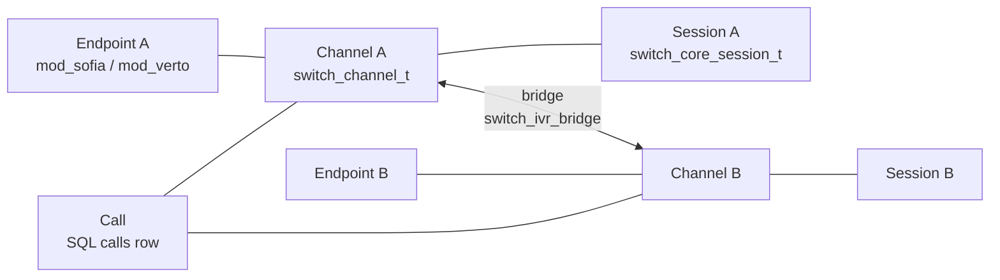
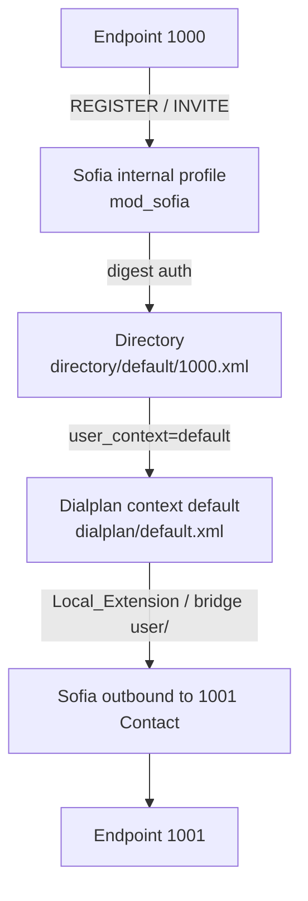
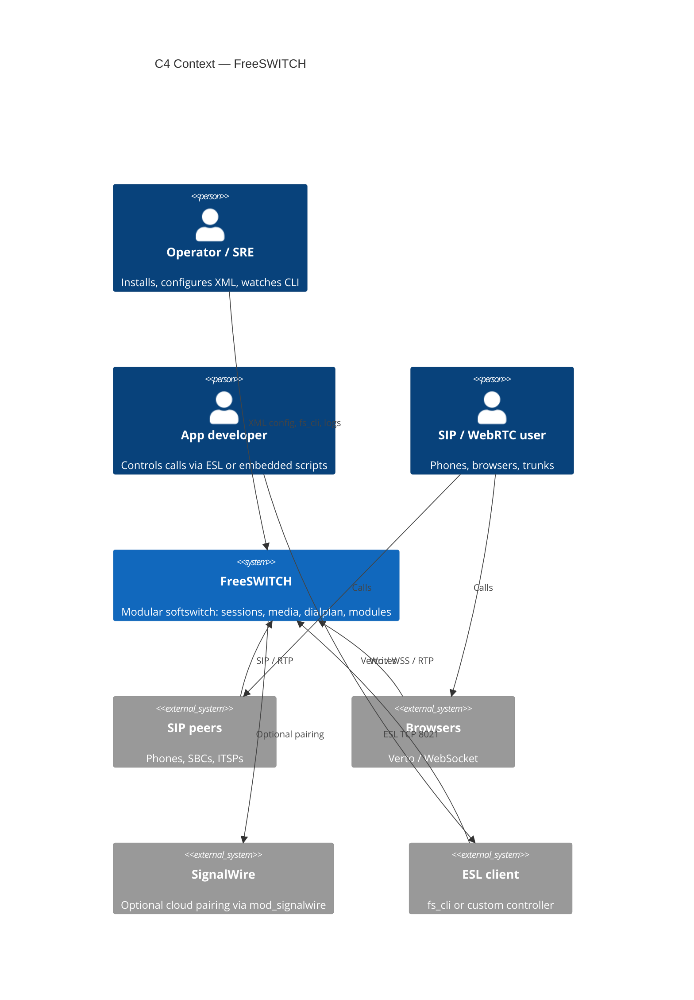

# 00. Project Overview

<!-- maintained-by: human+ai -->

FreeSWITCH is a modular softswitch: a software-defined telecom stack that replaces proprietary PBX and class-5 switching hardware with a process that runs on commodity servers, from a Raspberry Pi to a multi-core host. This repository is the C core, loadable modules, XML configuration profiles, packaging, and Event Socket tooling for that stack. Version in this tree is **1.11.3-dev** (`configure.ac`). License is **MPL 1.1**. SignalWire is the primary sponsor; `mod_signalwire` in this tree pairs a local switch with SignalWire cloud services.

## Purpose

- Switch, bridge, and transcode real-time voice, video, and messaging sessions.
- Expose a loadable-module API so SIP, WebRTC, codecs, dialplans, languages, and CDR backends can be added without forking the core.
- Provide a working default PBX configuration (`conf/vanilla`) so operators can start testing immediately.
- Offer an out-of-process control plane (Event Socket / ESL) so applications can originate, hang up, and subscribe to events without embedding in the media process.

This PKB documents **this source tree**. Operator configuration — XML, directory, SIP profiles, dialplan, codecs, applications, WebRTC, ESL — lives in the [FreeSWITCH Users Manual](https://developer.signalwire.com/freeswitch/). Every parameter table there is verified against FreeSWITCH source and the shipped vanilla config. Older wiki pages remain on [FreeSWITCH Explained](https://developer.signalwire.com/freeswitch/FreeSWITCH-Explained/) and [Confluence](https://freeswitch.org/confluence/).

The Users Manual applies to both **Open Source FreeSWITCH** (this tree and [release builds](https://files.freeswitch.org/releases/freeswitch/)) and **FreeSWITCH Enterprise** (commercially supported SignalWire builds). Hosted SignalWire cloud is still a separate product.

## Scope Boundaries

| In scope | Out of scope |
|----------|--------------|
| Core switch process (`src/switch.c`, `src/switch_core.c`) and session/media/event libraries | SignalWire hosted cloud, SMS, and serverless products (separate repos and services) |
| Loadable modules under `src/mod/` (endpoints, codecs, applications, event handlers, languages, XML interfaces) | Prompt/sound packages (`freeswitch-sounds-*` specs and the [sounds release repo](https://github.com/freeswitch/freeswitch-sounds)) |
| XML config profiles (`conf/vanilla`, `conf/sbc`, `conf/minimal`, …) and module autoload list (`build/modules.conf.in`) | Third-party [Sofia-SIP](https://github.com/freeswitch/sofia-sip) / SpanDSP / libks sources ([Tech Stack](../1.architecture/02-tech-stack.md#sofia-sip-library)) |
| ESL library and `fs_cli` (`libs/esl/`) | A hosted multi-tenant SaaS control plane |
| Autotools/Windows/Docker/Debian packaging in this repo | Duplicating Users Manual parameter tables — link out instead |

## Key Users and Use Cases

- **PBX / CCaaS operator**: run vanilla or a custom XML profile as an IP-PBX, conference, voicemail, or call-center node; register SIP phones; route DIDs.
- **SBC / interconnect engineer**: use the `conf/sbc` profile and Sofia SIP (`mod_sofia`) to border-control SIP trunks and media.
- **Application developer**: control calls from Lua/Python/JavaScript modules or from an external process over ESL (`mod_event_socket` on TCP 8021, `libs/esl/fs_cli.c`).
- **WebRTC / HTML5 developer**: terminate browser sessions through Verto (`mod_verto`, endpoint name `verto.rtc`).
- **Module developer**: implement `SWITCH_MODULE_LOAD_FUNCTION` against `src/include/switch.h`, register named interface tables, and drop a `.so` into the modules directory ([Architecture](../1.architecture/01-architecture.md#loadable-module-contract)).
- **Packager / SRE**: build from source (`bootstrap.sh` + Autotools), Debian packages (`debian/`, `scripts/packaging`), Windows (`w32/`, `Freeswitch.2017.sln`), or Docker (`docker/`).

## FS core concepts

Operator terms come from [Users Manual Chapter 1](https://developer.signalwire.com/freeswitch/foundations/introduction). This page maps them onto **this clone**. C types and the session state machine: [Architecture](../1.architecture/01-architecture.md). The `switch_*` lifetime model (pools, FSPR, frames): [C Runtime Framework](../1.architecture/06-c-runtime.md). The same 1000→1001 path with core symbols: [Workflows](../1.architecture/05-workflows.md).

Behavior is determined by XML, not by editing the C core. Vanilla (`conf/vanilla/`) is a working demo PBX so you can test immediately; it is not a production security baseline ([FAQ](../7.appendix/02-faq.md)).

### Endpoints, channels, and calls

A protocol endpoint is not a call. A channel is one **leg**. A call is one or more legs associated together. A session is the runtime object that holds one channel plus the application running on it.

1. **Endpoint** — A protocol interface that originates or receives calls. Each endpoint is a module, for example Sofia for SIP or Verto for WebRTC.

   端点是一个协议接口，用来发起或接收呼叫。每个端点就是一个模块，例如 Sofia（SIP）或 Verto（WebRTC）。

   In this tree: loadable modules under `src/mod/endpoints/` (`mod_sofia`, `mod_verto`, …).

2. **Channel** — One leg of communication between FreeSWITCH and a single endpoint. A channel carries call state, media, and a set of channel variables.

   通道是 FS 与一个单独 Endpoint 之间的一条腿（call leg）。一个通道承载 call state、media 和一组通道变量。

   In this tree: `switch_channel_t` (`src/switch_channel.c`).

3. **Call** — One or more channels associated together. A typical call between two parties is two channels joined by a bridge.

   一个或多个通道关联在一起形成一个 Call。双方之间的典型 Call 是由 bridge 连起来的两个通道。

   In this tree: core SQL `calls` (`caller_uuid` / `callee_uuid` in `src/switch_core_sqldb.c`). A call is **not** one session.

4. **Bridge** — The association that joins two channels so their media flows between them.

   桥接是两个通道之间的联系，用来搭起它们之间的媒体通路。

   In this tree: dialplan app `bridge`; core `switch_ivr_bridge`.

5. **Session** — The runtime container for a channel and the application state running on it.

   会话是一个运行时容器，包含一个 Channel 以及在上面运行的应用状态。

   In this tree: `switch_core_session_t` (`src/switch_core_session.c`). Lifetime/pool: [C Runtime](../1.architecture/06-c-runtime.md).

| Term | Meaning | In this tree |
|------|---------|--------------|
| Endpoint | Protocol interface that originates or receives calls | `src/mod/endpoints/` (`mod_sofia` SIP, `mod_verto` WebRTC, …) |
| Channel | One leg; call state, media, channel variables | `switch_channel_t` |
| Session | Runtime container for a channel plus the application on it | `switch_core_session_t` |
| Call | One or more associated channels | Core SQL `calls` |
| Bridge | Joins two channels so media can flow | `bridge` app / `switch_ivr_bridge` |

Channel variables are `${name}` at **call time**. Preprocessor variables are `$${name}` and expand **once** while assembling XML (`conf/vanilla/vars.xml`). Mixing them is a common config bug ([Chapter 3](https://developer.signalwire.com/freeswitch/configuration/xml), [FAQ](../7.appendix/02-faq.md)).

### Three configuration domains

FreeSWITCH separates configuration into three domains. Keeping them distinct is the key to understanding the system. They are **not** one XML blob.

1. **Directory** — Who is allowed to connect, and what are their properties?

   目录：谁被允许连接，他们有哪些属性。

2. **Dialplan** — When a call arrives, where does it go and what happens to it?

   拨号计划：当一个呼叫进来，它要从哪里走，会发生哪些事。

3. **Configuration** — How does each module and the core behave?

   配置：核心和每个模块如何行为。

This tree stores them under `conf/vanilla/` (the configuration root is the directory that contains `freeswitch.xml`):

| Domain | Question it answers | Vanilla path | Hunt / load |
|--------|---------------------|--------------|-------------|
| Directory | Who may connect, and with what properties? | `conf/vanilla/directory/` | SIP digest, `user_context`, `user/` bridge lookup |
| Dialplan | When a call arrives, where does it go and what happens? | `conf/vanilla/dialplan/` | `mod_dialplan_xml` in `CS_ROUTING` |
| Configuration | How do the core and each module behave? | `conf/vanilla/autoload_configs/` | Module `.conf.xml`; SIP profiles live beside this in `sip_profiles/` |

A directory user authenticates to a Sofia profile. After digest auth, that user’s `user_context` selects the dialplan context. Vanilla internal profile `context` is `public` (`conf/vanilla/sip_profiles/internal.xml`) and applies to **unauthenticated** inbound only; users 1000–1019 have `user_context=default` (`conf/vanilla/directory/default/1000.xml`). Operator detail: [Chapter 6](https://developer.signalwire.com/freeswitch/users-and-endpoints/user-directory), [Chapter 7](https://developer.signalwire.com/freeswitch/users-and-endpoints/sip-profiles), [Chapter 12](https://developer.signalwire.com/freeswitch/dialplan/xml).

### Anatomy of a vanilla 1000→1001 call

1. **REGISTER.** 1000 registers to the internal profile (`conf/vanilla/sip_profiles/internal.xml`). With `auth-calls` enabled, Sofia challenges and checks `conf/vanilla/directory/default/1000.xml`. On success it stores the Contact binding and loads user variables, including `user_context=default` and caller-ID fields.
2. **INVITE.** 1000 sends INVITE for `1001`. After the same digest check, routing uses `user_context` (`default`), not the profile’s `context=public`.
3. **Dialplan match.** `mod_dialplan_xml` evaluates `conf/vanilla/dialplan/default.xml`. `Local_Extension` matches `^(10[01][0-9])$`; `$1` becomes `dialed_extension`. The extension sets `call_timeout`, `hangup_after_bridge`, and `continue_on_fail` before bridging.
4. **Bridge.** `bridge` `user/${dialed_extension}@${domain_name}` looks up 1001 in the directory, takes the registered Contact, and originates the B-leg. If the bridge fails and `continue_on_fail` is true, the same extension continues into the voicemail fallback.
5. **Media.** Internal `inbound-late-negotiation=true` defers A-leg codec choice until B-leg SDP exists. Codec prefs come from `$${global_codec_prefs}`. After 200 OK the channels are bridged and RTP flows (pass-through when both legs share a codec).

Track that call in the log by **session UUID**, not SIP `Call-ID` ([FAQ](../7.appendix/02-faq.md), [Observability](../5.operations/02-observability.md)).

### Modules

Almost all features load as in-process DSOs. Categories in this tree (`src/mod/<category>/mod_<name>/`):

| Category | Provides | Examples in this tree |
|----------|----------|------------------------|
| Endpoints | Call protocols | `mod_sofia`, `mod_verto` |
| Applications | Dialplan apps and APIs | `mod_dptools`, `mod_conference`, `mod_voicemail` |
| Codecs | Audio / video encoding | `mod_opus`, `mod_av` |
| File formats | Read / write media | `mod_sndfile`, `mod_local_stream` |
| Dialplans | Dialplan interpreters | `mod_dialplan_xml` |
| Event handlers | ESL and CDRs | `mod_event_socket`, `mod_cdr_csv` |
| Loggers | Log output | `mod_console`, `mod_logfile` |
| Languages | Embedded scripting | `mod_lua` |
| Say / ASR / TTS | Phrases and speech | `mod_say_en`, `mod_flite` |

Build list: `build/modules.conf.in` (copied to `modules.conf`). Runtime load list: `conf/vanilla/autoload_configs/modules.conf.xml`. Do not mix those files ([FAQ](../7.appendix/02-faq.md), [Chapter 5](https://developer.signalwire.com/freeswitch/configuration/module-loading/)).

The core does not call into a module by category directory. After `dlopen`, it uses the C tables the module registered (`SWITCH_MODULE_DEFINITION`, then endpoint / API / app / codec / …). That contract: [Architecture — Loadable module contract](../1.architecture/01-architecture.md#loadable-module-contract).

### The single XML document

At runtime the preprocessor (`#include` / `X-PRE-PROCESS` in `conf/vanilla/freeswitch.xml`) assembles many files into one document. Top-level sections:

| Section | Contents |
|---------|----------|
| `configuration` | `autoload_configs/*.xml` |
| `dialplan` | `dialplan/*.xml` |
| `chatplan` | `chatplan/*.xml` |
| `directory` | `directory/*.xml` |
| `languages` | `lang/…` phrase files |

The flattened dump is `freeswitch.xml.fsxml` under `log_dir`. Do not edit it while the process is running (it is memory-mapped). Assembly and `$${var}`: [Chapter 3](https://developer.signalwire.com/freeswitch/configuration/xml).

## Install and Runtime Defaults

The command examples in this PKB use a developer prefix with `--disable-fhs`, so
configuration, modules, state, and logs stay below one `$prefix`. A custom
prefix without that flag enables FHS layout in `configure.ac`; package
installations use the distro paths shown below.

| Concern | Developer prefix (`--disable-fhs`) | FHS/package layout |
|---------|------------------------------------|--------------------|
| Configuration root | `$prefix/conf` | `$prefix/etc/freeswitch` for a custom FHS prefix; `/etc/freeswitch` for Debian packages |
| Modules | `$prefix/mod` | `$prefix/lib/freeswitch/mod` for a custom FHS prefix |
| Database / logs / PID | `$prefix/db`, `$prefix/log`, `$prefix/run` | `$prefix/var/lib/freeswitch/db`, `$prefix/var/log/freeswitch`, `$prefix/var/run/freeswitch`; Debian uses `/var/lib/freeswitch`, `/var/log/freeswitch`, `/run/freeswitch` |
| Vanilla ESL listener | `::`:8021 | Depends on the selected configuration |
| `fs_cli` client default | `127.0.0.1:8021` with password `ClueCon` | Same client default unless overridden |

The shipped vanilla server configuration listens on wildcard IPv6 `::` with
the inbound ACL commented out. Whether that also accepts IPv4 depends on the
host's dual-stack socket behavior. The module sample instead binds
`127.0.0.1`. Change the ESL password, bind, and ACL before exposing the
vanilla configuration beyond a trusted management network.

## System Snapshot

- **Deployment model**: single long-running `freeswitch` process per host (Unix daemon or Windows service `FreeSWITCH`), plus optional sidecar apps talking ESL. Not a microservice mesh. Default install prefix is `/usr/local/freeswitch` (`configure.ac`).
- **Core runtime shape**: threaded C core owns sessions, media, timers, and a state machine; features load as DSOs from `src/mod/` categories (`endpoints`, `applications`, `codecs`, `dialplans`, `event_handlers`, `languages`, `xml_int`, …).
- **Primary data path**: signaling (SIP/Verto/Skinny/…) → session (`src/switch_core_session.c`) → XML dialplan / directory → applications (bridge, conference, voicemail, …) → RTP/SRTP media (`src/switch_rtp.c`, `src/switch_core_media.c`) → CDR/event consumers.
- **Top risk or constraint**: real-time media and large UDP port ranges. Docker docs require host networking; vanilla ESL listens on wildcard `::`:8021 with password `ClueCon` (`event_socket.conf.xml`) — change bind/password and enable an ACL before any non-loopback exposure. `fs_cli` still defaults to `127.0.0.1:8021`.

## Quality Targets

This repo does not publish numeric SLOs. The table records what the code and default config actually optimize for.

| Area | Target | Notes |
|------|--------|-------|
| Performance | Real-time media; default codec ptime assumption is **20 ms** (`conf/vanilla/autoload_configs/switch.conf.xml`) | Scale is a function of cores, codec mix, and whether the process is also bridging/transcoding. No p95 SLA in-tree. |
| Availability | Process stays up; XML is compiled to a memory-mapped `freeswitch.xml.fsxml`; optional `switchname` for HA/clustered DB identity | [NEEDS INPUT: site RTO/RPO] — operators own HA (active/standby, Kamailio, etc.). |
| Correctness | Channel/session state machine in core; dialplan and directory from XML (or curl/LDAP XML interfaces) | Default vanilla config is documented as a working PBX, not a production security baseline. |
| Security | Report vulns to `security@signalwire.com` (`SECURITY.md`). Vanilla ESL listens on wildcard `::`; the module sample is loopback-only. | Change ESL password `ClueCon`, bind, and ACL, plus SIP credentials before production. MPL 1.1; some bundled libs use other licenses. |

## Key Project Facts

- **Code roots**: `src/` (core + `src/include/` public API), `src/mod/` (modules), `libs/` (APR, SRTP, ESL, VPX, …), `conf/` (XML profiles), `build/` (Autotools helpers, `modules.conf.in`), `debian/` / `scripts/packaging/`, `w32/`, `docker/`, `tests/unit/`.
- **Primary interfaces**:
  - SIP: `src/mod/endpoints/mod_sofia/` (typical 5060/5080; TLS 5061/5081)
  - WebRTC/HTML5: `src/mod/endpoints/mod_verto/`
  - Event Socket: `src/mod/event_handlers/mod_event_socket/` + `libs/esl/` (`fs_cli`)
  - XML config: `conf/*/freeswitch.xml` preprocessor (`#include` / `X-PRE-PROCESS`)
  - Embedded languages: `src/mod/languages/` (Lua, Python3, V8, Perl, Java, managed, …)
- **Entry points**: `src/switch.c` (`main`), core init in `src/switch_core.c`, DSO loader in `src/switch_loadable_module.c`.
- **Default modules**: uncommented lines in `build/modules.conf.in` (Sofia, Verto, conference, voicemail, Opus, XML dialplan, `mod_signalwire`, …).
- **CI**: GitHub Actions on `master`, `v1.10`, `v1.11` (`.github/workflows/ci.yml` and related workflows for macOS, Windows, tarball, scan-build).
- **Source of truth docs**: this PKB for AI/repo navigation; the [FreeSWITCH Users Manual](https://developer.signalwire.com/freeswitch/) for operator configuration; [FreeSWITCH Explained](https://developer.signalwire.com/freeswitch/FreeSWITCH-Explained/) / [Confluence](https://freeswitch.org/confluence/) for historical wiki and release notes.

## Related Documentation

- [Quick Start](02-quick-start.md)
- [Architecture](../1.architecture/01-architecture.md)
- [C Runtime Framework](../1.architecture/06-c-runtime.md)
- [Tech Stack](../1.architecture/02-tech-stack.md)
- [Repository Map](../1.architecture/03-repo-map.md)
- [Runbook](../5.operations/01-runbook.md)
- [Users Manual](https://developer.signalwire.com/freeswitch/) — [Ch 1 concepts](https://developer.signalwire.com/freeswitch/foundations/introduction), [Ch 2 getting started](https://developer.signalwire.com/freeswitch/foundations/getting-started)

---
<!-- PKB-metadata
last_updated: 2026-09-15
commit: d7b5a87be8
updated_by: human+ai
review_status: pending
review_score: 0
reviewed_by:
confidentiality: L1
-->
