# 02. Architecture

<!-- maintained-by: human+ai -->

C4 view of this FreeSWITCH tree. Product scope is in [Overview](../0.getting-started/01-overview.md); directory ownership in [Repository Map](03-repo-map.md). How to read the `switch_*` runtime (pools, FSPR vs core, frames): [C Runtime Framework](06-c-runtime.md). Loadable modules live **in-process** as DSOs — they are components, not separate deployable containers.

Two different “modules.conf” files matter ([Users Manual Chapter 5](https://developer.signalwire.com/freeswitch/configuration/module-loading/)):

| File | When it applies | Role |
|------|-----------------|------|
| `build/modules.conf.in` → `modules.conf` | Build time | Which `src/mod/...` trees are compiled |
| `conf/vanilla/autoload_configs/modules.conf.xml` | Runtime | Which compiled modules `switch_loadable_module_init()` actually loads |
| `conf/vanilla/autoload_configs/pre_load_modules.conf.xml` | Runtime, **before** the main list | Vanilla loads `mod_pgsql` here so DB backends exist before other modules init |
| `conf/vanilla/autoload_configs/post_load_modules.conf.xml` | Runtime, **after** the main list | Empty in vanilla |

A module must be compiled before it can appear in `modules.conf.xml`. Enabling a `<load>` for a missing `.so` logs an error and continues; compiling a module but leaving it commented out in XML is harmless. How that tag is located in the compiled XML tree and turned into `dlopen`: [Runtime load tag](#runtime-load-tag).

## Three configuration domains

Operator config is three domains ([Users Manual Chapter 1](https://developer.signalwire.com/freeswitch/foundations/introduction)), not one XML blob. Teaching definitions (endpoint / channel / call / bridge / session): [Overview — FS core concepts](../0.getting-started/01-overview.md#fs-core-concepts).

| Domain | Question | Vanilla tree |
|--------|----------|--------------|
| Directory | Who is allowed to connect, and with what properties? | `conf/vanilla/directory/` |
| Dialplan | When a call arrives, where does it go and what happens to it? | `conf/vanilla/dialplan/` |
| Configuration | How does each module and the core behave? | `conf/vanilla/autoload_configs/` plus `sip_profiles/` |

Runtime objects the manual names (mapped to this tree):

| Term | Meaning | In this tree |
|------|---------|--------------|
| Endpoint | Protocol interface that originates or receives calls | `mod_sofia`, `mod_verto`, … under `src/mod/endpoints/` |
| Channel | One leg between FreeSWITCH and one endpoint | `switch_channel_t` |
| Session | Runtime container for a channel plus application state | `switch_core_session_t` |
| Call | One or more associated channels | Core SQL `calls` (`caller_uuid` / `callee_uuid`) |
| Bridge | Association that joins two channels’ media | `switch_ivr_bridge` / `bridge` app |

Channel variables use `${name}` at **call time**. Preprocessor variables use `$${name}` and expand **once** while assembling XML (`vars.xml`). Do not mix them ([Chapter 3](https://developer.signalwire.com/freeswitch/configuration/xml)).

## Context

FreeSWITCH is one softswitch process that terminates signaling and media, executes a dialplan, and emits events. Callers are SIP phones, trunks, and WebRTC browsers. Operators edit XML and use `fs_cli`. Application code either embeds (Lua/Python/V8 modules) or sits **outside** the process on the Event Socket (ESL). SignalWire is an optional cloud peer via `mod_signalwire`.

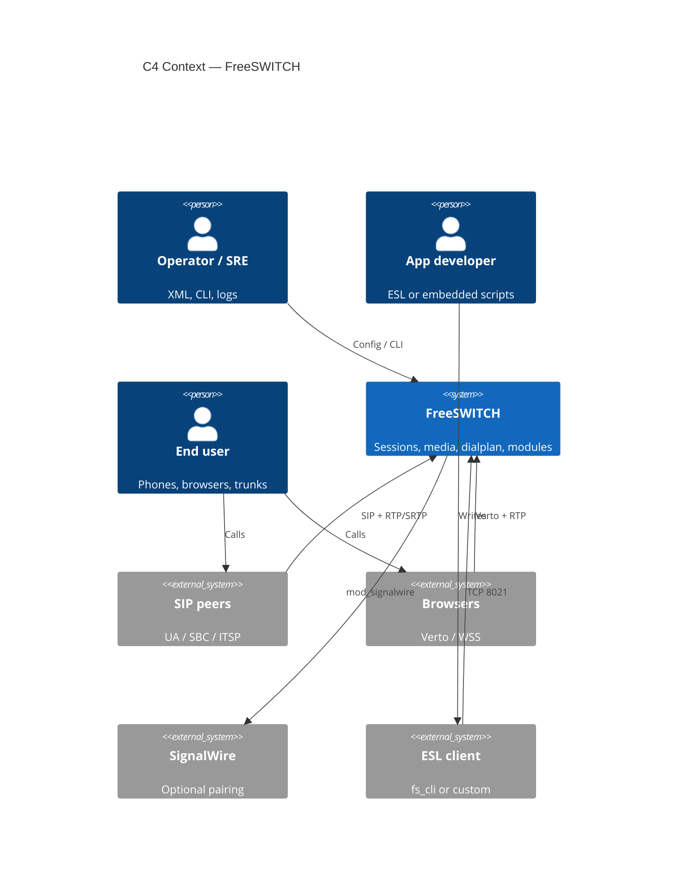

UML nearest match: system-context diagram (no standard UML type).

## Container View

Deployable runtime pieces. Modules are **not** listed here; they load into the `freeswitch` process.

| Container | Responsibility | Technology | Depends on |
|-----------|----------------|------------|------------|
| `freeswitch` process | Sessions, state machine, media, module host, XML registry, event bus | C, APR, POSIX threads / Windows service | XML on disk, core SQLite (or ODBC/pgsql), RTP ports, loaded DSOs |
| XML config tree | Dialplan, directory, SIP profiles, module autoload | Preprocessed XML (`X-PRE-PROCESS` / `#include`) | Flattened to `freeswitch.xml.fsxml` at start (`conf/vanilla/freeswitch.xml`) |
| Core database | Internal scoreboard / recovery / some module data | SQLite by default (`sqlite3_initialize` in `switch_core_init`); optional ODBC/pgsql | `db/` under prefix |
| ESL client (`fs_cli` or custom) | Out-of-process API + event subscribe | TCP to `mod_event_socket` | `fs_cli` targets `127.0.0.1:8021` by default; vanilla server config listens on `::` |
| SIP / WebRTC peers | Signaling and media | Sofia-SIP, Verto | UDP/TCP 5060/5080, WSS, RTP ranges |

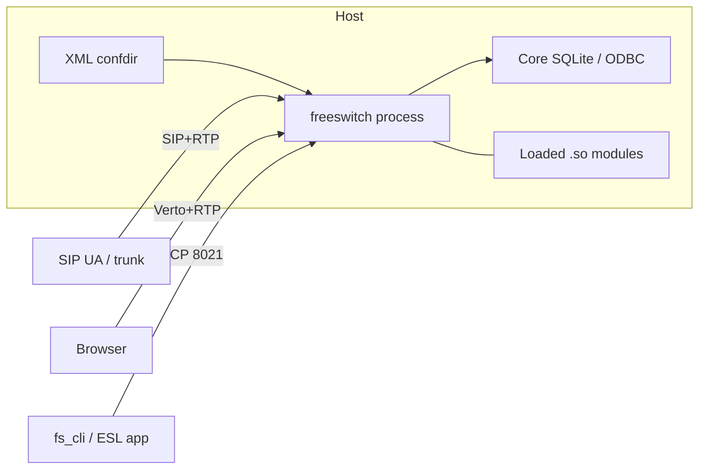

UML nearest match: deployment / component diagram.

Default install prefix is `/usr/local/freeswitch` (`configure.ac`). The
developer commands in [Quick Start](../0.getting-started/02-quick-start.md) add `--disable-fhs`, so
their paths stay below the prefix; a custom prefix without that flag uses FHS
paths. One process per host is the unit of deployment; extra hosts are
operator-owned HA, not an in-tree orchestrator. `switchname` in
`conf/vanilla/autoload_configs/switch.conf.xml` only overrides hostname for
DB/CURL identity in clustered configs.

## Component View

### `freeswitch` process

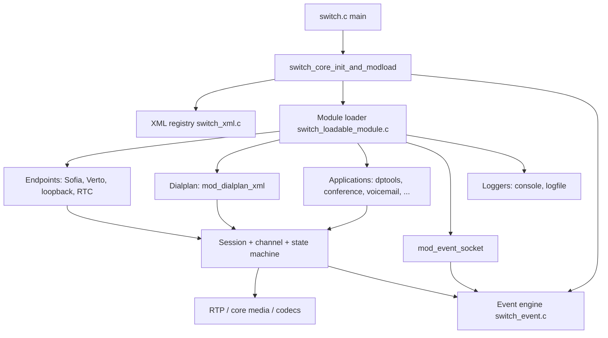

#### Core runtime

- **Responsibilities**: APR/memory pools, directories, SQLite, SQL flags, session thread pool (`SCF_SESSION_THREAD_POOL`), signal handlers, `SWITCH_EVENT_STARTUP`.
- **Key entry points**: `src/switch.c` (`main`), `switch_core_init()` / `switch_core_init_and_modload()` in `src/switch_core.c`.
- **Important dependencies**: bundled APR (`libs/apr`), SQLite, `libs/srtp`, `libs/libvpx`.
- **Failure modes**: init aborts if APR or SQLite cannot start; `SCF_NO_NEW_SESSIONS` is set until the core is ready.

#### XML configuration

- **Responsibilities**: parse `conf_dir/freeswitch.xml`, expand preprocessor includes (`X-PRE-PROCESS` / `#include` / `#set`), serve sections (`configuration`, `dialplan`, `directory`, `languages`, `chatplan`). `mod_xml_curl` / `mod_xml_ldap` can replace file-backed sections at runtime by installing `switch_xml_set_open_root_function()`.
- **Key entry points**: `src/switch_xml.c` (`switch_xml_open_root`, `__switch_xml_open_root`, `switch_xml_open_cfg`, `switch_xml_locate`), root document `conf/vanilla/freeswitch.xml`.
- **Lookup**: `switch_xml_open_cfg("modules.conf", …)` does **not** open that filename. It locates `section name="configuration"` then a child `configuration` whose `name` attribute equals the string (`modules.conf`, `switch.conf`, `sofia.conf`, …). Vanilla stitches those files in via `X-PRE-PROCESS cmd="include" data="autoload_configs/*.xml"` (`conf/vanilla/freeswitch.xml`). XML bindings (`mod_xml_curl`) run first; if none return a tree, the in-memory root (`MAIN_XML_ROOT`) is used.
- **Compiled artifact**: `log_dir/freeswitch.xml.fsxml` (comment in `conf/vanilla/freeswitch.xml`: `${prefix}/log/freeswitch.xml.fsxml`). Memory-mapped while running — do not edit it.
- **Failure modes**: broken include path or XML error leaves the switch unable to open root (`"Cannot Open log directory or XML Root!"`). A missing `modules.conf` configuration node logs `open of modules.conf failed` and continues; if **no** `<load>` entries were seen across pre/common/post lists, the loader falls back to loading every DSO in `mod_dir`.

#### Session, channel, state machine

- **Responsibilities**: each call leg is a `switch_core_session_t` (thread, codecs, queues, UUID) wrapping a `switch_channel_t` (state, variables, cause). The core runs `switch_state_handler_table` hooks; endpoints override them (Sofia’s `sofia_on_init` / `sofia_on_routing`).
- **Key entry points**: `src/switch_core_session.c`, `src/switch_channel.c`, `src/switch_core_state_machine.c`, types in `src/include/switch_types.h` (`switch_channel_state_t`).
- **Failure modes**: hung sessions if an endpoint returns without advancing state; media/proxy flags (`CF_PROXY_MODE`, `CF_PROXY_MEDIA`) change SDP/RTP ownership.

Default inbound path after create: `CS_NEW` → `CS_INIT` → `CS_ROUTING` (dialplan hunt) → `CS_EXECUTE` (apps) → `CS_EXCHANGE_MEDIA` or hangup path `CS_HANGUP` → `CS_REPORTING` → `CS_DESTROY`.

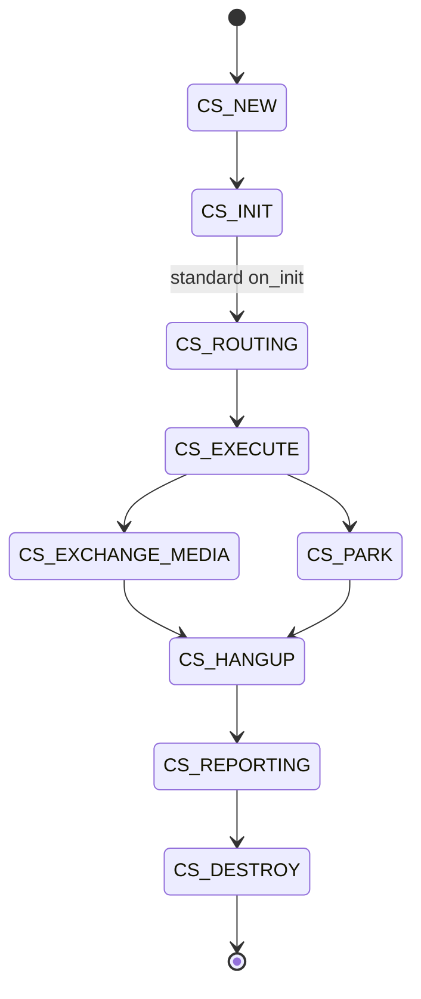

##### `STATE_MACRO`: 一个状态的完整处理管线

上面的状态图描述的是 **Channel State 如何变化**；真正消费某个状态的核心代码在
`src/switch_core_state_machine.c`。这里最容易读错的一点是：
`STATE_MACRO(init, "INIT")` 不是单纯调用一个 `on_init()` 函数，而是把一次状态处理拆成
多层 handler，并在最后决定是否执行 FreeSWITCH 的默认行为。

源码位置：

- 宏定义：`src/switch_core_state_machine.c:427-511`
- session 主循环：`src/switch_core_state_machine.c:530-721`
- handler 表类型：`src/include/switch_module_interfaces.h:65-92`

###### 1. 宏参数如何变成具体回调

宏使用 token-pasting 运算符 `##`：

```c
STATE_MACRO(routing, "ROUTING");
```

宏体中的（这里是预处理器拼接语法示意，不是可直接编译的 C 表达式）：

```text
application_state_handler->on_##__STATE(session)
```

预处理后等价于：

```c
application_state_handler->on_routing(session)
```

因此宏的第一个参数必须与 `switch_state_handler_table` 中的字段名对应：

| 调用 | 访问的字段 | 默认处理函数 |
|------|------------|--------------|
| `STATE_MACRO(init, "INIT")` | `on_init` | `switch_core_standard_on_init()` |
| `STATE_MACRO(routing, "ROUTING")` | `on_routing` | `switch_core_standard_on_routing()` |
| `STATE_MACRO(reset, "RESET")` | `on_reset` | `switch_core_standard_on_reset()` |
| `STATE_MACRO(execute, "EXECUTE")` | `on_execute` | `switch_core_standard_on_execute()` |
| `STATE_MACRO(exchange_media, ...)` | `on_exchange_media` | `switch_core_standard_on_exchange_media()` |
| `STATE_MACRO(soft_execute, ...)` | `on_soft_execute` | `switch_core_standard_on_soft_execute()` |
| `STATE_MACRO(park, ...)` | `on_park` | `switch_core_standard_on_park()` |
| `STATE_MACRO(consume_media, ...)` | `on_consume_media` | `switch_core_standard_on_consume_media()` |
| `STATE_MACRO(hibernate, ...)` | `on_hibernate` | `switch_core_standard_on_hibernate()` |

`STATE_MACRO` 最后写成 `do { ... } while (silly)`；在调用它的函数里 `silly` 初始化为
`0`，所以主体只执行一次。这个形式同时保证宏可以安全地放在 `case` 或 `if/else` 语句中，
并不是一个循环状态机。

###### 2. 三类 handler 的来源

一张 `switch_state_handler_table_t` 是一组按状态排列的函数指针；单个回调的签名是：

```c
typedef switch_status_t (*switch_state_handler_t)(switch_core_session_t *);
```

一次状态处理涉及三类表：

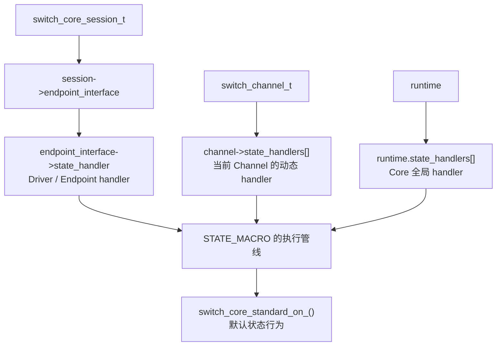

**Endpoint/Driver handler**

`switch_core_session_run()` 启动时从当前 session 取出 endpoint interface：

```c
endpoint_interface = session->endpoint_interface;
driver_state_handler = endpoint_interface->state_handler;
```

位置：`src/switch_core_state_machine.c:557-561`。

endpoint 模块在加载时创建 interface，并手动填充 `state_handler`。例如 `mod_sofia`：

```c
switch_state_handler_table_t sofia_event_handlers = {
    sofia_on_init,
    sofia_on_routing,
    sofia_on_execute,
    sofia_on_hangup,
    sofia_on_exchange_media,
    sofia_on_soft_execute,
    NULL,
    sofia_on_hibernate,
    sofia_on_reset,
    NULL,
    NULL,
    sofia_on_destroy
};
```

然后在 `mod_sofia.c:6836-6839`：

```c
sofia_endpoint_interface->state_handler = &sofia_event_handlers;
```

因此，Sofia session 的 `driver_state_handler` 就是 `sofia_event_handlers`；Verto、RTMP、
Skinny 等 endpoint 则使用各自模块的表。endpoint interface 的字段定义见
`src/include/switch_module_interfaces.h:177-193`。

**当前 Channel 的动态 handler**

`switch_channel_t` 内部保存：

```c
const switch_state_handler_table_t *state_handlers[SWITCH_MAX_STATE_HANDLERS];
int state_handler_index;
```

应用或通话流程通过：

```c
switch_channel_add_state_handler(channel, &some_handlers);
```

注册；宏通过 `switch_channel_get_state_handler(channel, index++)` 按插入顺序读取。
实现位置：`src/switch_channel.c:3044-3086`。

这类表通常表示某个 Channel 的临时业务行为，例如 bridge、originate、spy 或 HTTP API
流程。它们不改变 endpoint 的默认表，而是附加到当前 Channel 上。清理时：

- 传入具体指针：只移除那张表；
- 传入 `NULL`：只保留带 `SSH_FLAG_STICKY` 的表；
- 所有增删读取都使用 `channel->state_mutex`。

例如 bridge 在 `src/switch_ivr_bridge.c:1563-1564` 把
`signal_bridge_state_handlers` 加入两个 Channel。

**Core 全局 handler**

Core runtime 另有一个全局数组：

```c
runtime.state_handlers[]
runtime.state_handler_index
```

模块通过：

```c
switch_core_add_state_handler(&global_handlers);
```

注册，宏通过 `switch_core_get_state_handler(index++)` 读取，实现位置是
`src/switch_core.c:291-343`。例如 `mod_nibblebill` 在加载时注册
`nibble_state_handler`（`src/mod/applications/mod_nibblebill/mod_nibblebill.c:1057`）。

这类 handler 面向整个 Core 的 session，而不是某个特定 Channel；注册和移除使用
`runtime.global_mutex`。

###### 3. 每次状态处理的执行顺序

以 `STATE_MACRO(routing, "ROUTING")` 为例，完整顺序如下：

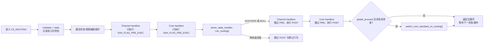

具体分为以下步骤：

1. 保存 `midstate = state`，输出 `State ROUTING` 日志；如果通话仍处于未保持状态，
   将 callstate 设为 `CCS_ACTIVE`，并请求视频刷新、生成媒体关键帧。
2. 从 `switch_channel_get_state_handler()` 遍历当前 Channel 的表，只执行带
   `SSH_FLAG_PRE_EXEC` 的回调。
3. 从 `switch_core_get_state_handler()` 遍历 Core 全局表，只执行带
   `SSH_FLAG_PRE_EXEC` 的回调。
4. 调用 endpoint 的 `driver_state_handler->on_routing`。如果该字段为 `NULL`，也视为
   成功；否则只有返回 `SWITCH_STATUS_SUCCESS` 才进入下一阶段。
5. 再次遍历 Channel 表，跳过 PRE handler，执行未设置 `SSH_FLAG_PRE_EXEC` 的回调。
6. 再次遍历 Core 表，跳过 PRE handler，执行未设置 `SSH_FLAG_PRE_EXEC` 的回调。
7. 如果没有 veto，且 handler 执行期间没有改变 Channel State，调用
   `switch_core_standard_on_routing()`。

没有对应状态函数的槽位（例如表中的 `on_consume_media = NULL`）不构成失败；宏把
`NULL` 当作“本层没有意见”，继续执行后续流程。

###### 4. `proceed`、`global_proceed` 与返回值

handler 的返回值在这里是“是否允许后续状态行为继续”的控制信号，而不只是普通的错误码：

| 位置 | 返回 `SWITCH_STATUS_SUCCESS` 或函数为 `NULL` | 返回其他状态 |
|------|----------------------------------------------|--------------|
| Channel PRE | 继续扫描并继续后续阶段 | 记录全局 veto；driver 仍会被调用 |
| Core PRE | 继续扫描并继续后续阶段 | 记录全局 veto；driver 仍会被调用 |
| Driver | 进入 POST handler | 直接跳过 POST 和默认行为 |
| Channel POST | 继续 | 禁止默认行为，并停止当前 POST 扫描 |
| Core POST | 继续 | 禁止默认行为，并停止当前 POST 扫描 |

这里有两个容易混淆的变量：

- `proceed`：当前一轮 handler 扫描能否继续。某个 handler 返回非成功时置零；Core
  PRE/POST 的循环还会用它决定是否继续扫描下一个 handler。
- `global_proceed`：本次状态是否允许进入默认 `switch_core_standard_on_<state>()`。
  Channel PRE、Core PRE、Channel POST、Core POST 的 veto，以及状态被中途改变，都会
  让它变成 `0`。

因此，Channel/Core 的 PRE handler 返回失败并不等于 driver 不执行；它主要阻止最后的
默认行为。Driver handler 返回失败则是更强的截断点，会连 POST handler 一起跳过。

状态变化也会阻止旧状态的默认逻辑继续执行：宏最后检查：

```c
midstate != switch_channel_get_state(session->channel)
```

例如 `on_routing()` 已经把 Channel 改到 `CS_HANGUP`，本轮就不会再执行旧的默认
`on_routing` 行为。

###### 5. 默认行为如何推动状态变化

`STATE_MACRO` 自身不负责状态跳转；它只是调用 handler 和默认函数。真正的跳转发生在
这些回调内部：

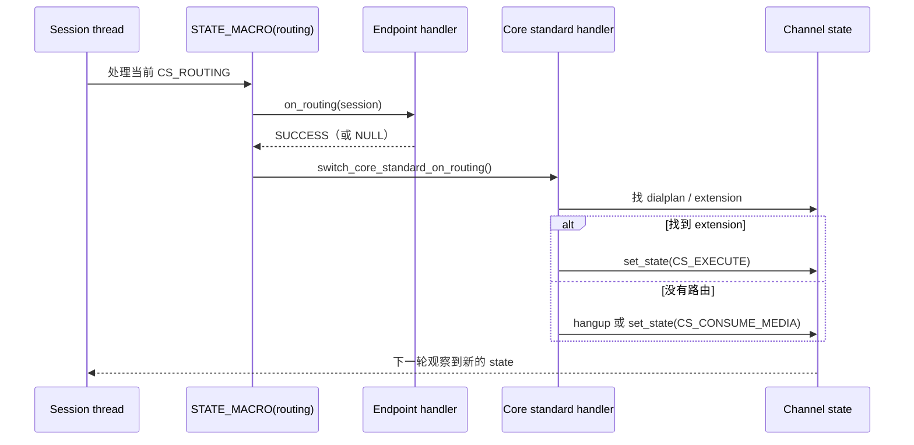

例如 `switch_core_standard_on_routing()`（`src/switch_core_state_machine.c:222-316`）会：

- 根据 caller profile 选择 dialplan；
- 调用 dialplan interface 的 `hunt_function`；
- 找到 extension 后设置 `CS_EXECUTE`；
- outbound 无 dialplan 时进入 `CS_CONSUME_MEDIA` 或挂断；
- 无法路由时以 `SWITCH_CAUSE_NO_ROUTE_DESTINATION` 挂断。

`switch_core_standard_on_execute()`（`src/switch_core_state_machine.c:318-386`）则循环执行
当前 extension 的 application；应用执行完且 Channel 仍然处于 `CS_EXECUTE` 时，默认会
以 `SWITCH_CAUSE_NORMAL_CLEARING` 挂断。

###### 6. `switch_core_session_run()` 如何触发这条管线

session 线程在 `switch_core_session_run()` 中持续观察 Channel State：

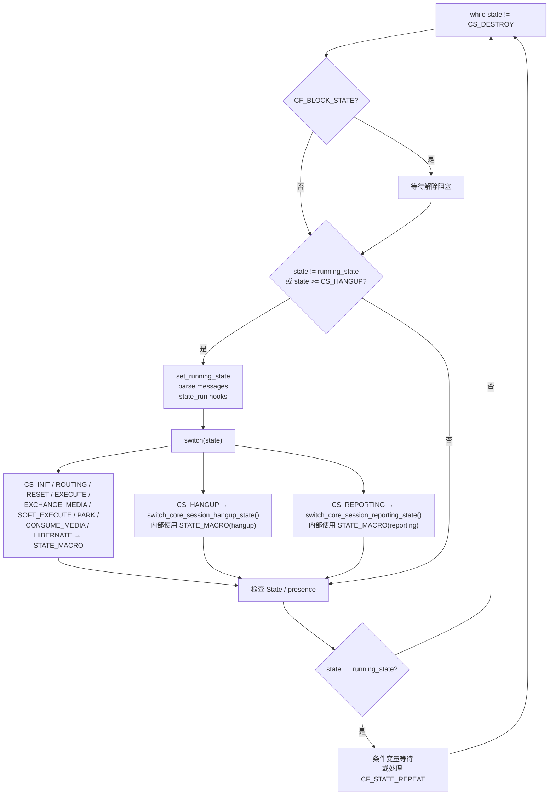

主循环中的关键点：

- `running_state` 表示 session 线程当前已经认领并正在处理（或等待中的）状态；只有 state
  与它不同，才会进入新的状态处理分支（`src/switch_core_state_machine.c:575-584`）。
- `CS_HANGUP` 和 `CS_REPORTING` 在主循环中分别调用专门函数，但这两个函数内部仍然
  使用同一个 `STATE_MACRO`，所以挂断和 CDR/reporting 也共享 handler 管线。
- `CS_NEW` 只记录日志；如果长期没有推进，主循环经过 500 次等待后将 Channel 以
  `SWITCH_CAUSE_WRONG_CALL_STATE` 挂断（`src/switch_core_state_machine.c:682-691`）。
- 当 state 没有变化且没有 `CF_STATE_REPEAT` 时，session thread 设置
  `CF_THREAD_SLEEPING`，在 `session->cond` 上等待；状态变化或事件会唤醒它
  （`src/switch_core_state_machine.c:693-708`）。

所以“handler 执行”和“状态跳转”是两个动作：handler 或默认行为修改 Channel State，
session 主循环在下一轮看到新值，再选择新的 `case` 和新的 `STATE_MACRO`。

###### 7. 代码阅读导航与调试要点

阅读或排查一个状态时，按下面顺序定位最省时间：

1. 在 `switch_core_state_machine.c` 找主循环中的 `case CS_*`，确认该状态是否直接调用
   宏，还是委托给 `hangup_state` / `reporting_state`。
2. 找 `session->endpoint_interface` 的创建位置，确认具体 endpoint 的
   `state_handler` 表；Sofia 入口是 `mod_sofia.c:6836-6839`。
3. 搜索 `switch_channel_add_state_handler()`，列出当前业务流程可能附加的 Channel 表。
4. 搜索 `switch_core_add_state_handler()`，列出全局模块附加的 Core 表。
5. 对每张表检查目标槽位是否为 `NULL`、是否设置 `SSH_FLAG_PRE_EXEC`、以及回调返回值。
6. 最后检查回调内部的 `switch_channel_set_state()`、`switch_channel_hangup()` 和默认
   行为，确认是谁推动了下一次状态变化。

常见误区：

- `state_handler` 不是一个 handler，而是一张包含所有 `on_<state>` 槽位的表；
- endpoint 表、Channel 表、Core 全局表是三个不同的存储位置，不能混为一谈；
- `SWITCH_STATUS_FALSE` 在这里常常表示“拦截默认行为”，不一定表示整个 session 失败；
- `STATE_MACRO` 不会自动把 `CS_ROUTING` 改成 `CS_EXECUTE`，状态改变必须由回调或默认行为
  显式完成；
- `CS_HANGUP` / `CS_REPORTING` 的宏调用位于辅助函数中，不在主循环的 `case` 语句表面直接
  展开。

##### 实例分析：`audio_bridge_on_exchange_media`

前面的 `STATE_MACRO` 机制可以用 `src/switch_ivr_bridge.c:969-1039` 这个函数具体说明。
它是一个很典型的 **Channel 级临时 state handler**：bridge 流程创建一个 B-leg 专用的
handler 表，把它挂到 B-leg；当 B-leg 进入 `CS_EXCHANGE_MEDIA` 时，这个回调接管该状态，
启动 B-leg 侧的音频桥接循环，桥接结束后清理 handler 并选择后续动作。

这里的“state handler”不是 `mod_sofia` 之类 endpoint interface 上的固定 driver 表，而是
`switch_channel_add_state_handler()` 加到某个 Channel 上的附加表。它的完整关系是：

```mermaid
flowchart LR
    bridge["switch_ivr_multi_threaded_bridge()"] --> alloc["创建 a_leg / b_leg\nswitch_ivr_bridge_data_t"]
    alloc --> install["把 audio_bridge_peer_state_handlers\n挂到 peer_channel（B-leg）"]
    install --> context["peer_channel 私有数据 _bridge_ = b_leg"]
    context --> state["peer_channel -> CS_EXCHANGE_MEDIA"]
    state --> run["B-leg session thread\n进入 STATE_MACRO(exchange_media)"]
    run --> handler["audio_bridge_on_exchange_media()\nChannel POST handler"]
    handler --> loop["audio_bridge_thread(NULL, b_leg)\n同步运行 B-leg bridge loop"]
    loop --> cleanup["清理 handler / 处理 bridge 结束策略"]
```

###### 1. 先看这张 handler 表

函数前面有一个前置声明：`src/switch_ivr_bridge.c:35`；完整表定义在
`src/switch_ivr_bridge.c:1062-1070`：

```c
static const switch_state_handler_table_t audio_bridge_peer_state_handlers = {
    /* on_init */            NULL,
    /* on_routing */         audio_bridge_on_routing,
    /* on_execute */         NULL,
    /* on_hangup */          NULL,
    /* on_exchange_media */  audio_bridge_on_exchange_media,
    /* on_soft_execute */    NULL,
    /* on_consume_media */   audio_bridge_on_consume_media,
};
```

这个初始化器只填到 `on_consume_media`，后面的 `on_hibernate`、`on_reset`、
`on_park`、`on_reporting`、`on_destroy` 和 `flags` 都由 C 的静态初始化规则置为零。
因此这张表的 `flags == 0`，没有设置 `SSH_FLAG_PRE_EXEC`：

```text
进入某个状态
  → endpoint driver handler
  → audio_bridge_peer_state_handlers 的 POST handler
```

对 `CS_EXCHANGE_MEDIA` 来说，真正被调用的是表中的：

```c
audio_bridge_peer_state_handlers.on_exchange_media
    == audio_bridge_on_exchange_media
```

而不是 `audio_bridge_on_routing()` 或 `audio_bridge_on_consume_media()`。同一张表还拦截
`CS_ROUTING` 和 `CS_CONSUME_MEDIA`，用于把 bridge 对端置于被动状态；本实例只追踪
`on_exchange_media`。

###### 2. 谁安装它：`switch_ivr_multi_threaded_bridge`

安装入口是 `switch_ivr_multi_threaded_bridge()`，源码位于
`src/switch_ivr_bridge.c:1613-1961`。

它先为两条腿建立 bridge context：

```c
switch_ivr_bridge_data_t *a_leg =
    switch_core_session_alloc(session, sizeof(*a_leg));
switch_ivr_bridge_data_t *b_leg =
    switch_core_session_alloc(peer_session, sizeof(*b_leg));
```

`switch_ivr_bridge_data_t` 定义在 `src/switch_ivr_bridge.c:344-354`，关键字段是：

| 字段 | A-leg context (`a_leg`) | B-leg context (`b_leg`) |
|------|-------------------------|-------------------------|
| `session` | `session` | `peer_session` |
| `b_uuid` | B-leg 的 UUID | A-leg 的 UUID |
| `other_leg_data` | `b_leg` | `a_leg` |
| `input_callback` / `session_data` | A-leg 侧数据 | B-leg 侧数据 |

具体赋值在 `src/switch_ivr_bridge.c:1648-1662`。随后只把这张临时表挂到 B-leg：

```c
switch_channel_add_state_handler(peer_channel,
                                 &audio_bridge_peer_state_handlers);
```

位置：`src/switch_ivr_bridge.c:1664`。

这一步只“安装回调表”，还没有立刻调用 `audio_bridge_on_exchange_media()`。后续代码在
确认两条腿已经具备桥接条件、设置完桥接变量后，才把 B-leg context 放入 Channel 私有
数据，并推动 B-leg 状态：

```c
switch_channel_set_private(peer_channel, "_bridge_", b_leg);
switch_channel_set_state(peer_channel, CS_EXCHANGE_MEDIA);
```

位置：`src/switch_ivr_bridge.c:1786-1792`。`CF_ARRANGED_BRIDGE` 分支可能跳过这里的
`CS_EXCHANGE_MEDIA` 设置；下面按普通 audio bridge 路径说明。

###### 3. 为什么是 B-leg handler、A-leg 却先启动 bridge loop

普通路径里紧接着执行：

```c
audio_bridge_thread(NULL, (void *) a_leg);
```

位置：`src/switch_ivr_bridge.c:1794`。

这里传入 `NULL` 作为 thread 参数并不会创建新线程，而是直接同步调用函数。于是普通
audio bridge 会形成如下配对：

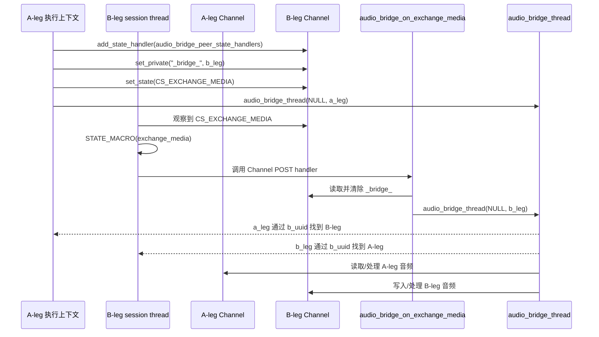

也就是说，A-leg 侧的 `audio_bridge_thread(a_leg)` 由调用
`switch_ivr_multi_threaded_bridge()` 的上下文直接运行；B-leg 侧的同一个函数则由
`audio_bridge_on_exchange_media(b_session)` 从 B-leg 的 session state machine 调用。
两边通过各自 context 的 `b_uuid` 找到对端 session，形成两条方向相反的媒体处理循环。

`audio_bridge_thread()` 的定义在 `src/switch_ivr_bridge.c:356`。它会：

- 通过 `data->b_uuid` 调用 `switch_core_session_locate()` 找到对端 session；
- 获取两条腿的 Channel；
- 循环读取音频帧、处理 DTMF、静音、媒体旁路，以及可选的文本/视频桥接；
- 把帧写入另一条腿；
- 任一腿结束、读写失败、收到 break 或 bridge 策略触发时退出循环。

因此 `audio_bridge_on_exchange_media()` 不是音频帧循环本身；它是把 B-leg 从状态机接入
已经存在的 bridge context 的“入口适配器”。

###### 4. 它在 `STATE_MACRO` 的哪一层执行

假设 B-leg 使用 Sofia endpoint，那么 B-leg 的固定 driver 表来自
`sofia_endpoint_interface->state_handler`，其中：

```c
on_exchange_media = sofia_on_exchange_media
```

`sofia_on_exchange_media()` 在 `src/mod/endpoints/mod_sofia/mod_sofia.c:693-697` 返回
`SWITCH_STATUS_SUCCESS`。B-leg 进入 `CS_EXCHANGE_MEDIA` 时，实际顺序是：

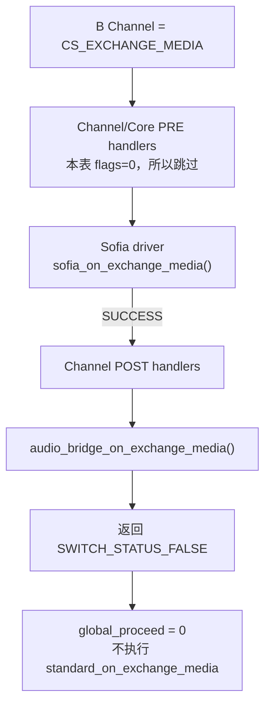

所以它不是在 `CS_EXCHANGE_MEDIA` 刚进入时最先执行，而是在 endpoint driver 成功之后
执行。对于其他 endpoint，driver handler 的返回值不同，可能会影响这个 Channel POST
handler 是否有机会执行：`STATE_MACRO` 在 driver 返回非成功时会跳过整个 POST 阶段。

###### 5. 逐段解释 `audio_bridge_on_exchange_media`

**(a) 取出 Channel 和 bridge context**

```c
switch_channel_t *channel = switch_core_session_get_channel(session);
switch_ivr_bridge_data_t *bd =
    switch_channel_get_private(channel, "_bridge_");
```

`session` 是 B-leg session；`channel` 是 B-leg Channel；`bd` 应该就是此前在
`switch_channel_set_private(peer_channel, "_bridge_", b_leg)` 放进去的 B-leg context。

**(b) 先清掉私有指针，再执行 bridge loop**

```c
if (bd) {
    switch_channel_set_private(channel, "_bridge_", NULL);
```

这是消费一次性 bridge context 的动作，避免同一个指针在重复进入
`CS_EXCHANGE_MEDIA` 时被再次消费。它清掉的是 Channel 私有数据中的引用，不是释放
`bd`；`bd` 来自 session memory pool，生命周期仍由 session pool 管理。

**(c) 校验 context 是否属于当前 session，且对端 UUID 存在**

```c
if (bd->session == session && *bd->b_uuid) {
```

`b_leg->session` 在 `src/switch_ivr_bridge.c:1648` 被设为 `peer_session`，正好对应
调用这个 handler 的 B-leg session；`b_leg->b_uuid` 则在 `src/switch_ivr_bridge.c:1649`
保存 A-leg UUID。这个判断防止用错误的 context 启动 bridge。

**(d) 同步进入 B-leg 的 bridge loop，然后重置媒体资源**

```c
audio_bridge_thread(NULL, (void *) bd);
switch_core_session_reset(session, SWITCH_TRUE, SWITCH_TRUE);
```

这里仍然是同步调用：`audio_bridge_thread()` 返回前，当前 B-leg session thread 会一直
停留在该调用中。bridge loop 退出后，`switch_core_session_reset()` 清理/重置读写 codec、
resampler、session message、raw buffer 和 DTMF 等资源（实现：
`src/switch_core_session.c:1391-1432`）。这个 reset 函数本身不负责把 Channel State 改成
`CS_RESET`；后面的代码会根据 bridge 结果决定下一状态。

如果 context 不合法，或根本没有 `_bridge_` context，则走：

```c
switch_channel_hangup(channel,
                      SWITCH_CAUSE_DESTINATION_OUT_OF_ORDER);
```

对应源码：`src/switch_ivr_bridge.c:976-986`。

**(e) 无论如何都移除这张临时 handler 表**

```c
switch_channel_clear_state_handler(channel,
                                   &audio_bridge_peer_state_handlers);
```

位置：`src/switch_ivr_bridge.c:987`。传入具体表指针意味着只移除
`audio_bridge_peer_state_handlers`，不会误删其他 Channel handler。此后 B-leg 不再通过
这张表处理后续状态。

**(f) bridge 结束后的策略分支**

函数随后重新读取当前状态，并检查 transfer、redirect、zombie、`clean_exit`、inner
bridge 等条件。普通 audio bridge 的主要结果如下：

| 条件 | 动作 | 返回值/状态效果 |
|------|------|-----------------|
| `park_after_bridge` | `switch_ivr_park_session(session)` | 返回 `SWITCH_STATUS_FALSE`，交给 park 流程 |
| `transfer_after_bridge` | `transfer_after_bridge(session, var)` | 返回 `SWITCH_STATUS_FALSE`，发起转移 |
| B-leg 被 intercepted | 清理 intercept 标志 | 返回 `SWITCH_STATUS_FALSE` |
| 未接通且没有 orphaned B-leg hooks | B-leg 以 `ORIGINATOR_CANCEL` 挂断 | 返回 `SWITCH_STATUS_FALSE` |
| 已接通 | B-leg 以 `NORMAL_CLEARING` 挂断 | 返回 `SWITCH_STATUS_FALSE` |
| 仍处于 `CS_EXCHANGE_MEDIA` | 设置 `park_timeout=3`，转到 `CS_PARK` | 返回 `SWITCH_STATUS_FALSE` |

相关代码在 `src/switch_ivr_bridge.c:989-1038`。如果未接通，代码会先尝试
`execute_on_orphaned_bleg` 和 `api_on_orphaned_bleg`；至少一个 hook 成功执行时，不会
立即执行默认的 `ORIGINATOR_CANCEL` 挂断。

###### 6. 为什么它总是返回 `SWITCH_STATUS_FALSE`

这个函数最后无条件：

```c
return SWITCH_STATUS_FALSE;
```

在普通业务函数里看到 `FALSE` 容易误以为 bridge 失败；在这里它是有意的状态机控制
信号。由于这张表没有 `SSH_FLAG_PRE_EXEC`，它是在 Channel POST 阶段运行；返回 FALSE
会让 `STATE_MACRO`：

1. 把 `proceed` 置零；
2. 把 `global_proceed` 置零；
3. 不再执行 `switch_core_standard_on_exchange_media()`。

这样做表示：B-leg 的 `CS_EXCHANGE_MEDIA` 已经由 audio bridge 逻辑处理，不能再让通用
默认 handler 接管。即使当前代码最后把 B-leg 放入 `CS_PARK`，这个状态变化也是本函数
显式完成的，不是 `return FALSE` 自动完成的。

完整控制流可以压缩为：

```text
CS_EXCHANGE_MEDIA
  → Sofia driver on_exchange_media() 返回 SUCCESS
  → Channel POST: audio_bridge_on_exchange_media()
  → 取出一次性 _bridge_ context
  → 同步运行 B-leg audio_bridge_thread()
  → 清理 audio_bridge_peer_state_handlers
  → park / transfer / hangup / CS_PARK
  → 返回 FALSE，禁止通用 exchange-media 默认行为
```

###### 7. 这个实例揭示的通用模式

`audio_bridge_on_exchange_media()` 展示了 FreeSWITCH 中临时 state handler 的几个关键
设计点：

- **表是能力集合，不是单个回调**：同一张表可以同时覆盖 routing、exchange media、
  consume media；未填槽位就是 `NULL`。
- **安装和触发分离**：`add_state_handler()` 只登记表；必须等 Channel State 变成对应
  `CS_*`，session thread 才会在 `STATE_MACRO` 中调用对应槽位。
- **handler 可以消费一次状态**：先清 `_bridge_` 私有数据，再清 handler 表，表示这次
  exchange-media 进入是一次性入口。
- **handler 可以把状态处理权交给长循环**：状态线程在回调内同步运行 bridge loop；这也
  是为什么 bridge 期间不能把这个回调简单理解成一个瞬时通知。
- **返回值是调度协议**：`SWITCH_STATUS_FALSE` 在这里不是“没有做成 bridge”，而是
  “不要执行通用默认状态行为”。
- **状态改变由业务代码显式完成**：`set_state(CS_EXCHANGE_MEDIA)`、`set_state(CS_PARK)`、
  `hangup()` 都是明确的状态推进点；宏只是按当前状态分派处理。

#### Module loader

- **Responsibilities**: dlopen modules from `mod_dir`, register interface tables (endpoint, dialplan, application, codec, API, file, say, ASR, …) on `switch_loadable_module_interface`. This registration is the core extensibility mechanism: [Loadable module contract](#loadable-module-contract).
- **Key entry points**: `src/switch_loadable_module.c`, `src/include/switch_loadable_module.h`, `src/include/switch_module_interfaces.h`. Modules export `SWITCH_MODULE_DEFINITION` / `SWITCH_MODULE_LOAD_FUNCTION`.
- **Failure modes**: missing `.so` or load error is logged; `critical="true"` on a `<load>` tag calls `abort()`. `switch_core_init_and_modload` fails the whole startup if `switch_loadable_module_init(SWITCH_TRUE)` itself returns failure (for example core SQL after pre-load). A non-critical missing DSO does **not** fail that function.

#### Runtime load tag

Vanilla example: `<load module="mod_sofia"/>` in `conf/vanilla/autoload_configs/modules.conf.xml`. Commented `<!-- <load …/> -->` lines never become XML children.

Startup order inside `switch_loadable_module_init()` (`src/switch_loadable_module.c`): built-in `CORE_*` modules → `<load>` rows in `pre_load_modules.conf` → `switch_core_sqldb_init()` → remaining `CORE_*` (VPX when built) → `<load>` rows in `modules.conf` → `<load>` rows in `post_load_modules.conf` → `switch_loadable_module_runtime()`. Console/ESL `load` / `unload` / `reload` use the same `switch_loadable_module_load_module()` path; `reloadxml` does **not** re-walk these lists.

Each `<load>` is a sibling under `<modules>`. Attributes:

| Attribute | Effect |
|-----------|--------|
| `module` | Required. Basename (`mod_sofia`). On non-Windows the loader appends `.so` under `mod_dir` unless `module` is already a filesystem path. A name containing `.` that is not a recognized DSO suffix is skipped (`Invalid extension for …`). |
| `path` | Optional directory of the DSO. Omitted or empty → `SWITCH_GLOBAL_dirs.mod_dir`. |
| `global` | `true` → open the DSO with global symbols (`RTLD_GLOBAL` via `switch_dso_open`). |
| `critical` | `true` → load `SWITCH_STATUS_GENERR` aborts the process. Vanilla `mod_sofia` is not marked critical. Not read on the post-load list. |

Execution for `module="mod_sofia"`: `switch_loadable_module_load_module_ex` → `switch_loadable_module_load_file` opens `{mod_dir}/mod_sofia.so`, resolves the exported table `mod_sofia_module_interface` (`SWITCH_MODULE_DEFINITION` in `src/include/switch_types.h`), checks `SWITCH_API_VERSION`, then calls the `load` pointer (`mod_sofia_load`). That function registers interfaces and, for Sofia, `config_sofia(SOFIA_CONFIG_LOAD, NULL)` plus profile threads. Success logs `Successfully Loaded [mod_sofia]` and inserts the module into `module_hash`. Duplicate load: `Module … Already Loaded!`.

Startup sequence with these symbols: [Server startup](05-workflows.md#runtime-load-tag). Operator parameter tables: [Users Manual Chapter 5](https://developer.signalwire.com/freeswitch/configuration/module-loading/).

The **tables** that `mod_sofia_load` fills after `dlopen` are the extensibility contract: [Loadable module contract](#loadable-module-contract).

#### Loadable module contract

This is the plugin architecture. FreeSWITCH does **not** read an IDL, protobuf, or GObject type file to discover what a module can do. After `dlopen`, the module’s **load function runs in-process and pushes C function pointers plus names into a core registry**. Later, dialplan XML, `fs_cli`, originate, and the media layer only do **string → hash lookup → call the pointer**. That is C-style dependency injection plus a service locator: providers register; consumers look up by name.

`libfreeswitch` owns sessions, the `CS_*` state machine, media, XML, and the event bus. Modules extend those surfaces; they do not fork the core. Same ABI, same headers (`src/include/switch.h`), same address space — so the function pointer **is** the interface. Skeleton: `src/mod/applications/mod_skel/mod_skel.c`. Types: `switch_types.h`, `switch_loadable_module.h`, `switch_module_interfaces.h`. Container of hashes: `struct switch_loadable_module_container loadable_modules` in `src/switch_loadable_module.c`.

```text
modules.conf.xml  →  dlopen(mod_xxx.so)  →  dlsym(mod_xxx_module_interface)
        →  mod_xxx_load()  →  SWITCH_ADD_* / create_interface
        →  switch_loadable_module_process() indexes hashes
        →  runtime lookup (app / api / endpoint / codec / …)
```

##### Discover the file, then the entry symbol

Phase 1 is XML, not reflection: `<load module="mod_sofia"/>` → `{mod_dir}/mod_sofia.so` → `switch_dso_open` (`dlopen` / `LoadLibraryEx`). Detail: [Runtime load tag](#runtime-load-tag).

Phase 2 is a **C symbol**. `SWITCH_MODULE_DEFINITION(mod_example, mod_example_load, shutdown, runtime)` expands to `mod_example_module_interface` of type `switch_loadable_module_function_table_t`: `{ SWITCH_API_VERSION, load, shutdown, runtime, flags }` (`switch_types.h`). `switch_loadable_module_load_file` `dlsym`s that name, checks `SWITCH_API_VERSION` (currently **5**), then calls `load(&module_interface, pool)`. A mismatch logs *Trying to load an out of date module*. `runtime` may be `NULL` (Sofia has no core module-runtime thread).

There is no separate “plugin manifest” beside that exported table.

##### The module bag vs the global hashes

Load **must** allocate the bag first:

```c
*module_interface = switch_loadable_module_create_module_interface(pool, modname);
```

`switch_loadable_module_interface_t` is this module’s list of capabilities: `endpoint_interface`, `application_interface`, `api_interface`, `codec_interface`, `dialplan_interface`, chat, JSON API, file, speech, ASR, say, timer, directory, management, limit, database, … Each kind is a **singly linked list** (`next`). `switch_loadable_module_create_interface(mod, SWITCH_APPLICATION_INTERFACE)` (`ALLOC_INTERFACE`) appends one node on the module pool, sets `parent` / `rwlock`.

`SWITCH_ADD_APP` / `SWITCH_ADD_API` / `SWITCH_ADD_CHAT` / `SWITCH_ADD_DIALPLAN` / `SWITCH_ADD_CODEC` / `SWITCH_ADD_JSON_API` / `SWITCH_ADD_LIMIT` are thin wrappers around `create_interface` plus field assignment (`switch_loadable_module.h`). **There is no `SWITCH_ADD_ENDPOINT` macro.** Endpoints call `create_interface(..., SWITCH_ENDPOINT_INTERFACE)` and fill `interface_name`, `io_routines`, `state_handler` by hand (`mod_sofia_load`).

When `load` returns success, `switch_loadable_module_process` walks those lists and inserts into **global, mostly case-insensitive hashes** (`application_hash`, `api_hash`, `endpoint_hash`, `dialplan_hash`, …). Codec and file hashes key by IANA / extension and may chain several implementations. Each successful insert can fire `SWITCH_EVENT_MODULE_LOAD` (`type` = `application` / `endpoint` / …). Optional `interface-allowlist` in `switch.conf` can skip app/API/JSON/chat-app names.

Two stores, two jobs:

| Store | Shape | Role |
|-------|--------|------|
| Per-module bag | linked lists on `switch_loadable_module_interface_t` | What this DSO owns; unload walks the same lists |
| Global hashes | `loadable_modules.*_hash` | Runtime **name → interface struct** |

Getters are `switch_loadable_module_get_*_interface(name)` (`HASH_FUNC` in `switch_loadable_module.c`). `PROTECT_INTERFACE` bumps a refcount while a call is in flight.

##### What an interface struct is

Not a proxy object. Example — `switch_application_interface_t` (`switch_module_interfaces.h`): `interface_name`, `application_function`, `short_desc` / `long_desc`, `syntax`, `flags`, `parent`, `next`. Same idea for API (`function` + `syntax`), endpoint (`io_routines` + `state_handler`), codec (`implementations` encode/decode). Unused IO/state slots are `NULL`. Several tables keep `padding[10]` for ABI growth.

`mod_dptools` registers the dialplan name `bridge` as `audio_bridge_function` (not a direct export of `switch_ivr_multi_threaded_bridge`; that helper is called from inside the app). Same module registers `"answer"` → `answer_function` (`SAF_SUPPORT_NOMEDIA`). `mod_commands` registers API `"status"` → `status_function`. Sofia registers endpoint `"sofia"` plus APIs `sofia`, `sofia_contact`, apps `sofia_sla`, chat `SOFIA_CHAT_PROTO`.

The dialplan XML never names `mod_dptools`. Consumers look up **interface type + name** (`APPLICATION` + `"answer"`). The module is only the capability container; ownership is `parent` on the interface struct for unload/refcount.

##### Golden path: answer

Four questions, answered from this tree.

**1. What does `SWITCH_ADD_APP` do?** It is not a separate registrar. Expansion in `switch_loadable_module.h`:

```c
app_int = (switch_application_interface_t *)
    switch_loadable_module_create_interface(*module_interface, SWITCH_APPLICATION_INTERFACE);
app_int->interface_name = int_name;           /* "answer" — there is no application_name field */
app_int->application_function = funcptr;      /* answer_function */
app_int->short_desc = short_descript;
app_int->long_desc = long_descript;
app_int->syntax = syntax_string;
app_int->flags = app_flags;                   /* answer uses SAF_SUPPORT_NOMEDIA */
```

`create_interface` (`ALLOC_INTERFACE`) allocates on the **module pool**, appends to `mod->application_interface` (`next` list), sets `parent` and `rwlock`. Real call in `mod_dptools_load` (after `*module_interface = switch_loadable_module_create_module_interface(pool, modname)`):

```c
SWITCH_ADD_APP(app_interface, "answer", "Answer the call",
    "Answer the call for a channel.", answer_function, "", SAF_SUPPORT_NOMEDIA);
```

`SWITCH_STANDARD_APP(answer_function)` is `static void answer_function(switch_core_session_t *session, const char *data)` (`switch_types.h`). Body ends in `switch_channel_answer(channel)`.

`SWITCH_MODULE_DEFINITION` only exports `mod_dptools_module_interface` `{ load = mod_dptools_load, shutdown = mod_dptools_shutdown, runtime = NULL }`. It does **not** register apps; `mod_dptools_load` does.

**2. Where is the interface stored?** First on the module bag list. When load returns, `switch_loadable_module_process` does `switch_core_hash_insert(loadable_modules.application_hash, "answer", ptr)` (case-insensitive hash) and may fire `SWITCH_EVENT_MODULE_LOAD` with `type=application`. Unload deletes the same key.

**3. How does dialplan find `"answer"`?** Hunt (`mod_dialplan_xml`) reads `application="answer"` and either `exec_app` (inline) or `switch_caller_extension_add_application` (queue on `switch_caller_extension_t`). The session then enters `CS_EXECUTE`. `switch_core_standard_on_execute` walks `extension->current_application` and calls `switch_core_session_execute_application(session, "answer", data)` — a macro for `switch_core_session_execute_application_get_flags(..., NULL)`. That function does `switch_loadable_module_get_application_interface("answer")`. It does not search by module name.

**4. How is the C function called?** `switch_core_session_exec` logs `EXECUTE … answer()`, fires `SWITCH_EVENT_CHANNEL_EXECUTE`, then `application_interface->application_function(session, expanded)` → `answer_function`. Then `SWITCH_EVENT_CHANNEL_EXECUTE_COMPLETE`. Empty `data` is a NULL/empty string, not a special IDL “void”.

Step-by-step with mermaid: [Interface registry lookup](05-workflows.md#worked-example-answer).

##### Command vs vtable

| Pattern | Examples | Dispatch |
|---------|----------|----------|
| Command | Application, API | Name → one function (`answer_function`, `status_function`) |
| Vtable / service | Endpoint, codec, ASR, file | Name → struct of many pointers (`io_routines`, codec `implementations`) |

##### Runtime lookup (consumers)

**Application.** `<action application="bridge" data="user/1001@…"/>` → `mod_dialplan_xml` / `switch_core_session_execute_application` → `switch_loadable_module_get_application_interface("bridge")` → `switch_core_session_exec` → `application_function(session, data)`. Missing name: `Invalid Application`.

**API.** `fs_cli -x status` / ESL `api status` → `switch_api_execute` → `get_api_interface("status")` → `api->function(arg, session, stream)`. Unknown: `INVALID COMMAND!`.

**Endpoint.** Channel URL first token `sofia/internal/1000@domain` → `switch_core_session_outgoing_channel` → `get_endpoint_interface("sofia")` → `io_routines->outgoing_channel` (`sofia_outgoing_channel`). Missing type: `Could not locate channel type`.

**Codec.** Name/IANA in SDP or `absolute_codec_string` → `codec_hash` → `init` / encode / decode on `switch_codec_implementation_t`.

**Dialplan interpreter.** `SWITCH_ADD_DIALPLAN` name (vanilla `XML`) is a hunt function, not an app.

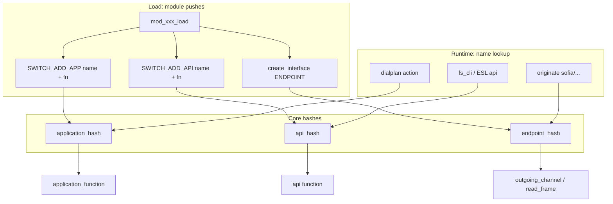

State-handler convention (endpoints): return **`SWITCH_STATUS_SUCCESS`** to let the core run the standard `CS_*` handler; **`SWITCH_STATUS_FALSE`** to skip it. Sofia’s tables: `sofia_io_routines`, `sofia_event_handlers` in `mod_sofia.c`.

##### Why there is no IDL

Core and modules compile against the same `switch.h`. Signatures such as `switch_application_function_t` are shared at **compile** time. At **run** time only the name→pointer map is missing, and load fills it. Out-of-process RPC would need an IDL; in-process C plugins do not.

**Not** this contract: `private_object_t` / `sofia_profile_t` on `switch_core_session_get_private()`; Sofia-SIP `nua`/`sip_t`. `src/mod/<category>/` is only Autotools layout.

##### Analogy (GStreamer)

GStreamer also registers by name, but the unit is a **GType / element factory** that **constructs instances**. FreeSWITCH’s unit is a **pre-existing C function** hung on a hash. `gst_element_factory_make("videoconvert")` vs `get_application_interface("bridge")` then call `application_function`. No GObject in this tree.

How XML `<load>` reaches `dlopen`: [Runtime load tag](#runtime-load-tag). Dispatch traces: [Interface registry lookup](05-workflows.md#interface-registry-lookup). Naming: [Conventions](../4.development/01-conventions.md). Operator lists: [Users Manual Chapter 5](https://developer.signalwire.com/freeswitch/configuration/module-loading/).

Source map: `switch_loadable_module_load_file`, `create_module_interface`, `create_interface`, `switch_loadable_module_process`, `get_*_interface`, `switch_api_execute`, `switch_core_session_outgoing_channel`, `switch_core_session_exec`.

#### Media path

- **Responsibilities**: RTP/SRTP, jitter buffer, codecs, video, media bugs (tap/spy).
- **Key entry points**: `src/switch_rtp.c`, `src/switch_core_media.c`, `src/switch_jitterbuffer.c`, codec modules under `src/mod/codecs/`.
- **Failure modes**: NAT, wrong ptime (default 20 ms assumption in `switch.conf.xml`), codec mismatch forcing transcoding.
- **Runtime sequence**: Sofia-SIP profile thread → `sofia_event_callback()` → session signal-data queue → `sofia_receive_message()` → `sofia_handle_sip_i_state()` → SDP negotiation → local port selection / SDP generation → `switch_core_media_activate_rtp()` → endpoint `read_frame` / `write_frame` → `switch_rtp_zerocopy_read_frame()` / `switch_rtp_write_frame()`. The detailed timing and call graph are in [Media negotiation and RTP activation](05-workflows.md#media-negotiation-and-rtp-activation).

#### Signaling endpoints (in-process)

- **Sofia (`mod_sofia`)**: SIP. Registers endpoint name `"sofia"` plus APIs/apps/chat ([Loadable module contract](#loadable-module-contract)). State handlers in `src/mod/endpoints/mod_sofia/mod_sofia.c`. Profiles in `conf/vanilla/sip_profiles/` (internal auth vs external `auth-calls=false`). Vanilla **internal** `context` is `public`; authenticated directory users override with `user_context` ([Chapter 7](https://developer.signalwire.com/freeswitch/users-and-endpoints/sip-profiles)). UDP/TCP sockets live in Sofia-SIP tport, not in `libfreeswitch` — see [Sofia-SIP (out of tree)](#sofia-sip-out-of-tree).
- **Verto (`mod_verto`)**: HTML5/WebRTC, endpoint name `verto.rtc`.
- **Loopback / RTC**: in-process and WebRTC helper endpoints loaded by vanilla `modules.conf.xml`.

Media mode on a Sofia profile ([Chapter 17](https://developer.signalwire.com/freeswitch/media-and-codecs/handling)): vanilla internal sets `inbound-late-negotiation=true` (defer A-leg codec until after dialplan). `inbound-bypass-media` sets `CF_PROXY_MODE` (RTP endpoint-to-endpoint); `inbound-proxy-media` sets `CF_PROXY_MEDIA` (RTP through the server without payload inspection).

#### Sofia-SIP (out of tree)

[Sofia-SIP](https://github.com/freeswitch/sofia-sip) is an LGPL, RFC 3261 SIP User-Agent library (Nokia Research Center lineage; FreeSWITCH maintains the fork used here). It is **not** under `libs/`. `configure.ac` requires `sofia-sip-ua >= 1.13.18`. Install/build notes: [Quick Start](../0.getting-started/02-quick-start.md), [FAQ](../7.appendix/02-faq.md). Submodule map: [Tech Stack](02-tech-stack.md#sofia-sip-library).

`mod_sofia` is the application on top of `libsofia-sip-ua`. One **profile thread** owns one `su_root_t` reactor and one (or more alias) `nua_t` from `nua_create(..., sofia_event_callback, profile, NUTAG_URL(bindurl), ...)`. `su_root_step()` waits on tport file descriptors. Inbound bytes become `sip_t` in the library; the first FreeSWITCH symbol is `sofia_event_callback`. That callback clones the event (`nua_save_event`) and hops to a **session** thread (`signal_data_queue`) or the global **MSG** queue so the profile thread can keep reading packets. Packet-level INVITE trace: [Inbound SIP Call](05-workflows.md#inbound-sip-call). NUA/NTA usage, tag lists, and callback rules: [Tech Stack — Sofia-SIP library](02-tech-stack.md#sofia-sip-library).

SIP retransmission timers (`NTATAG_SIP_T1` / `T2` / `T4`) and TCP keepalive tags are Sofia-SIP tport/nta, configured from profile XML in `nua_create`. RTP is **not** Sofia-SIP; it is `switch_rtp` after SDP negotiation.

#### Dialplan and applications

- **Dialplan**: `mod_dialplan_xml` matches XML extensions (`src/mod/dialplans/mod_dialplan_xml/mod_dialplan_xml.c`). Asterisk-style `mod_dialplan_asterisk` is optional.
- **Applications**: `mod_dptools` (bridge, answer, playback, …), `mod_conference`, `mod_voicemail`, `mod_commands` (CLI/API). Originate lives in core `switch_ivr_originate()` (`src/switch_ivr_originate.c`).

#### Event engine and ESL

- **Bus**: APR FIFO + backend thread (`src/include/switch_event.h`). Bind callbacks or consume from `mod_event_socket`.
- **ESL**: the vanilla `mod_event_socket` configuration listens on wildcard
  IPv6 `::`:8021 with password `ClueCon`; the module sample binds
  `127.0.0.1`. `fs_cli` is built from `libs/esl/fs_cli.c` and targets
  `127.0.0.1:8021` by default. Auth flag `LFLAG_AUTHED` is in
  `mod_event_socket.c`. Slow consumers must queue locally — the core warns
  against blocking the delivery thread.

#### Logging

- `mod_console`, `mod_logfile` (vanilla loads both). Levels via `SWITCH_CHANNEL_LOG` macros in `switch_types.h`.

## Code-Level View

Only types on the hot path. Full headers are the API; this is the map.

| Area | Important files or symbols | Why it matters |
|------|-----------------------------|----------------|
| Process boot | `src/switch.c` `main`; `switch_core_init`, `switch_core_init_and_modload` | Single-runlevel init; modules load only in the second function |
| Session | `struct switch_core_session` in `src/include/private/switch_core_pvt.h`; `switch_core_session_request_uuid` | UUID, endpoint pointer, codec pair, event/message queues, media bugs |
| Channel | `switch_channel_t`, `switch_channel_state_t` (`CS_*`), call state `CCS_*` | Dialplan and apps key off channel state/variables |
| Endpoint contract | `switch_endpoint_interface_t`, `switch_io_routines_t`, `switch_state_handler_table_t` | Channel prefix + IO + `CS_*` hooks; [Loadable module contract](#loadable-module-contract) |
| Sofia profile I/O | `sofia_profile_thread_run`, `nua_create`, `sofia_event_callback` | Profile thread owns SIP sockets via Sofia-SIP `su_root` |
| Module contract | `SWITCH_MODULE_DEFINITION`, `switch_loadable_module_interface_t`, `SWITCH_ADD_*` | In-process DSO extensibility; lookup by name |
| Events | `switch_event_t`, `SWITCH_EVENT_CHANNEL_*`, `SWITCH_EVENT_STARTUP` | ESL, CDR, and scripts subscribe here |
| XML | `switch_xml_open_root`, preprocessor in `conf/vanilla/freeswitch.xml` | Config is data, not code |
| Originate / bridge | `switch_ivr_originate`, `src/switch_ivr_bridge.c` | Outbound legs and B2BUA |

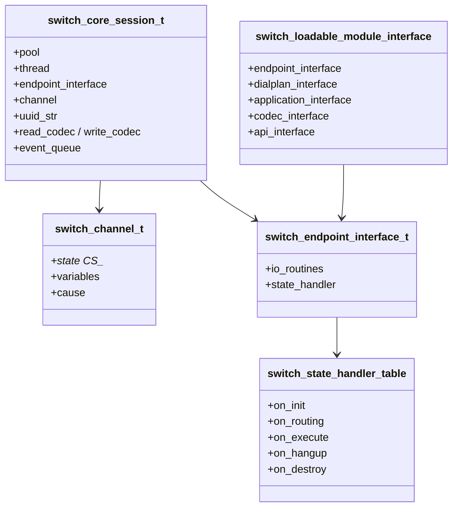

UML nearest match: class diagram + state machine (channel states above).

## Key Runtime Flows

### Inbound SIP call (vanilla)

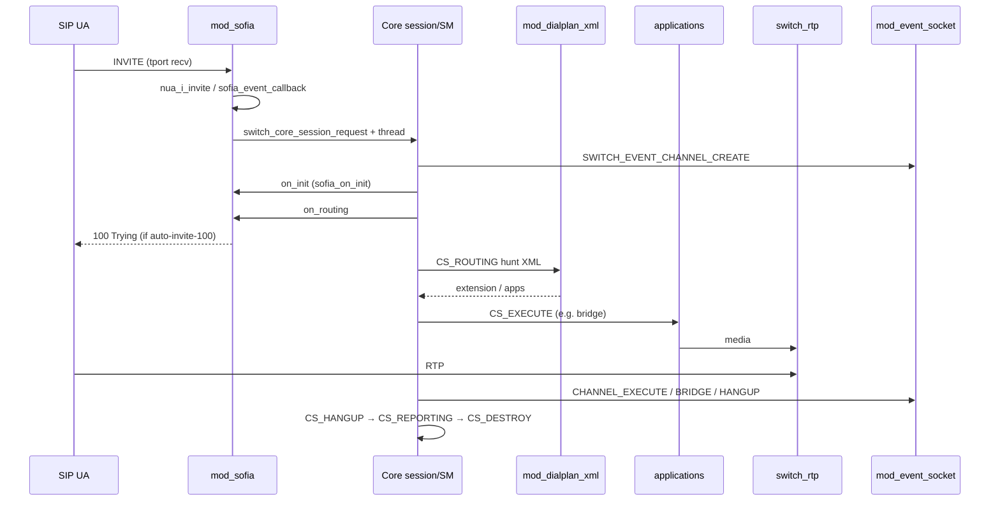

- **Success path**: UDP/TCP packet → Sofia-SIP tport/nta/nua → `sofia_event_callback` (profile thread) → session thread `CS_NEW` → INIT/ROUTING → XML extension → apps (bridge/conference/voicemail) → RTP → hangup/CDR events. Detail: [Workflows](05-workflows.md#inbound-sip-call).
- **Validation boundaries**: Sofia profile ACL (`apply-inbound-acl` on internal profile uses `domains` from `acl.conf.xml`); `auth-calls` on internal vs `false` on external; directory digest auth for users 1000–1019 in vanilla. Authenticated INVITE uses directory `user_context` (`default`); the profile’s own `context=public` is for unauthenticated inbound only ([Chapter 1](https://developer.signalwire.com/freeswitch/foundations/introduction) anatomy of a call).
- **Consistency**: one session thread owns the channel state machine. SQL scoreboard is internal (disable with `-nosql`). Channel recovery flags `CF_RECOVERING` skip routing and jump to `CS_EXECUTE`.
- **Retry / compensation**: SIP retransmits are Sofia/Sofia-SIP’s job. Dialplan `bridge` failover is application-level (pipe-separated gateways), not a core saga. ESL clients must not block the event thread.

### Outbound originate

`switch_ivr_originate()` allocates an outbound session through the named endpoint (`sofia/gateway/...`, `loopback/...`), runs the same state table with `TFLAG_OUTBOUND` so `sofia_on_init` sends INVITE via `sofia_glue_do_invite()`.

### ESL control

Client connects to 8021, authenticates, then `api` / `bgapi` / `event` / `sendmsg` (uuid). Health check used by Docker: `fs_cli -x status` must match `^UP`.

## Cross-Cutting Concerns

- **Authentication and authorization**: SIP digest + ACL lists (`conf/vanilla/autoload_configs/acl.conf.xml`, Sofia `apply-inbound-acl`). ESL password in `event_socket.conf.xml` (default `ClueCon`); vanilla binds to wildcard `::` with its inbound ACL commented out, while the module sample is loopback-only. Directory users are **not** OS users.
- **Error handling**: `switch_status_t` and hangup `switch_call_cause_t` on the channel. Endpoints return `SWITCH_STATUS_FALSE` from a state handler to skip the core’s standard handler (`sofia_on_init` comment).
- **Logging and tracing**: `switch_log_printf` with session UUID via `SWITCH_CHANNEL_SESSION_LOG`. Sofia `siptrace` is a profile/CLI switch, not distributed tracing. No OpenTelemetry in this tree.
- **Caching**: compiled XML root is memory-mapped (`freeswitch.xml.fsxml`); `reloadxml` re-parses. Directory/ACL can be rebuilt from XML. RTP jitter buffer is per-session, not a shared cache.
- **Configuration and secrets**: XML under `confdir`; `vars.xml` preprocessor `$$` vars (including `default_password`). Not a secret manager. Change demo passwords before any public bind (`conf/vanilla/README_IMPORTANT.txt`).

## Deployment and Scaling Notes

- **Environments**: same binary; profile choice (`vanilla`, `sbc`, `minimal`, `curl`) is the environment. CI builds on Debian containers, macOS, Windows.
- **Scaling model**: **vertical** (more cores / less transcoding) and **more processes/hosts** behind an SBC or Kamailio. Not a horizontally sharded in-process cluster. RTP needs host networking in Docker (`docker/README.md`).
- **Recovery**: `-nonat` to skip UPnP pinholes; session recovery flags in the state machine; core SQL can persist some state. Site HA, backups, and RTO are **[NEEDS INPUT: operator-owned]** — not specified in this repo.

## Related Documentation

- [Overview](../0.getting-started/01-overview.md) ([FS core concepts](../0.getting-started/01-overview.md#fs-core-concepts))
- [C Runtime Framework](06-c-runtime.md)
- [Tech Stack](02-tech-stack.md) (Sofia-SIP NUA usage: [Sofia-SIP library](02-tech-stack.md#sofia-sip-library))
- [Repository Map](03-repo-map.md)
- [Data and API](04-data-and-api.md)
- [Conventions](../4.development/01-conventions.md)
- [Workflows](05-workflows.md)
- [ADRs](../7.appendix/6.decisions/adr/index.md)
- [Users Manual Ch 1](https://developer.signalwire.com/freeswitch/foundations/introduction), [Ch 3 XML](https://developer.signalwire.com/freeswitch/configuration/xml), [Ch 5 modules](https://developer.signalwire.com/freeswitch/configuration/module-loading/)

---
<!-- PKB-metadata
last_updated: 2026-09-17
commit: 2db0ee9a64
updated_by: human+ai
review_status: pending
review_score: 0
reviewed_by:
confidentiality: L1
-->
