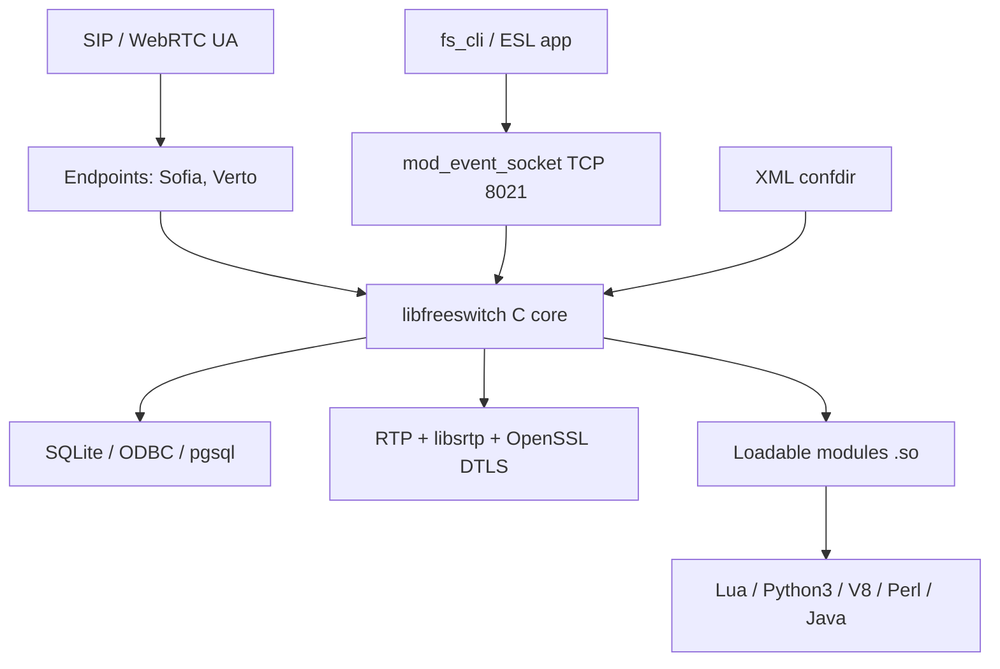

# 03. Tech Stack

<!-- maintained-by: human+ai -->

FreeSWITCH is a **C Autotools** softswitch. There is no `package.json` / `go.mod` / `Cargo.toml` for the product. `scripts/gen_tech_stack.py` only found the **PKB Sphinx** manifests under `man/` (see `_generated/02-tech-stack.generated.md`). Product versions below come from `configure.ac` `PKG_CHECK_MODULES` / `AC_CHECK_LIB` floors and from bundled `libs/` headers.

This tree is **1.11.3-dev** (`AC_INIT` in `configure.ac`).

## Purpose

A threaded C core (`libfreeswitch`) plus loadable DSOs implement SIP/WebRTC switching, RTP, dialplan, and ESL. DSOs **register** named C interfaces into core hashes at load; they are not described by an IDL ([Architecture — Loadable module contract](01-architecture.md#loadable-module-contract)). System libraries (Sofia-SIP, SpanDSP, OpenSSL, libks) and a few vendored trees (`libs/apr`, `libs/srtp`, `libs/libvpx`, …) provide portability, crypto, and codecs.

## System View



## Stack Summary

| Layer | Main technology | Why it exists in this repo |
|-------|-----------------|----------------------------|
| Signaling | Sofia-SIP (`sofia-sip-ua >= 1.13.18`), Verto + libks | SIP and HTML5/WebRTC endpoints (`mod_sofia`, `mod_verto`) |
| Runtime | C11-era C + pthreads; some C++ modules | Core, modules, Windows service |
| Media | RTP (`src/switch_rtp.c`), Cisco libSRTP 2.4.0, Opus, SpeexDSP, SpanDSP, libvpx 1.12.0 | Real-time audio/video, SRTP, fax/modem, VP8/VP9 |
| Control plane | ESL (`libs/esl`) + `mod_event_socket` | Out-of-process API; `fs_cli` |
| Config | XML + preprocessor | Dialplan, directory, profiles — not compiled constants |
| Storage | SQLite `>= 3.6.20` (core); optional PostgreSQL / MariaDB `>= 3.0.9` | Scoreboard, voicemail/CDR backends |
| Build | Autotools (autoconf `>= 2.59`, automake `>= 1.7`, libtool `>= 1.5.14`) | Unix; Windows via `Freeswitch.2017.sln` |
| Testing | FCTX macros in `src/include/test/switch_fct.h` via `switch_test.h` | `tests/unit/` Autotools programs |
| Docs PKB | Sphinx + MyST + sphinx-intl (`man/pyproject.toml`, Python `>=3.10,<4.0`) | This knowledge base only — not linked into `freeswitch` |

## Main Languages and Frameworks

- **Primary language**: C (core `src/switch_*.c`, most modules). Public API is `src/include/switch.h`.
- **Secondary languages**: C++ (`src/switch_cpp.cpp`, `mod_v8`, `mod_opal`, `mod_cv`, `mod_mariadb` headers); Lua (`mod_lua`, tries luajit then lua 5.3/5.2/5.1); Python 3 (`mod_python3`); JavaScript via V8 (`mod_v8`); Perl, Java, C# (`mod_managed`).
- **Primary “framework”**: FreeSWITCH module ABI (`SWITCH_MODULE_DEFINITION`, `switch_loadable_module_interface`) — not a web framework.
- **Build tool**: GNU Autotools (`bootstrap.sh` → `configure` → `make`). Historical `src/CMakeLists.txt` (CMake 2.6 comment) is not the CI path. macOS CI uses Homebrew; Linux CI uses Debian **bookworm** / **trixie** images (`.github/workflows/`).

## Key Dependencies

Minimum versions are **configure floors**. Distro packages may be newer. Out-of-tree deps are **not** in this git tree.

| Package | Area | Why it matters | Evidence |
|---------|------|----------------|----------|
| Sofia-SIP `sofia-sip-ua >= 1.13.18` | SIP | `mod_sofia`; CI clones [`freeswitch/sofia-sip`](https://github.com/freeswitch/sofia-sip) | `configure.ac` |
| SpanDSP `>= 3.1.1` | DSP / fax / some codecs | `mod_spandsp`; hard error if missing | `configure.ac` |
| libks2 `>= 2.0.11` or libks `>= 1.8.2` | KS runtime | Required if `mod_verto` or `mod_signalwire` enabled | `configure.ac` |
| signalwire_client2 `>= 2.0.0` or signalwire_client `>= 1.0.0` | Cloud pairing | `mod_signalwire` | `configure.ac` |
| OpenSSL `>= 1.0.1e` | TLS / DTLS-SRTP | `SAC_OPENSSL`; `SSL_CTX_set_tlsext_use_srtp`, `DTLSv1_method` | `configure.ac` |
| SQLite `>= 3.6.20` | Core DB | `sqlite3_initialize()` in `switch_core_init` | `configure.ac`, `src/switch_core.c` |
| PCRE2 `libpcre2-8 >= 10.00` | Regex | Dialplan / XML matching | `configure.ac` |
| libcurl `>= 7.19` | HTTP | `mod_xml_curl`, `mod_http_cache`, core CURL | `configure.ac` |
| libedit `>= 2.11` | Console | CLI line editing; `--disable-core-libedit-support` to skip | `configure.ac` |
| zlib | Compression | Hard error if missing | `configure.ac` |
| libjpeg | Images | Hard error if missing | `configure.ac` |
| Speex / SpeexDSP `>= 1.2rc1` | Audio | Core codecs / AGC | `configure.ac` |
| Opus `>= 1.1` | Audio | `mod_opus` | `configure.ac` |
| libsndfile `>= 1.0.20` | Files | `mod_sndfile` | `configure.ac` |
| APR 1.2.8 (forked as `fspr`) | Portability | Bundled `libs/apr` (`fspr_version.h`) unless `SYSTEM_APR`. OS abstraction only — telephony types are core ([C Runtime](06-c-runtime.md)) | `libs/apr/include/fspr_version.h` |
| libSRTP **2.4.0** | SRTP | Bundled `libs/srtp` | `libs/srtp/configure.ac` `AC_INIT` |
| libvpx **1.12.0** (“Torrent Duck”) | VP8/VP9 | Bundled `libs/libvpx` | `libs/libvpx/README` |
| libyuv | Video scale/convert | Bundled `libs/libyuv` | `libs/libyuv/README.md` |
| PostgreSQL libpq | Optional DB | `mod_pgsql`; `AC_CHECK_LIB([pq])` | `configure.ac` |
| MariaDB `>= 3.0.9` | Optional DB | `mod_mariadb` | `configure.ac` |
| FFmpeg libs (avcodec `>= 53.35.0`, avformat, swscale, …) | Optional A/V | `mod_av` | `configure.ac`, `debian/control-modules` |
| Python 3 | Embedded scripts | `mod_python3`; version taken from `python3 -V` at configure | `configure.ac` |

Optional/module-only floors also exist for mpg123, shout, AMR, codec2, flite, mongoc, memcached, AMQP `librabbitmq >= 0.5.2`, pocketsphinx `>= 5`, OpenCV, VLC, ImageMagick, and others in `configure.ac` — enable the matching `modules.conf` line or the check is skipped.

## Sofia-SIP library

[Sofia-SIP](https://github.com/freeswitch/sofia-sip) (`sofia-sip-ua`) is the SIP stack under `mod_sofia`. It is a separate Autotools/LGPL project: RFC 3261 User-Agent library, originally from Nokia Research Center, forked and maintained for FreeSWITCH. Historical site: [sofia-sip.sourceforge.net](http://sofia-sip.sourceforge.net). **Do not look for it under `libs/`** (APR, SRTP, ESL, VPX *are* bundled). CI clones the GitHub repo; macOS CI uses Homebrew `sofia-sip`.

`mod_sofia` links `libsofia-sip-ua` and drives it through NUA. Useful source trees in that repo (`libsofia-sip-ua/`):

| Submodule | Role in an inbound INVITE |
|-----------|---------------------------|
| `su` | Portable OS layer; `su_root_t` event loop (`select`/`kqueue`/`epoll`) |
| `tport` | UDP/TCP/TLS/WS sockets, `recv`/`send`, siptrace (`TPTAG_LOG`) |
| `msg` / `sip` / `bnf` / `url` | Message parser and SIP header objects (`sip_t`) |
| `nta` | RFC 3261 transactions and dialogs |
| `nua` | High-level UA: `nua_create`, `nua_i_invite`, `nua_respond`, `nua_bye` |
| `sdp` / `soa` | SDP offer/answer helpers used with media tags |
| `sresolv` | DNS SRV/NAPTR (`NTATAG_USE_SRV` / `USE_NAPTR` from the Sofia profile) |
| `iptsec` | Digest / auth helpers used with REGISTER and INVITE |

How FreeSWITCH binds a profile and hops off the stack thread: [Architecture](01-architecture.md#sofia-sip-out-of-tree). Byte-level INVITE: [Workflows](05-workflows.md#packet-path-udptcp-to-nua). API usage below.

Example clients in the Sofia-SIP tree (`utils/`: `sip-options`, `sip-date`) are **not** FreeSWITCH modules. Historical NUA/NTA reference: [sofia-sip.sourceforge.net/refdocs](http://sofia-sip.sourceforge.net/refdocs/). Compile against the library with `pkg-config --cflags --libs sofia-sip-ua`.

### NUA versus NTA

Daily use is **event loop + UA + tag list + callback on `sip_t`**.

| Layer | Header | You do | Who uses it here |
|-------|--------|--------|------------------|
| **su** | `sofia-sip/su.h` | Threads, `su_home` allocator, `su_root` reactor | Every Sofia program |
| **tport** | `sofia-sip/tport_tag.h` | UDP/TCP/TLS `bind`/`recv` (internal) | NTA and NUA |
| **nta** | `sofia-sip/nta.h` | Transactions; you assemble OPTIONS/INVITE | Sofia-SIP `utils/sip-options.c` |
| **nua** | `sofia-sip/nua.h` | Full UA: dialogs, 100rel, session timers | **`mod_sofia`** |

A softswitch or B2BUA uses **NUA**. A one-shot OPTIONS probe can use **NTA**.

### Tag lists

Optional arguments are a tag list and **must** end with `TAG_END()`:

```c
NUTAG_URL("sip:0.0.0.0:5060"),
SIPTAG_USER_AGENT_STR("my-ua"),
TAG_END()
```

`NUTAG_*` configures NUA, `NTATAG_*` the transaction agent, `TPTAG_*` transport, `SIPTAG_*` SIP headers. `mod_sofia` passes the same families from profile XML into `nua_create()` / `nua_set_params()`.

### Minimal NUA agent

Same skeleton as a Sofia profile: create `su_root`, `nua_create` with a callback and bind URL, then run the reactor.

```c
#include <sofia-sip/su.h>
#include <sofia-sip/nua.h>
#include <sofia-sip/sip_status.h>

static void on_nua(nua_event_t event, int status, char const *phrase,
                   nua_t *nua, nua_magic_t *magic,
                   nua_handle_t *nh, nua_hmagic_t *hmagic,
                   sip_t const *sip, tagi_t tags[])
{
    switch (event) {
    case nua_i_invite:
        nua_respond(nh, SIP_180_RINGING, TAG_END());
        nua_respond(nh, SIP_200_OK, TAG_END());
        break;
    case nua_i_bye:
        nua_respond(nh, SIP_200_OK, TAG_END());
        nua_handle_destroy(nh);
        break;
    case nua_r_shutdown:
        su_root_break((su_root_t *)magic);
        break;
    default:
        break;
    }
}

int main(void)
{
    su_root_t *root;
    nua_t *nua;

    su_init();
    root = su_root_create(NULL);
    nua = nua_create(root, on_nua, root,
                     NUTAG_URL("sip:*:5060"),
                     NUTAG_AUTOANSWER(0),
                     TAG_END());
    su_root_run(root);
    nua_destroy(nua);
    su_root_destroy(root);
    su_deinit();
    return 0;
}
```

FreeSWITCH does not block on `su_root_run()`. The profile thread calls `su_root_step(profile->s_root, 1000)` so it can interleave other work. Shutdown is `nua_shutdown` → wait for `nua_r_shutdown` → `nua_destroy` → `su_root_destroy` (`sofia_profile_thread_run` in `src/mod/endpoints/mod_sofia/sofia.c`).

### Callback arguments and events

`mod_sofia` types the NUA magic pointer as `sofia_profile_t *` (`sofia_event_callback` in `sofia.c`).

| Argument | Meaning |
|----------|---------|
| `event` | `nua_i_*` inbound request/notice; `nua_r_*` is a **response to a request this UA sent** |
| `status` / `phrase` | SIP status (meaningful on `nua_r_*`) |
| `nh` | Handle for this dialog/transaction; pass it to `nua_respond` / `nua_bye` |
| `sip` | Parsed message (`sip_from`, `sip_to`, `sip_call_id`, `sip_contact`, `sip_payload`) |
| `hmagic` | Pointer from `nua_handle_bind(nh, ptr)` |

| Event | When | Typical action |
|-------|------|----------------|
| `nua_i_invite` | Inbound INVITE | `nua_respond(nh, 100/180/200, …)` |
| `nua_i_register` | REGISTER | Challenge or 200 |
| `nua_i_state` | Call-state / SDP progress | Read `NUTAG_CALLSTATE` |
| `nua_r_invite` | Response to **your** INVITE | Handle 401 / 180 / 200 |
| `nua_i_bye` / `nua_i_cancel` | Peer ended the call | 200 then `nua_handle_destroy` |

Outbound INVITE:

```c
nua_handle_t *nh = nua_handle(nua, my_leg, TAG_END());
nua_invite(nh,
           SIPTAG_TO_STR("sip:1001@example.com"),
           SOATAG_USER_SDP_STR(sdp),
           TAG_END());
```

Answer with SDP: `nua_respond(nh, SIP_200_OK, SOATAG_USER_SDP_STR(sdp), TAG_END())`. Hang up: `nua_bye(nh, TAG_END())`. Unknown headers: `SIPTAG_HEADER_STR("X-Foo: bar")`.

### Stack-thread rules

These are why `mod_sofia` clones events off the profile thread:

1. **Stack thread.** `nua_create`, `nua_invite`, `nua_respond`, `nua_destroy`, and the NUA callback all run on the thread that drives `su_root_run` / `su_root_step`. Do not hunt dialplan, block on SQL, or sleep in the callback — that stalls SIP I/O. FreeSWITCH copies the event with `nua_save_event` onto `signal_data_queue` or `msg_queue`.
2. **Handle lifetime.** One `nua_handle_t` per dialog. Inbound handles are created by the stack; bind application state with `nua_handle_bind`. Destroy with `nua_handle_destroy`. Crossing threads requires `nua_handle_ref` / `nua_handle_unref` (and the `*_user` variants).
3. **Memory.** `sip_t` is valid only until the callback returns. Copy Call-ID / Contact into a `su_home_t` (`su_strdup`) or your own heap. Destroying the home frees those copies.

### Reading sip_t

```c
if (sip && sip->sip_request)
    /* method name + Request-URI: sip->sip_request->rq_method_name,
       url_as_string(..., sip->sip_request->rq_url) */
if (sip->sip_from)
    /* sip->sip_from->a_url->url_user */
if (sip->sip_payload)
    /* SDP: sip_payload->pl_data / pl_len */
```

Walk unknown headers on `sip->sip_unknown`.

### NTA OPTIONS example

[sofia-sip `utils/sip-options.c`](https://github.com/freeswitch/sofia-sip/blob/master/utils/sip-options.c) (not in this git tree):

```c
su_init();
root = su_root_create(ctx);
agent = nta_agent_create(root, URL_STRING_MAKE("sip:*:*"),
                         NULL, NULL, TAG_END());  /* ignore inbound */
leg = nta_leg_tcreate(agent, NULL, NULL,
                      SIPTAG_FROM(from), SIPTAG_TO(to), TAG_END());
orq = nta_outgoing_tcreate(leg, response_cb, ctx, NULL,
                           sip_method_options, NULL, r_uri, TAG_END());
su_root_run(root);  /* 2xx handler calls su_root_break */
```

That is fire-and-forget. FreeSWITCH does not originate calls this way; NUA owns dialog and SDP state.

### Mapping to mod_sofia

| Sofia-SIP | FreeSWITCH |
|-----------|------------|
| One `su_root` + one `nua` | One SIP **profile** thread |
| `NUTAG_URL(bindurl)` | `sip-ip` / `sip-port`; default `transport=udp,tcp` |
| NUA callback | `sofia_event_callback` (admit, then `nua_save_event`) |
| `nua_handle` + `nua_handle_bind` | `sofia_private` / session UUID |
| `nua_invite` / `nua_respond` / `nua_bye` | `sofia_glue_do_invite`, `sofia_acknowledge_call`, `sofia_on_hangup` |
| SDP via `soa` | Then **`switch_rtp`** — RTP is not Sofia-SIP |

Debug: environment `TPORT_LOG=1`, `NTA_DEBUG`, or `sofia profile <name> siptrace on` (`TPTAG_LOG` on the profile). See [Observability](../5.operations/02-observability.md).

The stock build is not limited to the hard core dependencies: uncommented
entries in `build/modules.conf.in` enable `mod_av`, `mod_pgsql`, and
`mod_sndfile`, and the vanilla runtime configuration loads them. Install
FFmpeg/libswscale, libpq, and libsndfile development packages for that
default module set, or disable both the build entry and the corresponding
runtime `<load>` when those capabilities are not needed.

## Runtime Interaction Model

1. **Signaling** (Sofia/Verto) accepts a call and asks the core for a `switch_core_session_t`.
2. **Core** runs the channel state machine; **XML dialplan** (`mod_dialplan_xml`) picks applications.
3. **Applications** (dptools, conference, …) bridge or play media; **codecs** and **libSRTP/OpenSSL** handle RTP.
4. **Events** go to the in-process bus; **ESL** clients and CDR modules consume them. **SQLite** holds core scoreboard unless `-nosql`.

Layers do **not** talk over HTTP internally. The process is the unit of composition; DSOs register interface tables.

## Build and Packaging Notes

- **Local development**: `./bootstrap.sh -j && ./configure --prefix=... --disable-fhs && make && make install` ([Quick Start](../0.getting-started/02-quick-start.md)). Debug: `./devel-bootstrap.sh`.
- **CI**: `.github/workflows/ci.yml` (Debian bookworm-amd64 base `signalwire/freeswitch-public-ci-base`), `macos.yml` (Homebrew + `signalwire/homebrew-signalwire/{libks2,signalwire-c2,spandsp}`), `windows.yml`, `scan-build.yml` (clang-14).
- **Production / distro**: Debian packages via FSGET/FSDEB (`scripts/packaging/`); module `Build-Depends` in `debian/control-modules` (Bookworm vs Trixie ffmpeg package names differ). Docker packaged images need a SignalWire token (`docker/master/Dockerfile`); source image recipe is `docker/examples/Debian11/Dockerfile`.
- **Windows**: Visual Studio 2017 solution `Freeswitch.2017.sln`, projects under `w32/`.

## Docs tooling (not in the switch binary)

`man/pyproject.toml` / `man/requirements.txt`: Python `^3.10`, Sphinx `>=7`, myst-parser, sphinx-rtd-theme, sphinx-intl, sphinxcontrib-mermaid. Used only to build this PKB.

## Common Misconceptions

| Misconception | Reality in this repo |
|---------------|----------------------|
| FreeSWITCH is a Node/Java/Go service | It is a C process with optional language modules |
| Sofia-SIP / SpanDSP / libks live in `libs/` | They are **external**; CI and Docker clone and install them first |
| `src/CMakeLists.txt` is how you build | Autotools is the supported Unix path; CMake file is historical |
| `man/pyproject.toml` is a product dependency | It is Sphinx for documentation only |
| `build/` is a CMake output directory | It is Autotools helper sources (`modules.conf.in`, config macros) |
| SQLite is optional for a default core | Core calls `sqlite3_initialize()` at init; `-nosql` only disables the internal SQL scoreboard |
| One `modules.conf` | Build-time `modules.conf` vs runtime `autoload_configs/modules.conf.xml` ([Architecture](01-architecture.md)) |

## Related Documentation

- [Architecture](01-architecture.md)
- [C Runtime Framework](06-c-runtime.md)
- [Workflows](05-workflows.md#packet-path-udptcp-to-nua)
- [Observability](../5.operations/02-observability.md)
- [Repository Map](03-repo-map.md)
- [Quick Start](../0.getting-started/02-quick-start.md)
- [Build](../4.development/02-build.md)
- [Sofia-SIP](https://github.com/freeswitch/sofia-sip)

---
<!-- PKB-metadata
last_updated: 2026-09-07
commit: d7b5a87be8
updated_by: human+ai
review_status: pending
review_score: 0
reviewed_by:
confidentiality: L1
-->
