# 06. Workflows

<!-- maintained-by: human+ai -->

Critical **runtime** paths in this tree. Channel states (`CS_*`) and the state-handler contract are in [Architecture](01-architecture.md); ESL commands, events, and SQL tables are in [Data and API](04-data-and-api.md). Default inbound progression after create: `CS_NEW` → `CS_INIT` → `CS_ROUTING` → `CS_EXECUTE` → media or hangup `CS_HANGUP` → `CS_REPORTING` → `CS_DESTROY` (`src/include/switch_types.h`).

These flows use vanilla XML (`conf/vanilla/`). Other profiles (`conf/sbc`, `conf/minimal`, `conf/curl`) change bind ports, auth, and whether directory/dialplan come from files or `mod_xml_curl`. Operator-level walkthrough of the same 1000→1001 call: [Users Manual Chapter 1](https://developer.signalwire.com/freeswitch/foundations/introduction).

## Workflow Index

1. [Server startup](#server-startup) ([runtime `<load>` tag](#runtime-load-tag))
2. [Interface registry lookup](#interface-registry-lookup) ([`answer` golden path](#worked-example-answer))
3. [Inbound SIP call](#inbound-sip-call) ([`show channels` during a bridge](#worked-example-show-channels-during-a-bridge))
   - [Media negotiation and RTP activation](#media-negotiation-and-rtp-activation)
4. [SIP registration and directory lookup](#sip-registration-and-directory-lookup) ([Digest after 401](#worked-example-register-digest-after-401))
5. [ESL originate and event control](#esl-originate-and-event-control)
6. [XML reload](#xml-reload)

Vanilla 1000 calling 1001 (config files, not C): REGISTER on `sip_profiles/internal.xml` → directory `directory/default/1000.xml` (`user_context=default`) → INVITE `1001` → `dialplan/default.xml` `Local_Extension` → `bridge` `user/${dialed_extension}@${domain_name}`. Internal profile `context` is `public`; that value applies only to **unauthenticated** inbound. Late codec negotiation: `inbound-late-negotiation=true` on the internal profile.

Packet receive through Sofia-SIP (`su` / `tport` / `nta` / `nua`) is **out of this git tree**. Stack layout and NUA usage: [Sofia-SIP library](02-tech-stack.md#sofia-sip-library). Bind and callback symbols: [Architecture](01-architecture.md#sofia-sip-out-of-tree).

---

## Server Startup

### Trigger and Goal

- **Trigger**: execute `freeswitch` with command-line options. The common local command is `freeswitch -ncwait -nonat`; `-ncwait` backgrounds the process and waits for the child to report readiness, while `-nonat` disables automatic NAT detection.
- **Goal**: establish process and runtime state, create the configured directories and PID lock, initialize the core services, load XML configuration and modules, announce `SWITCH_EVENT_STARTUP`, then remain in the console or background runtime loop until shutdown.

### Main Flow

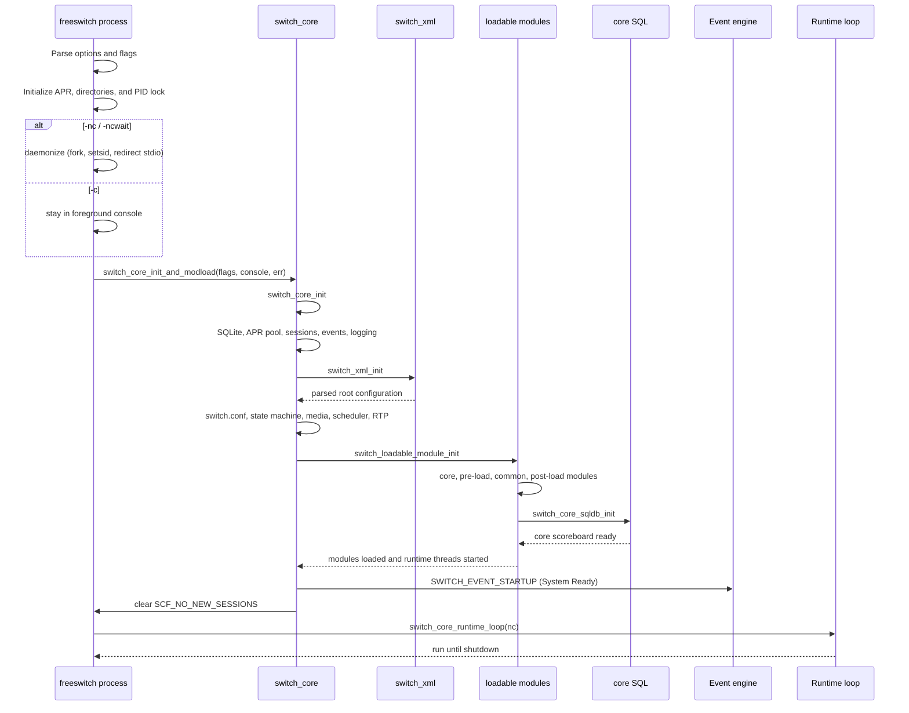

### Key Steps

1. **Parse process options.** `main()` starts with core flags for SQL scoreboard, automatic NAT detection / port mapping, clock calibration, and realtime clock. Options such as `-nosql`, `-nonat`, `-nonatmap`, `-nc`, `-ncwait`, `-c`, `-conf`, `-log`, `-run`, and `-mod` modify those flags or global directories. `FREESWITCH_OPTS` is appended to the command-line arguments before parsing.
2. **Initialize the process runtime.** APR is initialized before the core. `switch_core_set_globals()` resolves the base, configuration, module, log, run, database, and related directories. The process creates or locks `${run_dir}/freeswitch.pid`; a second process using the same run directory exits instead of starting a duplicate server.
3. **Choose foreground or background mode.** `-c` passes `console=true` and enters the interactive console loop. `-nc` backgrounds without waiting. `-ncwait` backgrounds and uses a pipe so the parent waits until initialization succeeds or fails. `-nonat` removes `SCF_USE_AUTO_NAT`; it does not disable SIP or RTP.
4. **Apply process controls.** Signal handlers are installed for shutdown, optional priority is selected (`-rp`, `-lp`, or `-np`), resource limits are set, and `-u` / `-g` can drop to the requested user and group before core initialization.
5. **Initialize the core.** `switch_core_init()` resets runtime state, initializes SQLite, APR-backed memory pools, core session structures, global events, MIME types, console, event engine, and channel globals. It creates the configured directories and sets global variables such as `conf_dir`, `log_dir`, `run_dir`, and `mod_dir`.
6. **Load the root configuration.** `switch_xml_init()` parses the configured `freeswitch.xml` and its preprocessor includes. Unless `SCF_MINIMAL` is set, `switch_core_init()` then loads `switch.conf`, initializes the state machine and media layer, starts the scheduler task thread, performs late NAT initialization, initializes RTP, and schedules heartbeat / IP-check tasks.
7. **Load modules in dependency order.** `switch_loadable_module_init()` first prepares the module registries and loads core modules. It then reads `pre_load_modules.conf.xml`, starts the core SQL scoreboard, releases module-load events held until SQL is ready, reads `modules.conf.xml` and `post_load_modules.conf.xml`, and finally starts module runtime threads. A `critical="true"` module failure aborts startup. How each `<load>` tag is located and executed: [Runtime load tag](#runtime-load-tag).
8. **Publish readiness.** `switch_core_init_and_modload()` logs `Bringing up environment.` and `Loading Modules.`, fires `SWITCH_EVENT_STARTUP` with `Event-Info: System Ready`, prints the banner and startup summary, executes the optional `api_on_startup` command, and clears `SCF_NO_NEW_SESSIONS`. With systemd support it also sends `READY=1`.
9. **Enter the runtime loop.** `switch_core_runtime_loop(nc)` waits on `runtime.running` in background mode or reads console input in foreground mode. `-ncwait` reports readiness to its parent only after the initialization function returns successfully.
10. **Shutdown and cleanup.** SIGTERM / console shutdown leaves the runtime loop, calls `switch_core_destroy()`, marks the runtime as shutting down, rejects new sessions, hangs up existing sessions, shuts down modules and event / XML / RTP services, closes the PID file, removes it, and optionally re-execs when the result is `SWITCH_STATUS_RESTART`.

### Startup Output and Checks

Typical console output includes:

```text
Bringing up environment.
Loading Modules.
FreeSWITCH Started
```

For a background install, readiness should be checked through ESL after the process starts:

```bash
"$HOME/fs/bin/freeswitch" -ncwait -nonat
"$HOME/fs/bin/fs_cli" -x status
```

`fs_cli -x status` should print a line beginning with `UP`. `-ncwait` only means the parent waits for the child initialization handshake; it does not replace an application-level health check.

### Error and Edge Cases

| Case | Where handled | Expected outcome |
|------|---------------|------------------|
| Existing or locked PID file | `main` / `switch_file_lock` | Startup stops; the old PID content is preserved in the failure path |
| Invalid command-line option | `main` | Error text and non-zero exit |
| Missing XML root or malformed configuration | `switch_xml_init` / `switch_xml_open_root` | Initialization fails unless `SCF_MINIMAL` permits missing configuration |
| Core SQL unavailable | `switch_core_sqldb_init` | Module loading is interrupted and startup fails |
| Critical module cannot load | `switch_loadable_module_init` | Logs a critical error and calls `abort()` |
| Non-critical module cannot load | `switch_loadable_module_init` | Logs the module error and continues loading other modules |
| `-ncwait` child initialization failure | `daemonize` pipe handshake | Parent reports `Error starting system!` and exits after terminating the child |
| SIGTERM | `handle_SIGTERM` / `handle_SIGILL` | Requests elegant or immediate core shutdown, depending on `-elegant-term` |
| Restart requested by a module / API | `switch_core_destroy` → `main` | PID file is removed and the process re-execs, with a fork/system fallback |

### Data and Contracts Involved

- Global directory structure: `SWITCH_GLOBAL_dirs` and `${run_dir}/freeswitch.pid`.
- Runtime flags: `SCF_USE_SQL`, `SCF_USE_AUTO_NAT`, `SCF_USE_NAT_MAPPING`, `SCF_NO_NEW_SESSIONS`, and `SCF_SHUTTING_DOWN`.
- XML configuration layers: `freeswitch.xml`, `switch.conf`, `pre_load_modules.conf.xml`, `modules.conf.xml`, `post_load_modules.conf.xml`. Lookup is by `configuration/@name` (`switch_xml_open_cfg`), not by opening those filenames as standalone documents.
- Startup event: `SWITCH_EVENT_STARTUP` with `Event-Info: System Ready`.
- Readiness state: `runtime.running` and the `-ncwait` parent/child pipe handshake.

### Code References

- `src/switch.c` — `main`, option parsing, daemonization, PID file, signal handling, runtime loop
- `src/switch_core.c` — `switch_core_init`, `switch_core_init_and_modload`, `switch_core_runtime_loop`, `switch_core_destroy`
- `src/switch_loadable_module.c` — `switch_loadable_module_init`, `switch_loadable_module_load_module_ex`, `switch_loadable_module_load_file`, preload/common/postload ordering, runtime threads
- `src/switch_xml.c` — XML root initialization, `switch_xml_open_cfg` / `switch_xml_locate`, reload primitives
- `src/include/switch_types.h` — `SWITCH_MODULE_DEFINITION` / `SWITCH_MODULE_LOAD_FUNCTION`
- `src/switch_core_sqldb.c` — core SQL scoreboard initialization and shutdown
- `conf/vanilla/freeswitch.xml` — default configuration root and included sections
- `conf/vanilla/autoload_configs/modules.conf.xml` — runtime module load list
- `src/mod/endpoints/mod_sofia/mod_sofia.c` — `SWITCH_MODULE_DEFINITION(mod_sofia, …)`, `mod_sofia_load`

### Runtime load tag

- **Trigger**: `switch_core_init_and_modload()` calls `switch_loadable_module_init(SWITCH_TRUE)` after `switch_xml_init()` has already compiled `freeswitch.xml` (including `autoload_configs/*.xml`) into `MAIN_XML_ROOT`.
- **Goal**: walk each `<load>` child in the pre-load, common, and post-load configuration nodes and `dlopen` the matching DSO. Attribute semantics and the two `modules.conf` files: [Architecture](01-architecture.md#runtime-load-tag).

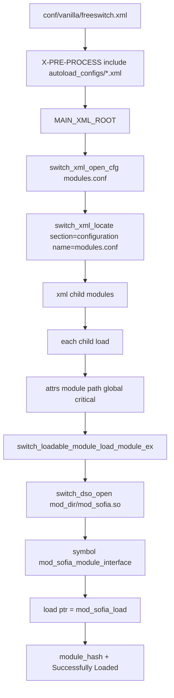

1. **Find the configuration node.** `switch_xml_open_cfg("modules.conf", &cfg, NULL)` (`cf` in `switch_loadable_module_init`). The same helper is used with `"pre_load_modules.conf"` and `"post_load_modules.conf"`.
2. **Iterate `<load>`.** `switch_xml_child(cfg, "modules")` then `switch_xml_child(mods, "load")`. Document-commented tags are not children. Empty `module` or a dotted name that is not a known DSO suffix is skipped (`Invalid extension for …`).
3. **Open and call load.** Path `{dir}/{module}.so` (non-Windows). `switch_loadable_module_load_file` resolves `{filename}_module_interface` and invokes `load_func_ptr(&module_interface, pool)`. For Sofia that is `mod_sofia_load()`, which registers the endpoint and runs `config_sofia(SOFIA_CONFIG_LOAD, NULL)`.
4. **After the lists.** `switch_loadable_module_runtime()` starts each module’s optional runtime thread. If every XML list was empty, the loader loads all files in `mod_dir` instead (`No modules loaded, assuming 'load all'`).

`reloadxml` replaces the XML root; it does **not** re-execute these `<load>` rows. Use `load` / `unload` / `reload` (or restart) to change the set of DSOs.

---

## Interface registry lookup

### Trigger and Goal

- **Trigger**: a **name** appears at runtime — dialplan `application="bridge"`, ESL/`fs_cli` `api status`, originate `sofia/…`, or a codec IANA name. The module that implements that name has already run its load function during startup ([Runtime load tag](#runtime-load-tag)).
- **Goal**: resolve the string through `loadable_modules.*_hash` to a function pointer and invoke it. Architecture and why this is not an IDL: [Loadable module contract](01-architecture.md#loadable-module-contract).

### Main Flow

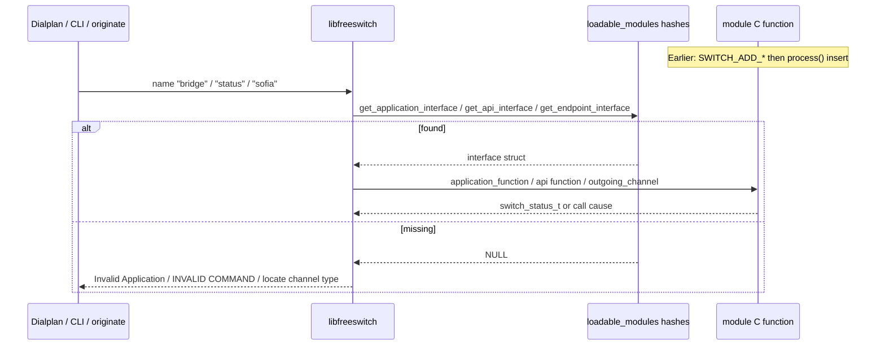

### Key Steps

1. **Register at load.** `SWITCH_ADD_APP(app_interface, "bridge", …, audio_bridge_function, …)` in `mod_dptools.c` appends a `switch_application_interface_t` on the module bag. `SWITCH_ADD_API(..., "status", …, status_function, …)` in `mod_commands.c`. Sofia has no `SWITCH_ADD_ENDPOINT`; it `create_interface(..., SWITCH_ENDPOINT_INTERFACE)` and sets `interface_name = "sofia"`.
2. **Index.** `switch_loadable_module_process` inserts each named node into `application_hash` / `api_hash` / `endpoint_hash` (and logs `Adding Application 'bridge'`). Duplicate names last-writer-wins at hash insert.
3. **Application dispatch.** `mod_dialplan_xml` `exec_app` / `switch_core_session_execute_application` → `switch_loadable_module_get_application_interface(app)` → `switch_core_session_exec` → `application_interface->application_function(session, arg)`. `bridge`’s function may later call `switch_ivr_multi_threaded_bridge`; that is an implementation detail, not the registry key.
4. **API dispatch.** `switch_api_execute(cmd, arg, session, stream)` → `get_api_interface(cmd)` → `api->function`. Used by console, ESL `api`/`bgapi`, and other modules.
5. **Endpoint dispatch.** `switch_core_session_outgoing_channel(..., "sofia", profile, …)` → `get_endpoint_interface` → `io_routines->outgoing_channel`. Inbound Sofia sessions attach the same endpoint interface when the session is created.

### Worked example: `answer`

The shortest real chain from XML to C. Source: `mod_dptools.c` (`SWITCH_MODULE_DEFINITION(mod_dptools, mod_dptools_load, mod_dptools_shutdown, NULL)`), `switch_loadable_module.h` (`SWITCH_ADD_APP`), `switch_core_session.c`, `switch_core_state_machine.c` `switch_core_standard_on_execute`. Macro field names: the name is **`interface_name`**, not `application_name`.

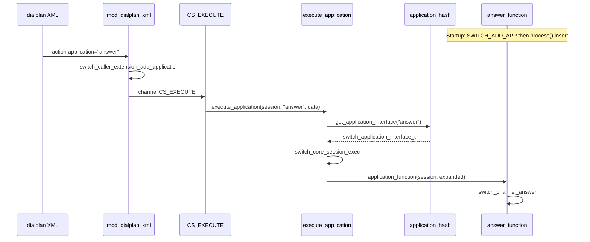

**Load (once).** `mod_dptools_load` calls `switch_loadable_module_create_module_interface`, then:

```c
SWITCH_ADD_APP(app_interface, "answer", "Answer the call",
    "Answer the call for a channel.", answer_function, "", SAF_SUPPORT_NOMEDIA);
```

That expands to `create_interface(..., SWITCH_APPLICATION_INTERFACE)` and fills `interface_name`, `application_function`, descriptions, `syntax=""`, `flags`. `process()` inserts `"answer"` into `application_hash`. `answer_function` is `SWITCH_STANDARD_APP`: `static void (session, data)` ending in `switch_channel_answer`. Flags `SAF_SUPPORT_NOMEDIA` skip the “needs media / pre_answer” path in `execute_application_get_flags`.

**Hunt (per call).** `<action application="answer"/>` does not `dlopen` anything. `mod_dialplan_xml` queues the string `"answer"` on the caller extension (or `exec_app` if inline). The consumer never mentions `mod_dptools`.

**Execute.** `switch_core_session_execute_application` is `#define` → `switch_core_session_execute_application_get_flags`. Lookup failure: `Invalid Application` + hangup `DESTINATION_OUT_OF_ORDER`. Success: `switch_core_session_exec` → pointer call. Log line `EXECUTE [depth=…] … answer()`.

Same pattern for API `"status"` via `SWITCH_ADD_API` / `switch_api_execute`. Endpoints differ: name → **vtable** (`io_routines`), not one function. See the [Architecture](01-architecture.md) page for the golden path.

### Error and Edge Cases

| Case | Where | Outcome |
|------|--------|---------|
| Unknown app name | `get_application_interface` NULL | `Invalid Application`; hunt path may hang up `DESTINATION_OUT_OF_ORDER` |
| App has no function pointer | `exec_app` | `No Function for …` |
| Unknown API | `switch_api_execute` | `INVALID COMMAND!` |
| Unknown endpoint token | `switch_core_session_outgoing_channel` | `Could not locate channel type` / `CHAN_NOT_IMPLEMENTED` |
| Allowlist in `switch.conf` | `switch_loadable_module_interface_allowed` | App/API skipped at index time (`Skipping Application`) |
| Module unloaded | `unprocess` deletes hash keys | Later lookup fails like unknown name |

### Code References

- `src/switch_loadable_module.c` — `create_interface`, `process`, `HASH_FUNC` getters, `switch_api_execute`
- `src/include/switch_loadable_module.h` — `SWITCH_ADD_APP` / `SWITCH_ADD_API` / `SWITCH_ADD_CODEC`
- `src/include/switch_module_interfaces.h` — interface structs
- `src/mod/applications/mod_dptools/mod_dptools.c` — `SWITCH_ADD_APP(..., "answer", …, answer_function)` and `"bridge"`
- `src/switch_core_session.c` — `switch_core_session_execute_application_get_flags`, `switch_core_session_exec`
- `src/switch_core_state_machine.c` — `switch_core_standard_on_execute`
- `src/mod/applications/mod_commands/mod_commands.c` — `SWITCH_ADD_API(..., "status", …)`
- `src/mod/endpoints/mod_sofia/mod_sofia.c` — endpoint `interface_name = "sofia"`
- `src/mod/dialplans/mod_dialplan_xml/mod_dialplan_xml.c` — `exec_app`
- `src/switch_core_session.c` — `switch_core_session_exec`, `switch_core_session_outgoing_channel`

---

## Inbound SIP Call

### Trigger and Goal

- **Trigger**: a SIP `INVITE` datagram or TCP segment arrives on a Sofia profile bind (vanilla internal typically UDP/TCP **5060**, external **5080**). The kernel delivers it to a socket owned by Sofia-SIP **tport**, not by `libfreeswitch`. After parse and transaction matching, NUA delivers `nua_i_invite` to `sofia_event_callback()` in `src/mod/endpoints/mod_sofia/sofia.c` on the **profile** thread.
- **Goal**: allocate a session/channel, authenticate if the profile requires it, hunt an XML extension, run applications (vanilla `Local_Extension` bridges `user/${dialed_extension}@${domain_name}`), exchange media, then hang up with a SIP response/`BYE`/`CANCEL` and CDR/events.

### Packet path (UDP/TCP to NUA)

FreeSWITCH never `recv()`s SIP on the session thread. Each profile thread creates `su_root_t`, calls `nua_create(..., sofia_event_callback, profile, NUTAG_URL(profile->bindurl), ...)`, then loops `su_root_step()`. `config_sofia_profile_urls()` builds `bindurl` as `sip:<user>@<sip-ip>:<sip-port>` plus `transport=udp,tcp` unless `bind-params` override it (`sofia.c`). TLS/WS/WSS are extra `NUTAG_SIPS_URL` / `NUTAG_WS_URL` / `NUTAG_WSS_URL` binds.

Inside [Sofia-SIP](https://github.com/freeswitch/sofia-sip) (`libsofia-sip-ua`):

1. **tport** (`libsofia-sip-ua/tport`) — `recvfrom` / TCP `read` (TLS decrypt, WebSocket unframe). UDP is usually one SIP message per datagram (`NTATAG_UDP_MTU(65535)` on IPv4 in `nua_create`). TCP is framed with `Content-Length`. `TPTAG_LOG` / `sofia profile <name> siptrace on` dumps this layer ([Observability](../5.operations/02-observability.md)).
2. **msg / sip** — parse start-line, headers, body into `msg_t` / `sip_t`.
3. **nta** (`libsofia-sip-ua/nta`) — match or create a transaction (`Via` / `Call-ID` / `CSeq` / branch). Inbound INVITE is a UAS transaction.
4. **nua** (`libsofia-sip-ua/nua`) — map to `nua_i_invite` and invoke `sofia_event_callback` **during** `su_root_step` on the profile thread.

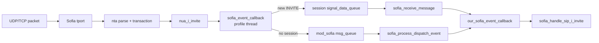

Three threads on a typical INVITE:

| Thread | Created by | Role |
|--------|------------|------|
| Profile `sofia_profile_thread_run` | one per Sofia profile | Owns sockets; `su_root_step`; first entry to `sofia_event_callback`; must return quickly |
| Session `switch_core_session_thread_launch` | first inbound INVITE | `CS_*` state machine; `SWITCH_MESSAGE_INDICATE_SIGNAL_DATA` → `sofia_receive_message` |
| MSG `sofia_msg_thread_run` | global `msg_queue` | Events with **no** session (REGISTER, OPTIONS, …); scales when the queue is deep |

`sofia_event_callback` admits the request on the profile thread (503/422), then `nua_save_event` into `sofia_dispatch_event_t` so NUA can free the stack event. A **new** INVITE allocates `switch_core_session_request`, `sofia_glue_attach_private`, launches the session thread in `CS_NEW`, and `switch_core_session_queue_signal_data`. `sofia_handle_sip_i_invite` runs later on the **session** thread via `sofia_process_dispatch_event` → `our_sofia_event_callback`. Follow-up SIP on the same `nua_handle` (re-INVITE, BYE, `nua_i_state`) also uses `signal_data_queue`. REGISTER without a session uses `sofia_queue_message`.

#### Session-timer admission (RFC 4028)

Before queueing an incoming INVITE, `sofia_event_callback()` checks the
request's `Session-Expires` against the profile's
`minimum-session-expires` setting ([`sofia.c:2450-2459`](https://github.com/signalwire/freeswitch/tree/master/src/mod/endpoints/mod_sofia/sofia.c)).
`sip->sip_session_expires->x_delta` is the requested interval in seconds.
If it is below the configured minimum, FreeSWITCH sends:

```text
SIP/2.0 422 Session Interval Too Small
Min-SE: <minimum-session-expires>
```

The `goto end` skips event allocation and queueing, so the rejected INVITE is
not admitted as a call. If the interval is equal to or greater than the local
minimum, this guard does nothing and normal INVITE processing continues.

`Session-Expires` and `Min-SE` have different meanings:

- `Session-Expires` is the requested maximum time between session refreshes.
- `Min-SE` is the lower bound that an element is willing to accept.

Therefore this code compares `Session-Expires` with the local minimum; it does
not compare the peer's `Min-SE` value. The profile value is parsed from
`minimum-session-expires` and values below 90 seconds are raised to 90, in
accordance with RFC 4028. The same value is passed to Sofia-SIP with
`NUTAG_MIN_SE` when session timers are configured ([`sofia.c:3355-3356`](https://github.com/signalwire/freeswitch/tree/master/src/mod/endpoints/mod_sofia/sofia.c)).

RFC 4028 defines `Session-Expires`, `Min-SE`, and response code 422. A UAS or
proxy may reject an INVITE whose session interval is below its local policy;
the 422 response must contain `Min-SE` with that policy value. The minimum is
90 seconds, and a successful 2xx response carries the negotiated
`Session-Expires` and identifies the refresher (`uac` or `uas`). The refresher
typically sends a re-INVITE or UPDATE before expiry; this code covers only the
early admission/rejection step, not the later refresh transaction.

For example, with `minimum-session-expires=120`, an INVITE containing
`Session-Expires: 60` receives 422 and `Min-SE: 120`; the caller should retry
with an interval of at least 120 seconds. This block does not reject an INVITE
that has no `Session-Expires` header. RFC 4028 also discusses the `Supported:
timer` capability negotiation; this local guard itself checks the presence and
value of `Session-Expires`, but does not explicitly inspect `Supported`.

See [RFC 4028](https://www.rfc-editor.org/rfc/rfc4028.html), especially
Sections 4–6 and 9.

Digest **401** then a second INVITE with `Authorization` is often **one** session UUID: the first callback may detach the handle and store Call-ID in `profile->chat_hash`; the authenticated INVITE re-attaches (`Re-attaching to session`). Siptrace shows two INVITEs.

Session threads send SIP only through `nua_respond` / `nua_bye` / `nua_invite`; tport `send` still runs on the profile `su_root`.

### Main Flow

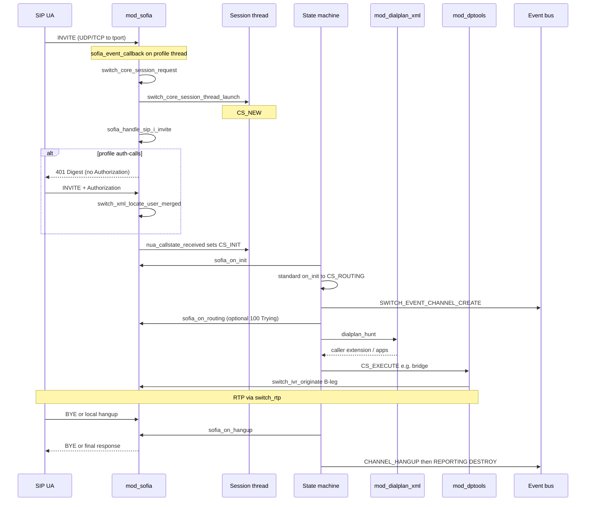

### Key Steps

1. **Admit the INVITE.** `sofia_event_callback()` rejects with **503** `"Maximum Calls In Progress"` / `"System Busy"` / `"System Paused"` when session limit, message-queue critical watermark, or `PFLAG_STANDBY` is hit. Missing `Call-ID` → **503** `"INVALID INVITE"`. An incoming `Session-Expires` below the profile's `minimum-session-expires` → **422** with `Min-SE`.
2. **Create the inbound session.** `switch_core_session_request()` (or `switch_core_session_request_uuid()` when `PFLAG_CALLID_AS_UUID`) plus `sofia_glue_new_pvt()` / `sofia_glue_attach_private()`. The event is queued onto the session with `switch_core_session_queue_signal_data()`; the session thread starts in `CS_NEW`.
3. **Handle the INVITE body.** `sofia_handle_sip_i_invite()` requires a `Contact` (**400** `"Missing Contact Header"` otherwise). Source IP/port become `sip_network_ip` / `sip_network_port`. Destination number is Request-URI user (`req_user`), or the full URI when `full-id-in-dialplan` (`PFLAG_FULL_ID`).
4. **Authenticate when required.** Vanilla internal profile: `auth-calls=$${internal_auth_calls}` (`true` in `conf/vanilla/vars.xml`) and `apply-inbound-acl` = `domains`. Failed ACL can fall back to Digest. Digest uses the same `sofia_reg_handle_register(..., REG_INVITE, ...)` path as REGISTER. Success sets `sip_authorized=true` and loads directory XML via `switch_ivr_set_user_xml()` (including `user_context`). External profile: `auth-calls=false` — typically no digest; context stays the profile context (`public`).
5. **Build the caller profile.** Context order in `sofia_handle_sip_i_invite()`: ACL override → channel `user_context` → profile `context` (or From-host when profile context is `_domain_`). Dialplan defaults to profile `dialplan` (`XML`) unless `inbound_dialplan` is set.
6. **Leave `CS_NEW`.** `sofia_handle_sip_i_state()` on `nua_callstate_received` sets `CS_INIT` after SDP offer handling (`sofia_media_negotiate_sdp` unless proxy/late-neg). `STATE_MACRO(init)` runs `sofia_on_init` then, if the endpoint returns `SWITCH_STATUS_SUCCESS`, `switch_core_standard_on_init()` (moves to `CS_ROUTING`, or `CS_EXECUTE` when `CF_RECOVERING`). After that macro, the `CS_INIT` case fires `SWITCH_EVENT_CHANNEL_CREATE`.
7. **Optional 100 Trying.** `sofia_on_routing()` sends `SIP_100_TRYING` when `PFLAG_AUTO_INVITE_100` and the inbound channel is not yet answered (`sofia_acknowledge_call()`).
8. **Hunt the dialplan.** `switch_core_standard_on_routing()` looks up `caller_profile->dialplan` (comma-separated names) and calls `hunt_function`. `mod_dialplan_xml` registers name `"XML"` → `dialplan_hunt()`. Hunt locates `<context name="...">` (fallback `global`), walks `<extension>` / `<condition>` regexes (`parse_exten`). Vanilla authenticated users (`user_context=default`) match `Local_Extension` `^(10[01][0-9])$` in `conf/vanilla/dialplan/default.xml`.
9. **Execute applications.** `switch_core_standard_on_execute()` walks `extension->current_application` and `switch_core_session_execute_application()`. Vanilla `Local_Extension` sets `hangup_after_bridge=true` / `continue_on_fail=true`, then `bridge` `user/${dialed_extension}@${domain_name}`. `audio_bridge_function()` calls `switch_ivr_originate()` for the B-leg, then `switch_ivr_multi_threaded_bridge()` (or `switch_ivr_signal_bridge()` when `CF_PROXY_MODE`). Failed originate can fall through to voicemail via `loopback/app=voicemail:...`.
10. **Hang up.** `switch_channel_hangup()` fires `SWITCH_EVENT_CHANNEL_HANGUP` (`src/switch_channel.c`). Session thread `CS_HANGUP` → `sofia_on_hangup()`: answered → `nua_bye`; unanswered outbound → `nua_cancel`; unanswered inbound → `nua_respond` with `hangup_cause_to_sip()`. Then `CS_REPORTING` → `CS_DESTROY`. Vanilla CDR is `mod_cdr_csv`, not core SQL.

### Error and Edge Cases

| Case | Where handled | Expected outcome |
|------|---------------|------------------|
| Session limit / queue overload / standby | `sofia_event_callback` | SIP **503** with `Retry-After: 300` (busy/max); standby has no Retry-After |
| Session timer interval below profile minimum | `sofia_event_callback` (`sofia.c:2450-2459`) | SIP **422** `Session Interval Too Small` with `Min-SE: <minimum-session-expires>`; INVITE is not queued |
| No Contact | `sofia_handle_sip_i_invite` | SIP **400** `"Missing Contact Header"`; `ib_failed_calls++` |
| Auth required, no credentials | `sofia_reg_handle_register` / `sofia_reg_auth_challenge` | SIP **401** with `WWW-Authenticate` Digest; nonce stored in `sip_authentication` |
| Bad digest / unknown user | `sofia_reg_parse_auth` | `AUTH_FORBIDDEN` → **403** (or **401** if not marked forbidden); log `"Can't find user [user@domain]"` |
| ACL reject with `auth-calls-acl-only` | `sofia_handle_sip_i_invite` | SIP **403**; no digest fallback |
| No matching extension | `switch_core_standard_on_routing` | Hangup `SWITCH_CAUSE_NO_ROUTE_DESTINATION` |
| Codec mismatch on offer | `sofia_media_negotiate_sdp` / `nua_callstate_received` | SIP **488** if already past `CS_NEW` |
| `bridge` originate fails | `audio_bridge_function` | Logs `"Originate Failed"`; vanilla `continue_on_fail=true` continues to voicemail loopback |
| Recovered channel (`CF_RECOVERING`) | `switch_core_standard_on_init` | Skips `CS_ROUTING`; goes to `CS_EXECUTE` |
| Proxy media (`CF_PROXY_MODE` / `CF_PROXY_MEDIA`) | `sofia_on_init`, bridge | SDP absorbed; `switch_ivr_signal_bridge` instead of RTP bridge |
| Re-INVITE while both legs reinvite | `nua_callstate_received` | **491** Request Pending; redo outbound invite |
| Digest 401 then authenticated INVITE | `nua_i_terminated` + `chat_hash` | Re-attach to the same session UUID; not a second A-leg |

### Data and Contracts Involved

- Channel / session UUID; `switch_caller_profile_t` (`destination_number`, `context`, `dialplan`).
- Directory user XML after auth (`id`, `password`, `user_context`) — vanilla `conf/vanilla/directory/default/1000.xml`.
- Dialplan XML: `conf/vanilla/dialplan/default.xml` (`Local_Extension`), `conf/vanilla/dialplan/public.xml` for unauthenticated/external.
- Events: `SWITCH_EVENT_CHANNEL_CREATE`, `CHANNEL_STATE`, `CHANNEL_EXECUTE` / `_COMPLETE`, `CHANNEL_BRIDGE` / `_UNBRIDGE`, `CHANNEL_HANGUP` / `_HANGUP_COMPLETE`, outbound B-leg also `CHANNEL_ORIGINATE`.
- Core SQL `channels` / `calls` are a scoreboard projection, not the source of truth.
- SIP hangup mapping: `hangup_cause_to_sip()` in `mod_sofia.c`; optional Q.850 `Reason` unless `disable_q850_reason`.

### Code References

- `src/mod/endpoints/mod_sofia/sofia.c` — `config_sofia_profile_urls`, `nua_create`, `sofia_profile_thread_run` / `su_root_step`, `sofia_event_callback`, `sofia_queue_message`, `sofia_process_dispatch_event`, `our_sofia_event_callback`, `sofia_handle_sip_i_invite`, `sofia_handle_sip_i_state`
- `src/mod/endpoints/mod_sofia/mod_sofia.c` — `sofia_receive_message` (`SWITCH_MESSAGE_INDICATE_SIGNAL_DATA`), `sofia_on_init`, `sofia_on_routing`, `sofia_on_execute`, `sofia_on_hangup`, `sofia_outgoing_channel`, `sofia_acknowledge_call`
- `src/mod/endpoints/mod_sofia/sofia_media.c` — `sofia_media_negotiate_sdp`, `sofia_media_activate_rtp`, `sofia_media_tech_media`
- [sofia-sip](https://github.com/freeswitch/sofia-sip) `libsofia-sip-ua/{su,tport,nta,nua,sip,msg}` — sockets, parse, transactions (not in this git tree)
- `src/mod/endpoints/mod_sofia/sofia_glue.c` — `sofia_glue_do_invite`, `sofia_glue_new_pvt`
- `src/mod/endpoints/mod_sofia/rtp.c` — endpoint RTP IO routines for the compact RTP endpoint
- `src/mod/endpoints/mod_sofia/mod_sofia.c` — `sofia_read_frame`, `sofia_write_frame`, audio endpoint IO routines
- `src/switch_core_media.c` — `switch_core_media_negotiate_sdp`, `switch_core_media_gen_local_sdp`, `switch_core_media_activate_rtp`, `switch_core_media_read_frame`, `switch_core_media_write_frame`
- `src/switch_core_io.c` — `switch_core_session_read_frame`, `switch_core_session_write_frame`
- `src/switch_rtp.c` — `switch_rtp_ready`, `rtp_common_read`, `switch_rtp_zerocopy_read_frame`, `switch_rtp_write_frame`, `switch_rtp_write_raw`
- `src/switch_core_session.c` — `switch_core_session_request`, `switch_core_session_thread_launch`
- `src/switch_core_state_machine.c` — `STATE_MACRO`, `switch_core_standard_on_routing`, `switch_core_standard_on_execute`
- `src/mod/dialplans/mod_dialplan_xml/mod_dialplan_xml.c` — `dialplan_hunt`
- `src/mod/applications/mod_dptools/mod_dptools.c` — `audio_bridge_function` (`bridge`)
- `src/switch_ivr_originate.c` — `switch_ivr_originate`
- `src/switch_ivr_bridge.c` — media / signal bridge
- `conf/vanilla/sip_profiles/internal.xml`, `conf/vanilla/sip_profiles/external.xml`
- `conf/vanilla/dialplan/default.xml`

### Media negotiation and RTP activation

This is a separate signal/media path from the session state machine. `switch_core_session_run()` in
`src/switch_core_state_machine.c:530` schedules `CS_*` handlers; it does not itself parse SDP or
run an RTP packet loop. For Sofia, SIP callbacks and media IO enter the core through endpoint
callbacks and `io_routines`.

#### Backend dispatch into `sofia_handle_sip_i_state`

The SDP-bearing state event normally crosses two threads. Sofia-SIP receives and parses the SIP
message on the profile thread; FreeSWITCH queues a saved `sofia_dispatch_event_t` to the session
thread. The session thread then invokes the endpoint message callback and finally dispatches
`nua_i_state` to `sofia_handle_sip_i_state()`:

```text
Sofia-SIP su_root_step()                         [profile thread, out of tree]
  -> sofia_event_callback()                      [sofia.c]
  -> switch_core_session_queue_signal_data()     [existing session]
  -> sofia_receive_message()                     [session thread]
  -> sofia_process_dispatch_event()
  -> our_sofia_event_callback()
  -> switch(event): case nua_i_state
  -> sofia_handle_sip_i_state()
```

For a new inbound INVITE, `sofia_event_callback()` first creates/attaches the session and queues
the event; the same dispatch then reaches `nua_i_invite` and
`sofia_handle_sip_i_invite()`. If there is no session to attach, the event goes through
`sofia_queue_message()` and the message-thread path instead. Inside
`sofia_handle_sip_i_state()`, Sofia tags provide the call state plus local/remote SDP and
offer/answer flags. The handler restores the saved SDP for relevant 100/200 events, stores the
remote SDP, calls `switch_core_media_set_sdp_codec_string()` / `sofia_glue_pass_sdp()`, and then
selects the `nua_callstate_*` branch. This is the control-plane entry point for the media flows
below; it is not the RTP packet loop.

#### When negotiation happens

Negotiation happens while processing an SDP-bearing `INVITE`, `re-INVITE`, or the answer to an
outbound offer. The endpoint wrapper `sofia_media_negotiate_sdp()` calls
`switch_core_media_negotiate_sdp()`, which parses the remote SDP, matches codecs and payload
types, and stores remote media/crypto/ICE parameters in the session media handle.

The important branches are:

- **Inbound offer**: `nua_callstate_received` calls
  `sofia_media_negotiate_sdp(session, r_sdp, SDP_OFFER)`. A successful match marks the Sofia
  leg ready and moves a new channel toward `CS_INIT`; the local answer is generated on the
  response path with `switch_core_media_gen_local_sdp(..., SDP_ANSWER, ...)`.
- **Outbound offer / answer**: `sofia_glue_do_invite()` generates the local offer with
  `switch_core_media_gen_local_sdp(..., SDP_OFFER, ...)`. When the remote answer arrives,
  `nua_callstate_early` or `nua_callstate_ready` uses `SDP_ANSWER`, then regenerates the local
  SDP if needed and activates the media.
- **Early media**: `nua_callstate_proceeding` passes an SDP offer to
  `sofia_media_tech_media()`, which performs negotiation, chooses a port, activates RTP, and
  marks the channel pre-answered.
- **Proxy/no-media**: `CF_PROXY_MODE` / `CF_PROXY_MEDIA` take a separate path. The handler may
  copy or patch the SDP and set remote media variables, but it does not perform the normal
  endpoint codec/packet termination path.

```text
Inbound INVITE with SDP
  -> sofia_handle_sip_i_state(): nua_callstate_received
  -> sofia_media_negotiate_sdp(..., SDP_OFFER)
  -> switch_core_media_negotiate_sdp()
  -> switch_core_media_gen_local_sdp(..., SDP_ANSWER, ...)

Outbound INVITE
  -> sofia_glue_do_invite()
  -> switch_core_media_gen_local_sdp(..., SDP_OFFER, ...)
  -> remote SDP answer
  -> sofia_handle_sip_i_state(): nua_callstate_early/ready
  -> sofia_media_negotiate_sdp(..., SDP_ANSWER)
  -> switch_core_media_negotiate_sdp()
```

With `inbound-late-negotiation=true`, the inbound leg may defer codec negotiation until the
dialplan/bridge has supplied the required media context. Proxy-media paths are an important
exception: `CF_PROXY_MODE` / `CF_PROXY_MEDIA` can keep FreeSWITCH from terminating or inspecting
RTP in the normal codec path.

#### When RTP becomes usable

RTP setup has three distinct phases; SDP parsing alone does not mean that RTP can flow.

1. **Choose the local endpoint** — `switch_core_media_choose_port()` requests a port from
   `switch_rtp_request_port()`, selects the advertised IP/port, and applies NAT mapping when
   required. Proxy mode, proxy media, an existing advertised port, or an existing RTP session
   can make this a no-op.
2. **Activate media** — `sofia_media_activate_rtp()` takes the Sofia mutex and calls
   `switch_core_media_activate_rtp()`. The core selects codecs, applies RTP/RTCP, timestamp,
   RFC2833, auto-adjust, SRTP/DTLS and re-INVITE flags, then creates or updates the RTP engines
   and remote address. On success the Sofia wrapper sets `TFLAG_RTP` and `TFLAG_IO`.
3. **Pass the readiness gate** — `switch_rtp_ready()` requires a live, non-shutdown session,
   input and output sockets, a remote address, `SWITCH_RTP_FLAG_IO`, and `ready == 2`.

```text
sofia_media_tech_media()                         [early media path]
  -> sofia_media_negotiate_sdp()
  -> switch_core_media_negotiate_sdp()
  -> switch_core_media_choose_port()
  -> sofia_media_activate_rtp()
     -> switch_core_media_activate_rtp()
  -> switch_rtp_ready() == true
```

For an inbound offer, `nua_callstate_received` may first perform only the codec match and later
complete local SDP/port setup on the answer path. For early media, the explicit setup chain above
is in `sofia_media_tech_media()`. Re-INVITE/unhold handling reuses the same core media functions
with `SDP_OFFER` or `SDP_ANSWER` as appropriate. Once the readiness gate is true, the endpoint
IO callbacks can read and write RTP frames.

#### RTP receive path

The session does not receive RTP in `CS_EXECUTE` or `CS_EXCHANGE_MEDIA` by virtue of entering that
state. A consumer that asks for a frame enters the endpoint IO path:

```text
switch_core_session_read_frame()
  -> endpoint io_routines->read_frame
  -> sofia_read_frame()
  -> switch_core_media_read_frame()
  -> switch_rtp_zerocopy_read_frame()
  -> rtp_common_read()
  -> switch_frame_t
```

`rtp_common_read()` polls and parses RTP/RTCP, applies packet/jitter handling, and
`switch_rtp_zerocopy_read_frame()` exposes the received packet as a `switch_frame_t`. The core
then performs codec decode/resampling as needed before returning the frame to the caller.

#### RTP send path

Applications, bridges, codecs, or media threads write a frame through the session IO path:

```text
switch_core_session_write_frame()
  -> perform_write()
  -> endpoint io_routines->write_frame
  -> sofia_write_frame()
  -> switch_core_media_write_frame()
  -> switch_rtp_write_frame()
  -> switch_rtp_write_raw()
  -> UDP RTP socket
```

Before `switch_rtp_write_frame()`, the core may encode, transcode, resample, process media bugs,
and update timestamps. The RTP layer then builds the RTP header and applies SRTP/encryption when
configured. Proxy packets can take the fast pass-through branch instead of the normal codec path.

#### Ownership and timing summary

| Concern | Where | When |
|---|---|---|
| SIP/SDP signal handling | `mod_sofia/sofia.c`, `sofia_media.c` | INVITE/re-INVITE/answer processing |
| SDP parsing and codec match | `switch_core_media_negotiate_sdp()` | after remote SDP arrives |
| Local SDP offer/answer | `switch_core_media_gen_local_sdp()` | before sending SIP offer/answer |
| RTP session activation | `switch_core_media_activate_rtp()` | after negotiation and port selection |
| RTP receive | endpoint `read_frame` → `switch_rtp_zerocopy_read_frame()` | when a consumer reads a frame |
| RTP send | endpoint `write_frame` → `switch_rtp_write_frame()` | when a producer writes a frame |
| Session state transitions | `switch_core_session_run()` | throughout channel lifetime; orchestration only |

The key boundary is therefore: **SDP negotiates the media contract; RTP activation creates the
usable media session; frame IO moves packets.**

### Worked example: `show channels` during a bridge

`fs_cli -x 'show channels'` is a CSV dump of the core SQL `channels` scoreboard (`select * from channels where hostname=… order by created_epoch` in `show_function()`, `src/mod/applications/mod_commands/mod_commands.c`). Schema: `create_channels_sql` in `src/switch_core_sqldb.c`. The session thread is the source of truth; this table is a projection for operators and recovery ([Data and API](04-data-and-api.md)).

Docker (default prefix inside the image):

```bash
docker exec freeswitch /usr/local/freeswitch/bin/fs_cli -x 'show channels'
```

On a prefix install: `"$PREFIX/bin/fs_cli" -x 'show channels'`. Related: `show calls` (view `basic_calls`, one row per bridged pair), `show channels count`, `show channels like <pattern>`.

#### Column meanings

| Column | Meaning |
|--------|---------|
| `uuid` | Channel (leg) UUID |
| `direction` | `inbound` (accepted by FreeSWITCH) or `outbound` (originated by FreeSWITCH) |
| `created` / `created_epoch` | Create time (local string) and Unix seconds |
| `name` | Channel name: typically `sofia/<profile>/<user>@<host>` |
| `state` | Channel state machine (`CS_*` in `src/include/switch_types.h`). Distinct from `callstate` (`CCS_*`) |
| `cid_name` / `cid_num` | Current caller ID name / number |
| `ip_addr` | Remote IP stored on this channel |
| `dest` | Destination (often Request-URI / originate target user) |
| `application` / `application_data` | Dialplan app currently running and its argument (empty when none) |
| `dialplan` / `context` | Dialplan module name (`XML`) and hunt context |
| `read_codec` / `read_rate` / `read_bit_rate` | Receive codec, sample rate, bit rate |
| `write_codec` / `write_rate` / `write_bit_rate` | Send codec, sample rate, bit rate |
| `secure` | Media crypto label (for example SRTP over DTLS) |
| `hostname` | Switch hostname (`switchname` / hostname filter on the SQL row) |
| `presence_id` / `presence_data` | Presence identity (often `user@domain`) and extra presence payload |
| `accountcode` | Billing / account code |
| `callstate` | Call state (`ACTIVE`, `RINGING`, …), not `CS_*` |
| `callee_name` / `callee_num` | Callee display name / number on this channel |
| `callee_direction` | Callee direction flag (`SEND` in this snapshot) |
| `call_uuid` | Call-level UUID shared by legs of the same call |
| `sent_callee_name` / `sent_callee_num` | Callee identity actually sent toward the peer |
| `initial_cid_name` / `initial_cid_num` | Caller ID at channel create |
| `initial_ip_addr` / `initial_dest` | Remote IP and dest at create |
| `initial_dialplan` / `initial_context` | Dialplan / context at create |

`CS_EXECUTE`: channel is executing its dialplan. `CS_EXCHANGE_MEDIA`: channel is exchanging media with another channel (`switch_types.h`).

#### Snapshot (lab, 2026-09-15)

Header plus two rows from a running container. Values are a lab capture, not a production baseline.

```text
uuid,direction,created,created_epoch,name,state,cid_name,cid_num,ip_addr,dest,application,application_data,dialplan,context,read_codec,read_rate,read_bit_rate,write_codec,write_rate,write_bit_rate,secure,hostname,presence_id,presence_data,accountcode,callstate,callee_name,callee_num,callee_direction,call_uuid,sent_callee_name,sent_callee_num,initial_cid_name,initial_cid_num,initial_ip_addr,initial_dest,initial_dialplan,initial_context
26ff4896-e43a-41cd-bb70-e6058724ad42,inbound,2026-09-15 02:17:55,1789438675,sofia/internal/1002@10.100.212.8,CS_EXECUTE,1002,1002,10.100.168.105,1001,bridge,user/1001@10.100.212.8,XML,default,opus,48000,0,opus,48000,0,srtp:dtls:AES_CM_128_HMAC_SHA1_80,Server-10-100-212-8,1002@10.100.212.8,,1002,ACTIVE,Outbound Call,ll7n8l5n,SEND,26ff4896-e43a-41cd-bb70-e6058724ad42,Outbound Call,ll7n8l5n,1002,1002,10.100.168.105,1001,XML,default
5e2c53e0-7afa-481b-8ccf-2df9b703875e,outbound,2026-09-15 02:18:06,1789438686,sofia/internal/ll7n8l5n@8rv9m8q3nf0v.invalid,CS_EXCHANGE_MEDIA,Extension 1002,1002,10.100.168.105,ll7n8l5n,,,XML,default,opus,48000,0,opus,48000,0,srtp:dtls:AES_CM_128_HMAC_SHA1_80,Server-10-100-212-8,1001@10.100.212.8,,,ACTIVE,Outbound Call,ll7n8l5n,SEND,26ff4896-e43a-41cd-bb70-e6058724ad42,Extension 1002,1002,Extension 1002,1002,10.100.168.105,ll7n8l5n,XML,default
```

Join the legs on **`call_uuid`**. When `call_uuid` equals the inbound `uuid`, that inbound channel is the call’s A-leg (the `calls` table uses that id as `call_uuid`).

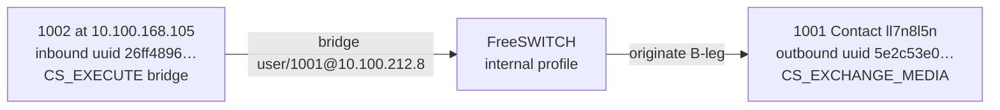

**Inbound leg** (`26ff4896-…`, `direction=inbound`):

- `name` `sofia/internal/1002@10.100.212.8`: Sofia **internal** profile; authenticated user **1002** on domain `10.100.212.8`.
- `state=CS_EXECUTE`: still running dialplan. `application=bridge`, `application_data=user/1001@10.100.212.8` matches vanilla `Local_Extension` (`bridge` `user/${dialed_extension}@${domain_name}` in `conf/vanilla/dialplan/default.xml`).
- `dest=1001`: dialed extension. `cid_*` and `initial_*` are still 1002 / `10.100.168.105` / dest `1001`.
- `ip_addr=10.100.168.105`: remote address of this SIP/WebRTC peer.
- Codecs: opus 48 kHz both ways. `secure=srtp:dtls:AES_CM_128_HMAC_SHA1_80`: DTLS-SRTP (typical WebRTC).
- `presence_id=1002@10.100.212.8`, `accountcode=1002`, `callstate=ACTIVE`.
- `callee_num=ll7n8l5n` (and `sent_callee_*`): the **registered Contact user** of the B-leg, not the directory id `1001`.

**Outbound leg** (`5e2c53e0-…`, `direction=outbound`):

- Created about 11 seconds later (`created_epoch` 1789438686 vs 1789438675): originate / answer delay after the A-leg started `bridge`.
- `name` `sofia/internal/ll7n8l5n@8rv9m8q3nf0v.invalid`: outbound INVITE to Contact **`ll7n8l5n`**. Host `.invalid` is the RFC 2606 reserved TLD; SIP.js / JsSIP and similar WebRTC stacks often use a random `user@….invalid` Contact, not a resolvable DNS name.
- `state=CS_EXCHANGE_MEDIA`: media path with the other channel. `application` / `application_data` empty: this leg is not executing a dialplan app.
- `cid_name=Extension 1002`, `cid_num=1002`: caller identity presented toward 1001.
- `dest=ll7n8l5n`: originate target is the Contact user. **`presence_id=1001@10.100.212.8`**: directory / presence user for this leg is **1001** — that is how the two names (`1001` vs `ll7n8l5n`) fit together.
- Same opus / DTLS-SRTP / `callstate=ACTIVE`. Same `call_uuid` as the inbound row.

This is a normal two-leg **bridge**: 1002 inbound → `bridge user/1001@…` → FreeSWITCH originates to 1001’s current registration (here a WebRTC Contact). Use `uuid` for logs and `uuid_*` APIs; use `call_uuid` to group legs. SIP `Call-ID` is not this CSV.

---

## SIP Registration and Directory Lookup

### Trigger and Goal

- **Trigger**: SIP `REGISTER` on a Sofia profile (`nua_i_register` → `sofia_reg_handle_sip_i_register()` in `src/mod/endpoints/mod_sofia/sofia_reg.c`). Directory lookup is also used for INVITE digest (`REG_INVITE`) and Verto login.
- **Goal**: locate `user@domain` in the XML `directory` section, complete Digest (unless ACL/blind-reg), persist the Contact in Sofia `sip_registrations` and core `registrations`, answer **200 OK**, fire `CUSTOM sofia::register`.

Vanilla directory: domain `$${domain}` in `conf/vanilla/directory/default.xml`, users `1000`–`1019` under `conf/vanilla/directory/default/*.xml`. Password is `$${default_password}`. Domain for REGISTER is the To/From host unless the profile sets `reg-domain`.

### Main Flow

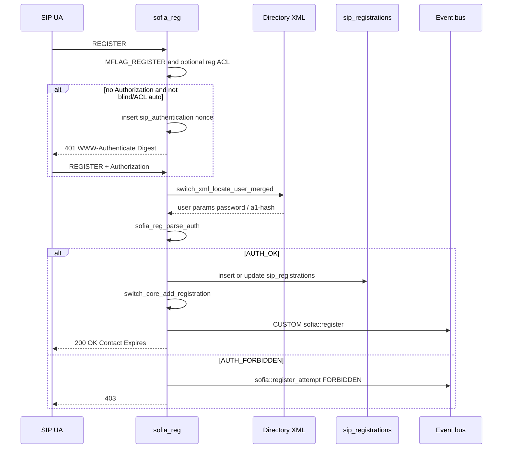

### Key Steps

1. **Profile gates.** If the profile lacks `MFLAG_REGISTER`, respond **403**. Optional `apply-register-acl`: reject IP → **403**; pass without `PFLAG_BLIND_REG` → `REG_AUTO_REGISTER` (skip digest). Vanilla internal has `apply-register-acl` commented out.
2. **Missing Contact.** With `reg_deny_binding_fetch_and_no_lookup`, no Contact → **400**. Otherwise a fetch-style REGISTER may proceed without adding a binding.
3. **Challenge.** No `Authorization` (and not auto/blind) → `sofia_reg_auth_challenge()` inserts a nonce into `sip_authentication` and sends **401** `Digest realm=..., nonce=..., algorithm=MD5, qop="auth"` (RFC 8760 extra algorithms when configured).
4. **Locate the user.** `sofia_reg_parse_auth()` calls `switch_xml_locate_user_merged("id", username, domain_name, ip, ...)`. Domain is `profile->reg_domain` if set, else Digest realm. Pointer users (`type="pointer"` in group XML) cannot register. Missing user → `AUTH_FORBIDDEN` and the log line that the domain/user must exist in directory.
5. **Verify Digest.** Directory `<param name="password">` or `a1-hash`. `sip-forbid-register=true` forbids. Per-user `auth-acl` can still reject the source IP. Results: `AUTH_OK`, `AUTH_RENEWED`, `AUTH_STALE` (re-challenge), `AUTH_FORBIDDEN`.
6. **Store the binding.** `insert into sip_registrations` (or `update` on refresh) in `sofia_reg.c`; `switch_core_add_registration()` writes the core `registrations` table. Expires 0 deletes (`switch_core_del_registration`) and fires `CUSTOM sofia::unregister`.
7. **Respond and notify.** **200 OK** with Contact list from positive-expires bindings. Fire `CUSTOM sofia::register` (`MY_EVENT_REGISTER`). Attempts also fire `sofia::register_attempt` with `auth-result` `SUCCESS` / `RENEWED` / `STALE` / `FORBIDDEN`.
8. **INVITE reuse.** Inbound INVITE with `PFLAG_AUTH_CALLS` calls the same `sofia_reg_handle_register(..., REG_INVITE, ...)` using `Proxy-Authorization` / `Authorization`, then copies directory variables onto the channel.

### Error and Edge Cases

| Case | Where handled | Expected outcome |
|------|---------------|------------------|
| Profile not accepting REGISTER | `sofia_reg_handle_sip_i_register` | SIP **403** |
| Register ACL miss | `reg_acl` loop | SIP **403**; log `"IP … Rejected by register acl"` |
| Incomplete To/From | `sofia_reg_handle_register_token` | SIP **401**; log cannot authorize without complete header |
| Unknown user / pointer user | `sofia_reg_parse_auth` | `AUTH_FORBIDDEN` → **403** |
| Stale nonce | `AUTH_STALE` | New **401** with `stale=true` |
| `Expires: 0` | unregister branch | Delete rows; `sofia::unregister`; **200** |
| NAT / WS / TLS | via / Contact / `nat-acl` | Status text e.g. `Registered(WS-NAT)`; Contact rewritten toward received address |
| `mod_xml_curl` directory | `switch_xml_locate_user` open-root hook | Same locate API; HTTP/LDAP backend is operator config — **[NEEDS INPUT: whether this deploy uses file XML or curl/LDAP]** |
| `cacheable` user XML | `switch_xml_locate_user_merged` | Cached user can survive `reloadxml` until TTL; vanilla demo users have no `cacheable` attr |

### Data and Contracts Involved

- XML directory section; vanilla users `1000`–`1019`, groups `sales` / `billing` / `support` as pointers.
- Sofia tables (`sofia_glue.c`): `sip_registrations`, `sip_authentication`, `sip_dialogs`, `sip_presence`, `sip_subscriptions`.
- Core table `registrations` (`switch_core_add_registration` in `src/switch_core_sqldb.c`).
- Events: `CUSTOM sofia::register`, `sofia::register_attempt`, `sofia::register_failure`, `sofia::unregister` (`MY_EVENT_*` in `mod_sofia.h`).
- Channel vars after INVITE auth: `sip_authorized`, directory `<variables>` (e.g. `user_context=default`).

### Code References

- `src/mod/endpoints/mod_sofia/sofia_reg.c` — `sofia_reg_handle_sip_i_register`, `sofia_reg_handle_register_token`, `sofia_reg_parse_auth`, `sofia_reg_auth_challenge`
- `src/mod/endpoints/mod_sofia/sofia.c` — `nua_i_register` dispatch; INVITE `REG_INVITE`
- `src/switch_xml.c` — `switch_xml_locate_user_merged`, `switch_xml_locate_user`
- `src/mod/endpoints/mod_sofia/sofia_glue.c` — `CREATE TABLE sip_registrations`
- `conf/vanilla/directory/default.xml`, `conf/vanilla/directory/default/1000.xml`
- `conf/vanilla/sip_profiles/internal.xml` (`auth-calls`, commented `apply-register-acl`)

### Worked example: REGISTER Digest after 401

Vanilla **internal** REGISTER is Digest (RFC 3261 / RFC 2617), not a cleartext password on the wire. The UAC sends REGISTER with **no** `Authorization`. `sofia_reg_auth_challenge()` (`src/mod/endpoints/mod_sofia/sofia_reg.c`) inserts a nonce into Sofia `sip_authentication` and answers **401** with `WWW-Authenticate`. After the UAC retries with `Authorization`, `sofia_reg_parse_auth()` locates the directory user and checks `password` or `a1-hash`. Success stores the Contact and returns **200 OK**. That binding is what later `bridge user/1001@…` looks up ([`show channels` during a bridge](#worked-example-show-channels-during-a-bridge)).

**REGISTER vs INVITE in this tree:** `REG_REGISTER` uses **401** + `WWW-Authenticate`. Inbound **INVITE** with `auth-calls` uses the same Digest math but **407** + `Proxy-Authenticate` (`sofia_reg_auth_challenge` when `regtype == REG_INVITE`). A 401/407 then a second request is the challenge, not by itself a failure.

Default vanilla challenge string (no RFC 8760 extra algorithms): `Digest realm="…", nonce="<uuid>", algorithm=MD5, qop="auth"`. Stale nonce adds `stale=true,`. Nonce TTL is `profile->nonce_ttl` or `DEFAULT_NONCE_TTL`.

Schematic lab messages for user **1002** registering to `10.100.212.8` (headers abbreviated; `Call-ID` / `nonce` / `response` below are **examples**, not a capture). Vanilla password is `$${default_password}` (`1234` in `conf/vanilla/vars.xml`) — demo only.

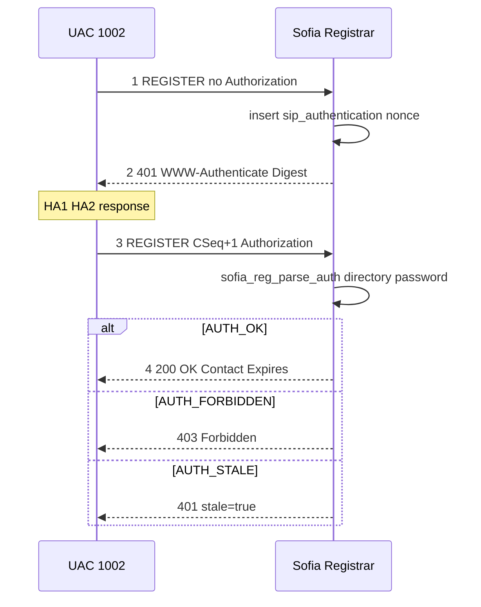

**1. REGISTER without credentials** — no `Authorization` header:

```text
REGISTER sip:10.100.212.8 SIP/2.0
Via: SIP/2.0/UDP 10.100.168.105:5060
From: <sip:1002@10.100.212.8>
To: <sip:1002@10.100.212.8>
Call-ID: abc123@10.100.168.105
CSeq: 1 REGISTER
Contact: <sip:1002@10.100.168.105:5060>
Expires: 3600
```

**2. 401 challenge** — `WWW-Authenticate` parameters:

| Parameter | Meaning |
|-----------|---------|
| `realm` | Digest realm (often the SIP domain / challenge realm) |
| `nonce` | Server nonce (here a UUID stored in `sip_authentication`; anti-replay) |
| `algorithm` | Hash algorithm (`MD5` by default; RFC 8760 algs when configured) |
| `qop` | Quality of protection; vanilla uses `"auth"` (not `auth-int`) |

```text
SIP/2.0 401 Unauthorized
Via: SIP/2.0/UDP 10.100.168.105:5060
From: <sip:1002@10.100.212.8>
To: <sip:1002@10.100.212.8>
Call-ID: abc123@10.100.168.105
CSeq: 1 REGISTER
WWW-Authenticate: Digest realm="10.100.212.8",
                  nonce="dcd98b7102dd2f0e8b11d0f600bfb0c093",
                  algorithm=MD5,
                  qop="auth"
```

**3. UAC computes Digest and retries** — same `Call-ID`, **`CSeq` increments** (1 → 2). With `qop=auth` (RFC 2617):

```text
HA1 = MD5(username:realm:password)
HA2 = MD5(method:digest-uri)
response = MD5(HA1:nonce:nc:cnonce:qop:HA2)
```

For this example: username `1002`, realm `10.100.212.8`, method `REGISTER`, URI `sip:10.100.212.8`. `nc` is the nonce count (`00000001` on first use); `cnonce` is client-generated. FreeSWITCH also accepts directory `a1-hash` (precomputed HA1) instead of a plaintext `password`.

```text
REGISTER sip:10.100.212.8 SIP/2.0
Via: SIP/2.0/UDP 10.100.168.105:5060
From: <sip:1002@10.100.212.8>
To: <sip:1002@10.100.212.8>
Call-ID: abc123@10.100.168.105
CSeq: 2 REGISTER
Contact: <sip:1002@10.100.168.105:5060>
Expires: 3600
Authorization: Digest username="1002",
               realm="10.100.212.8",
               nonce="dcd98b7102dd2f0e8b11d0f600bfb0c093",
               uri="sip:10.100.212.8",
               response="<digest>",
               algorithm=MD5,
               qop=auth,
               nc=00000001,
               cnonce="0a4f113b"
```

| Field | Meaning |
|-------|---------|
| `username` | Digest user (directory id, here `1002`) |
| `response` | Client Digest (not the password) |
| `nc` / `cnonce` | Nonce count and client nonce (replay resistance with `qop`) |
| `CSeq` | Must increase for the authenticated retry |

**4. Registrar verifies** — recomputes Digest from directory credentials and compares `response`:

- Match (`AUTH_OK` / `AUTH_RENEWED`) → **200 OK**, insert/update `sip_registrations`, `switch_core_add_registration`, event `CUSTOM sofia::register`.
- `AUTH_FORBIDDEN` → **403 Forbidden** (unknown user, bad password, `sip-forbid-register`, …).
- `AUTH_STALE` → new **401** with `stale=true`; client retries with the new nonce (password may still be correct).

```text
SIP/2.0 200 OK
Via: SIP/2.0/UDP 10.100.168.105:5060
From: <sip:1002@10.100.212.8>
To: <sip:1002@10.100.212.8>
Call-ID: abc123@10.100.168.105
CSeq: 2 REGISTER
Contact: <sip:1002@10.100.168.105:5060>
Expires: 3600
```

Why Digest instead of sending the password: the wire carries a hash bound to method, URI, and nonce; an old `response` cannot be replayed after the nonce expires. Digest is **not** equivalent to TLS: capture plus an offline attack on HA1 is still possible. Use SIPS/TLS for transport confidentiality; change vanilla `1234` before any public bind.

| Symptom | Typical cause in this tree |
|---------|----------------------------|
| Repeated **401** | Missing/wrong `Authorization`, stale nonce, or another challenge (`AUTH_STALE`) |
| **403** | `AUTH_FORBIDDEN`: unknown directory user, bad password/`a1-hash`, pointer user, `sip-forbid-register` |
| `stale=true` | Nonce expired or unknown; retry with the new nonce |
| Algorithm mismatch | Client MD5 vs profile RFC 8760 algorithms (or the reverse) |
| REGISTER **403** before Digest | Profile not accepting REGISTER, or `apply-register-acl` rejected the source IP |

After **200 OK**, 1002 can place and receive calls on that Contact. Siptrace: `fs_cli -x "sofia profile internal siptrace on"` ([Observability](../5.operations/02-observability.md)).

---

## ESL Originate and Event Control

### Trigger and Goal

- **Trigger**: TCP client (`fs_cli` or custom `libs/esl`) connects to `mod_event_socket`. Vanilla listen: port **8021**, password **`ClueCon`**, `listen-ip` **`::`** in `conf/vanilla/autoload_configs/event_socket.conf.xml`. `fs_cli` itself defaults to **`127.0.0.1:8021`** / `ClueCon` (`libs/esl/fs_cli.c`). If `apply-inbound-acl` is unset, `config()` still applies **`loopback.auto`** before any `auth/request`.
- **Goal**: authenticate, then run console APIs (`api` / `bgapi`, including `originate`), subscribe to events, and/or drive a live UUID with `sendmsg` (`call-command: execute|hangup|…`). Outbound mode: dialplan app `socket` connects **from** FreeSWITCH to a controller.

For production, bind ESL to loopback or a trusted management network, set
`apply-inbound-acl` to an explicit list (commented-out is **not** “no ACL”),
and replace `ClueCon`; the vanilla `listen-ip` is `::`
(wildcard IPv6, with IPv4 behavior dependent on the host socket settings).
Remote `fs_cli`: [Remote Event Socket ACL](../5.operations/01-runbook.md#remote-event-socket-acl).
**[NEEDS INPUT: site ESL bind, ACL CIDR, and password]**.

### Main Flow

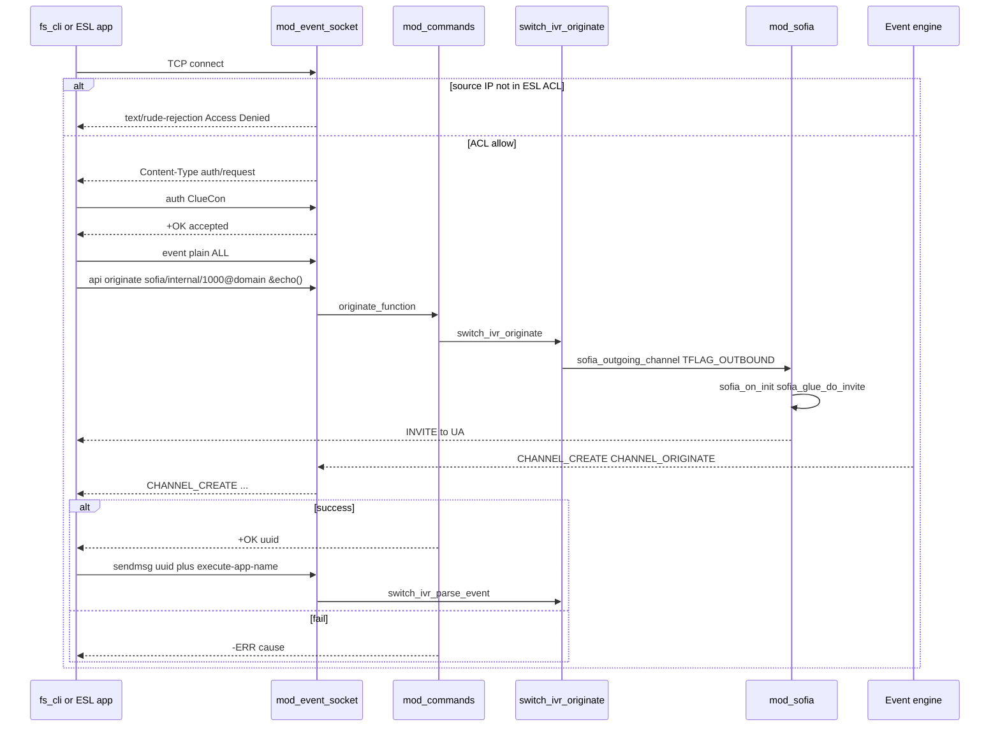

### Key Steps

1. **ACL, then challenge.** If `prefs.acl_count` is set (including the `loopback.auto` default), `switch_check_network_list_ip()` runs on `listener->remote_ip` **before** `auth/request`. A miss sends `Content-Type: text/rude-rejection` / `Access Denied, go away.` and closes the socket — `fs_cli` reports `Error Connecting []`. On allow, the listener sends `Content-Type: auth/request`. Until `LFLAG_AUTHED`, only `auth <password>` (compared to `prefs.password`) or `userauth user@domain:pass` (directory `esl-password` / `esl-allowed-api` / `esl-allowed-events`) are accepted. Wrong password: `-ERR invalid` and the socket is closed.
2. **Parse commands.** `parse_command()` in `mod_event_socket.c`. After auth: `api`, `bgapi` (async + `Job-UUID` + `BACKGROUND_JOB`), `event` / `nixevent` / `noevents` / `myevents`, `sendmsg`, `sendevent`, `getvar`, `log`, `linger`, `exit` (`+OK bye`). Replies are `+OK` or `-ERR`.
3. **`api originate`.** `originate_function` in `mod_commands.c`. Syntax: `<call url> <exten>|&<application_name>(<app_args>) [<dialplan>] [<context>] [<cid_name>] [<cid_num>] [<timeout_sec>]`. Defaults: dialplan `XML`, context `default`, timeout **60s**. Calls `switch_ivr_originate()`. On success the new session is transferred into the extension or `&app(args)` inline extension; on failure `-ERR` plus `switch_channel_cause2str(cause)`.
4. **Outbound SIP leg.** `sofia_outgoing_channel()` sets `TFLAG_OUTBOUND` and `CS_INIT`. `sofia_on_init()` then `sofia_glue_do_invite()` sends the INVITE. Core also fires `SWITCH_EVENT_CHANNEL_ORIGINATE` for outbound legs.
5. **`sendmsg`.** Headers include `call-command`. `switch_ivr_parse_event()` hashes `execute` (needs `execute-app-name` / `execute-app-arg`), `hangup`, `nomedia`, `unicast`, `xferext`. With a UUID, the event is queued on that session (`switch_core_session_queue_private_event`); outbound `socket` sessions may run it inline.
6. **Outbound ESL (`socket` app).** `SWITCH_ADD_APP(..., "socket", ..., socket_function, "<ip>[:<port>]")`. The channel connects out; the controller sends the same `sendmsg` vocabulary. `LFLAG_OUTBOUND` without `LFLAG_FULL` skips inbound-only commands (`api`, `sendevent`, …).
7. **Events to the client.** `mod_event_socket` binds `SWITCH_EVENT_ALL`. Serialize with `switch_event_serialize()` (plain) or JSON. Do not block the event thread (`switch_event.h`).

`bgapi` is the non-blocking form of `api`; `originate` itself can block up to the timeout (the API logs a notice if invoked on an existing session).

### Error and Edge Cases

| Case | Where handled | Expected outcome |
|------|---------------|------------------|
| Source IP not in ESL ACL | `listener_run` ACL loop | `text/rude-rejection` / `Access Denied, go away.`; no `auth/request`. Default list is `loopback.auto` when `apply-inbound-acl` is unset |
| Bad ESL password | `parse_command` auth | `-ERR invalid`; connection dropped |
| Command before auth | `LFLAG_AUTHED` check | Ignored except `auth` / `userauth` |
| `userauth` API not in allow-list | `auth_api_command` | `-ERR permission denied` |
| `originate` argc not 2–7 | `originate_function` | `-USAGE:` plus `ORIGINATE_SYNTAX` |
| Originate timeout / SIP fail | `switch_ivr_originate` | `-ERR` cause string (`NO_ANSWER`, `USER_BUSY`, …) |
| `sendmsg` unknown UUID | `parse_command` | `-ERR invalid session id [… ]` |
| Missing `call-command` | `switch_ivr_parse_event` | Log `"Invalid Command!"`; `SWITCH_STATUS_FALSE` |
| Unload/reload `mod_event_socket` via `api` | cheat rewrite | Forced to `bgapi` so the listener thread is not torn down mid-command |
| Slow ESL consumer | event delivery thread | Core warns; client must queue locally |

### Data and Contracts Involved

- ESL line protocol after `auth` (see [Data and API](04-data-and-api.md) command table).
- Console APIs: `originate`, `uuid_kill`, `uuid_bridge`, `uuid_transfer`, `status`, `show channels` (`mod_commands.c`).
- Events as subscribed; `BACKGROUND_JOB` for `bgapi`.
- Channel UUID returned on successful originate — handle for later `sendmsg` / `uuid_*`.

### Code References

- `src/mod/event_handlers/mod_event_socket/mod_event_socket.c` — `config()` (`loopback.auto` default), ACL `text/rude-rejection`, `parse_command`, `LFLAG_AUTHED`, `socket_function`
- `libs/esl/src/esl.c` — `esl_connect_timeout`, `esl_send_recv`
- `libs/esl/fs_cli.c` — default host/port/password; `-x` one-shot (`fs_cli -x status`)
- `src/mod/applications/mod_commands/mod_commands.c` — `originate_function`, `ORIGINATE_SYNTAX`
- `src/include/switch_ivr.h` / `src/switch_ivr_originate.c` — `switch_ivr_originate`
- `src/switch_ivr.c` — `switch_ivr_parse_event` (`call-command`)
- `src/switch_event.c` — bus, `switch_event_serialize`
- `conf/vanilla/autoload_configs/event_socket.conf.xml`
- `conf/vanilla/autoload_configs/acl.conf.xml`
- `src/switch_core.c` — `loopback.auto` (`127.0.0.0/8`, `::1/128`)

---

## XML Reload

### Trigger and Goal

- **Trigger**: console/ESL `reloadxml` (`reload_xml_function` in `mod_commands.c`), or `reloadacl` / `sofia profile <name> rescan` which also call `switch_xml_reload()`.
- **Goal**: re-parse `conf_dir` + `freeswitch.xml` (vanilla root `conf/vanilla/freeswitch.xml` with preprocessor includes), replace `MAIN_XML_ROOT`, fire `SWITCH_EVENT_RELOADXML` so **new** dialplan hunts and directory locates see the new tree. In-flight sessions keep the extension they already hunted.

### Main Flow

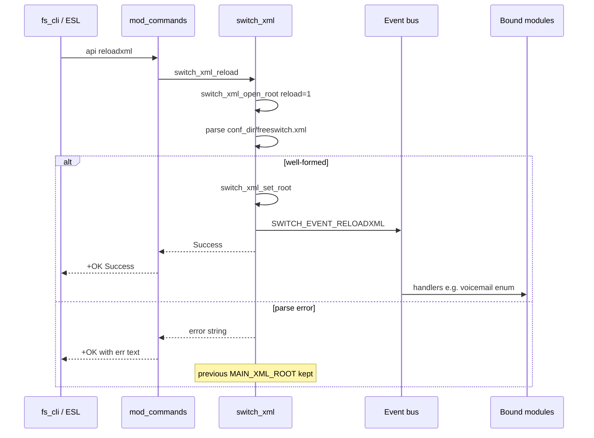

(`reload_xml_function` always prints `+OK [%s]` with the `err` string from `switch_xml_reload` — including failure text. Check the bracketed message, not only `+OK`.)

### Key Steps

1. **Re-open root.** `switch_xml_reload()` → `switch_xml_open_root(1, err)` → `__switch_xml_open_root()`. Path: `SWITCH_GLOBAL_dirs.conf_dir` + `SWITCH_GLOBAL_filenames.conf_name`. Preprocessor expands `X-PRE-PROCESS` / `#include` / `#set`. Flattened copy remains `freeswitch.xml.fsxml` (do not edit while running).
2. **Commit or keep old.** Parse error: `switch_xml_error()` copied to `err`, new tree discarded, previous root stays. Success: `switch_xml_set_root(new_main)`, `err` = `"Success"`.
3. **Notify.** If a root is returned, `SWITCH_EVENT_RELOADXML` is fired (`switch_xml_open_root`). Modules that `switch_event_bind(..., SWITCH_EVENT_RELOADXML, ...)` refresh themselves (examples in-tree: `mod_voicemail` does not bind this id for its main config in the same way; `mod_enum`, `mod_cidlookup`, `mod_loopback`, `mod_avmd`, `mod_tts_commandline` do).
4. **What picks up immediately.** Next `dialplan_hunt()` / `switch_xml_locate_user()` reads the new root. Vanilla file users without `cacheable` are re-read from XML.
5. **What does not auto-apply.** `mod_sofia` does **not** bind `SWITCH_EVENT_RELOADXML`. `sofia profile <name> rescan` reloads supported profile data and reparses gateways, domains, and aliases, but it does not rebind transport sockets. Changes to `sip-ip`, `sip-port`, TLS, `ws-binding`, or `wss-binding` require a profile restart or process restart. ACL lists: `reloadacl` reloads XML **and** `switch_load_network_lists(SWITCH_TRUE)`. Loaded DSOs: adding or removing `<load>` in `modules.conf.xml` is **not** applied by `reloadxml`; use `load` / `unload` / `reload` or restart. See [Runtime load tag](#runtime-load-tag).

`mod_xml_curl` (when enabled) may replace `__switch_xml_open_root` via `switch_xml_set_open_root_function()` — then “reload” is whatever that hook does (HTTP fetch). **[NEEDS INPUT: whether this deploy uses `mod_xml_curl` for live XML]**.

### Error and Edge Cases

| Case | Where handled | Expected outcome |
|------|---------------|------------------|
| Broken include / bad XML | `__switch_xml_open_root` | `err` set (e.g. parser message or `"Cannot Open log directory or XML Root!"`); old root kept |
| Success string vs API prefix | `reload_xml_function` | Stream is always `+OK [%s]\n` — inspect `%s` |
| In-call session | dialplan already hunted | Continues current extension; next transfer/new call uses new XML |
| `cacheable` directory users | `switch_xml_locate_user_merged` | Cache **not** cleared by `switch_xml_set_root`; stale user until TTL or `switch_xml_clear_user_cache` |
| Sofia bind/codec/gateway XML | `mod_sofia` (no RELOADXML bind) | Still running old profile until `sofia profile <name> rescan` / `restart` |
| ACL XML only | `reloadxml` alone | Network lists not rebuilt until `reloadacl` |
| `reloadacl reloadxml` extra arg | `reload_acl_function` | Deprecated notice; ACL path **always** reloads XML now |

### Data and Contracts Involved

- XML sections: `configuration`, `dialplan`, `directory`, `chatplan`, `languages` (`conf/vanilla/freeswitch.xml`).
- Event `SWITCH_EVENT_RELOADXML` (`switch_types.h`).
- Sofia CLI: `sofia profile <name> [start\|stop\|restart\|rescan]` (`mod_sofia.c`).

### Code References

- `src/mod/applications/mod_commands/mod_commands.c` — `reload_xml_function`, `reload_acl_function`
- `src/switch_xml.c` — `switch_xml_reload`, `switch_xml_open_root`, `__switch_xml_open_root`, `switch_xml_set_root`
- `src/mod/endpoints/mod_sofia/mod_sofia.c` — `sofia profile … rescan`
- `conf/vanilla/freeswitch.xml`

---

## Related Documentation

- [Architecture](01-architecture.md) (registry: [Loadable module contract](01-architecture.md#loadable-module-contract))
- [Data and API](04-data-and-api.md)
- [Testing](../4.development/03-testing.md)
- [Runbook](../5.operations/01-runbook.md) (`show channels`: [worked example](05-workflows.md#worked-example-show-channels-during-a-bridge); follow a call: [channel UUID](../5.operations/01-runbook.md#follow-one-call-by-channel-uuid); REGISTER Digest: [401 example](05-workflows.md#worked-example-register-digest-after-401))
- [Users Manual Ch 1](https://developer.signalwire.com/freeswitch/foundations/introduction), [Ch 5 modules](https://developer.signalwire.com/freeswitch/configuration/module-loading/), [Ch 7 SIP profiles](https://developer.signalwire.com/freeswitch/users-and-endpoints/sip-profiles), [Ch 12 Dialplan](https://developer.signalwire.com/freeswitch/dialplan/xml)

---
<!-- PKB-metadata
last_updated: 2026-09-17
commit: 2db0ee9a64
updated_by: human+ai
review_status: pending
review_score: 0
reviewed_by:
confidentiality: L1
-->
