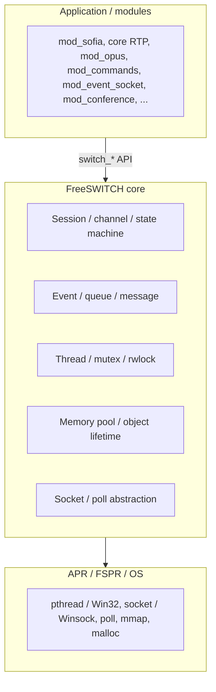
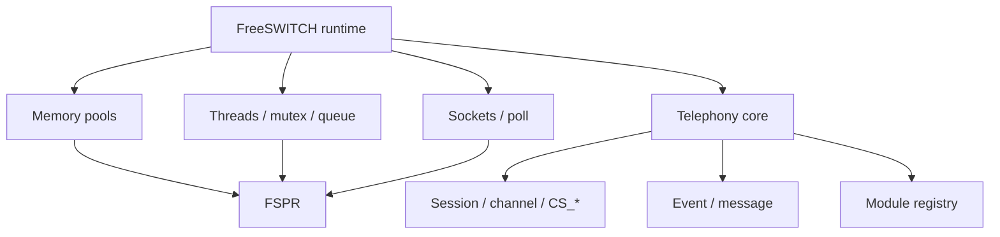
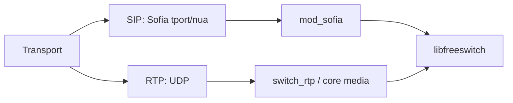

# 13. C Runtime Framework

<!-- maintained-by: human+ai -->

FreeSWITCH is a **C realtime communications switch that ships its own runtime**, not a typical “sockets plus `malloc`” C program. The `switch_*` APIs, memory pools, sessions, channels, modules, events, queues, and threads are that runtime. APR (forked here as **FSPR**) is only the portable OS layer underneath it.

This page is a reading model for the C core. C4 containers and the session state machine stay on [Architecture](01-architecture.md). Operator terms stay in the [Users Manual Chapter 1](https://developer.signalwire.com/freeswitch/foundations/introduction). Directory ownership stays on [Repository Map](03-repo-map.md).

```{admonition} Two layers
:class: tip

**APR/FSPR** answers “how do I mutex, socket, and allocate portably on Linux, macOS, and Windows?”
**FreeSWITCH core** answers “how do I represent a call, a codec, a module, and a media frame?”

`FreeSWITCH = C + APR` understates the project. Treat core as a telephony-oriented runtime on top of FSPR.
```

## Layering



Public umbrella header: `src/include/switch.h`. Portability wrappers: `src/include/switch_apr.h` implemented in `src/switch_apr.c` (calls `fspr_*`, not raw `pthread_*` / BSD sockets). Telephony objects: `src/include/switch_core.h`, `switch_channel.h`, `switch_event.h`, `switch_frame.h`, `switch_rtp.h`, `switch_loadable_module.h`.

There is **no** `switch_thread.h` / `switch_mutex.h` / `switch_queue.h` / `switch_socket.h`. Those types live in `switch_apr.h`.

## 1. Traditional C vs FreeSWITCH C

Typical C:

```c
void *worker(void *arg)
{
    struct connection *conn = malloc(sizeof(*conn));
    pthread_mutex_lock(&mutex);
    /* ... */
    pthread_mutex_unlock(&mutex);
    free(conn);
    return NULL;
}
```

FreeSWITCH style:

```c
switch_memory_pool_t *pool;
switch_core_new_memory_pool(&pool);

foo_t *foo = switch_core_alloc(pool, sizeof(*foo));
switch_mutex_init(&foo->mutex, SWITCH_MUTEX_NESTED, pool);
/* switch_thread_create(..., pool); */
switch_core_destroy_memory_pool(&pool);
```

The design goal is: **modules and objects should not each invent their own resource lifetime.** Pools, mutexes, sockets, and threads are tied to a pool. Destroying the pool releases the allocations created from it.

| Area | Traditional C | FreeSWITCH |
|------|---------------|------------|
| Memory | `malloc` / `free` | `switch_core_alloc`, `switch_core_session_alloc` (`src/include/switch_core.h`) |
| Threads | `pthread_create` | `switch_thread_create` (`switch_apr.h`) |
| Mutex | `pthread_mutex_*` | `switch_mutex_*` |
| RWLock | pthread rwlock | `switch_thread_rwlock_*` |
| Queue | ad hoc | `switch_queue_*` |
| Socket | BSD / Winsock | `switch_socket_*` / `switch_sockaddr_t` |
| Plugin | `dlopen` by hand | `SWITCH_MODULE_DEFINITION` + interface hashes ([Architecture](01-architecture.md#loadable-module-contract)) |
| Call | a struct you own | `switch_core_session_t` + `switch_channel_t` |
| Media | a buffer | `switch_frame_t` |
| Logging | `printf` | `switch_log_printf` |
| Config | custom parser | XML + preprocessor ([Architecture](01-architecture.md)) |

`switch_core_alloc` is zeroed (`switch_core.h` remark: memory is `memset` to zero). Macros pass `__FILE__` / `__LINE__` into `switch_core_perform_*` for leak tracking.

## 2. What APR/FSPR is for

Apache Portable Runtime (vendored as `libs/apr`, types prefixed `fspr_`) abstracts OS primitives. FreeSWITCH does **not** treat Linux syscalls as the programming model.

```text
module / application
        ↓
   switch_* API
        ↓
   core types (session, event, module)
        ↓
   FSPR (libs/apr)
        ↓
   OS (pthread / Win32, socket / Winsock, malloc)
```

Sockets are a typical stack. `switch_socket_accept` in `src/switch_apr.c` returns `fspr_socket_accept(...)`, which eventually calls the OS `accept()`. `mod_event_socket` creates TCP sockets with `switch_socket_create` (`src/mod/event_handlers/mod_event_socket/mod_event_socket.c`). Version pin: [Tech Stack](02-tech-stack.md) (`fspr_version.h`).

## 3. Core is more than APR



FSPR does not know what a SIP INVITE or an Opus frame is. That is core + modules.

## 4. Memory pools

Implementation: `src/switch_core_memory.c`. Create/destroy macros: `switch_core_new_memory_pool` / `switch_core_destroy_memory_pool`.

Pattern used in modules (example: profile structs allocated from a module-owned pool):

```c
switch_memory_pool_t *pool;
switch_core_new_memory_pool(&pool);
profile = switch_core_alloc(pool, sizeof(*profile));
/* ... */
switch_core_destroy_memory_pool(&pool);
```

Destroying the pool frees every allocation from that pool. That matches a **call/session lifetime boundary** better than pairing every `malloc` with a `free`.

A SIP call creates a session, channel, RTP, codecs, variables, and events. On hangup the session pool goes away instead of walking a free-list of dozens of objects. Leaks, double-frees, and use-after-free still happen if you stash a pointer after the pool is gone, or allocate from the wrong pool.

## 5. Session is the main lifetime

Private layout (`src/include/private/switch_core_pvt.h` — not installed; do not include it from modules):

- `pool` — session memory
- `thread` / `thread_id`
- `endpoint_interface`
- `channel`
- read/write codecs and `switch_frame_t` scratch buffers
- mutexes, rwlocks, cond
- `event_queue`, `message_queue`, `signal_data_queue`
- `media_handle`, UUID

`switch_core_session_alloc(session, size)` is “memory that dies with this session.” Codecs often bind context to `codec->memory_pool`. Example: `mod_opus` (`src/mod/codecs/mod_opus/mod_opus.c`) does `switch_core_alloc(codec->memory_pool, sizeof(*context))`.

```c
context = switch_core_session_alloc(session, sizeof(*context));
```

State machine and `CS_*`: [Architecture](01-architecture.md). Packet path into `signal_data_queue`: [Workflows](05-workflows.md).

## 6. Lifetime-centric, not allocation-centric

Traditional C: whoever `malloc`s must `free`.

FreeSWITCH: **which lifetime does this object belong to?** Session pool, channel (via session), module/profile pool, listener pool, core permanent pool (`switch_core_permanent_alloc`). When that lifetime ends, destroy the pool.

## 7. Concurrency is not one-connection-one-thread

A call mixes SIP signaling, channel state, RTP, codecs, applications, events, and timers. Core uses threads, mutexes, rwlocks, condvars, queues, and the event bus — not a single `pthread_create` per TCP connection.

Session launch (`src/switch_core_session.c` `switch_core_session_thread_launch`): if `SCF_SESSION_THREAD_POOL` is set, it uses `switch_core_session_thread_pool_launch`; otherwise it `switch_thread_create`s a detached thread on the session pool.

`SCF_SESSION_THREAD_POOL` is **set by default** in `switch_core_init` (`src/switch_core.c`). XML `switch.conf` param `session-thread-pool` can set or clear the flag. Vanilla `conf/vanilla/autoload_configs/switch.conf.xml` does **not** currently list that param; the default core flag still applies.

Event fan-out uses dispatch threads in `src/switch_event.c` (`switch_event_dispatch_thread`, `EVENT_DISPATCH_QUEUE_THREADS`).

## 8. Mutex, rwlock, queue

Shared tables typically use `switch_thread_rwlock_rdlock` / `wrlock` / `unlock`. Example: `mod_prefix` protects prefix trees with `switch_thread_rwlock_t` (`src/mod/applications/mod_prefix/mod_prefix.c`).

`switch_queue_t` (APR queue wrapper in `switch_apr.h`) decouples a realtime producer from a slower consumer:

```text
SIP / RTP / session thread  --do not block-->  switch_queue  -->  worker
                                                              (DB, ESL, log, app)
```

Session-private queues (`event_queue`, `signal_data_queue`) are the same idea inside one leg.

## 9. Events as decoupling

Core does not require `mod_sofia` to call every CDR/logger/ESL consumer. It fires events (`switch_event_fire` → `switch_event_fire_detailed` in `src/include/switch_event.h`). Names include `CHANNEL_CREATE`, `CHANNEL_ANSWER`, `CHANNEL_BRIDGE`, `CHANNEL_HANGUP`, `CUSTOM`, `HEARTBEAT` (enum comments in `src/include/switch_types.h`). Subscribers: loggers, CDR, `mod_event_socket`, scripts. ESL vs in-process bus: [Data and API](04-data-and-api.md).

## 10. Network vs SIP vs RTP

`switch_socket_*` is the portable TCP/UDP helper (ESL listen/accept, some module TCP). It is **not** the SIP stack and **not** the media engine.



- SIP: UDP/TCP/TLS/WebSocket → Sofia-SIP → `mod_sofia` ([Tech Stack](02-tech-stack.md#sofia-sip-library)).
- RTP: UDP → `src/switch_rtp.c` / `src/switch_core_media.c` → codec → `switch_frame_t`.

Do not mix those layers when reading code.

(11-frames)=
## 11. Frames

`switch_frame_t` (`src/include/switch_frame.h`, typedef in `switch_types.h`) is the media-processing unit. Codecs encode/decode frames; they do not own SIP or the UDP fd.

```text
RTP packet → RTP → decode → switch_frame_t → app / bridge / conference
          → switch_frame_t → encode → RTP packet
```

## 12. Modules

Not a single C binary of all features. Categories under `src/mod/<category>/mod_<name>/` register through `SWITCH_MODULE_DEFINITION` (`src/include/switch_types.h`) and then `SWITCH_ADD_*` into core hashes: endpoint, application, API, codec, dialplan, event, file, say, … Example codec: `mod_opus`. Contract: [Architecture](01-architecture.md#loadable-module-contract). Naming: [Conventions](../4.development/01-conventions.md).

## 13. Where to start reading

Do **not** start in `mod_sofia.c`. Suggested order:

1. `src/include/switch.h` (includes only — see the real headers it pulls)
2. `src/include/switch_types.h`
3. Memory: `src/switch_core_memory.c`, `switch_core.h` pool macros
4. Threads / mutex / queue: `src/include/switch_apr.h`, `src/switch_apr.c`
5. Events: `src/switch_event.c`, `src/include/switch_event.h`
6. Session / channel: `src/switch_core_session.c`, `src/switch_channel.c`, `src/switch_core_state_machine.c`
7. Sockets: `switch_socket_*` in `switch_apr.c` (then ESL, not Sofia)
8. RTP / frame / codec: `src/switch_rtp.c`, `switch_frame.h`, a small codec (`mod_opus`)
9. Module loader: `src/switch_loadable_module.c`
10. Then `src/mod/endpoints/mod_sofia/`

Mental spine: **pool → session → channel → thread → event → queue → socket → RTP → SIP**.

## 14. Go-shaped analogies (optional)

If you think in Go, map loosely:

| C API | Rough Go picture |
|-------|------------------|
| `switch_core_session_t` | `Session` with pool, channel, media |
| `switch_core_session_alloc` | object allocated on the session’s arena |
| `switch_mutex_lock` | `mutex.Lock()` |
| `switch_queue_push` | send on a bounded channel |
| `switch_event_fire` | publish on an event bus |
| `SWITCH_MODULE_DEFINITION` | plugin `init()` registering interfaces |

These are analogies, not bindings. There is no Go runtime in core.

## 15. One-line summary

**The design center is not “how to malloc in C.” It is “how a call’s many objects share a clear lifetime.”** Hangup destroys the session pool; the attached channel, codec contexts, queues, and frames go with it. APR/FSPR is POSIX-like portability. Core is the realtime-communications OS on top.

## Related Documentation

- [Architecture](01-architecture.md) — C4, `CS_*`, module contract
- [Tech Stack](02-tech-stack.md) — FSPR version, Sofia-SIP
- [Workflows](05-workflows.md) — INVITE path, registry lookup
- [Conventions](../4.development/01-conventions.md) — `SWITCH_MODULE_*`, `switch.h`
- [Data and API](04-data-and-api.md) — events, ESL
- [Users Manual Ch 1](https://developer.signalwire.com/freeswitch/foundations/introduction)

---
<!-- PKB-metadata
last_updated: 2026-09-15
commit: e6d261c069
updated_by: human+ai
review_status: pending
review_score: 0
reviewed_by:
confidentiality: L1
-->
