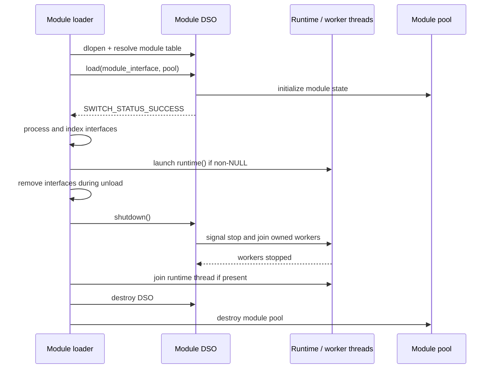
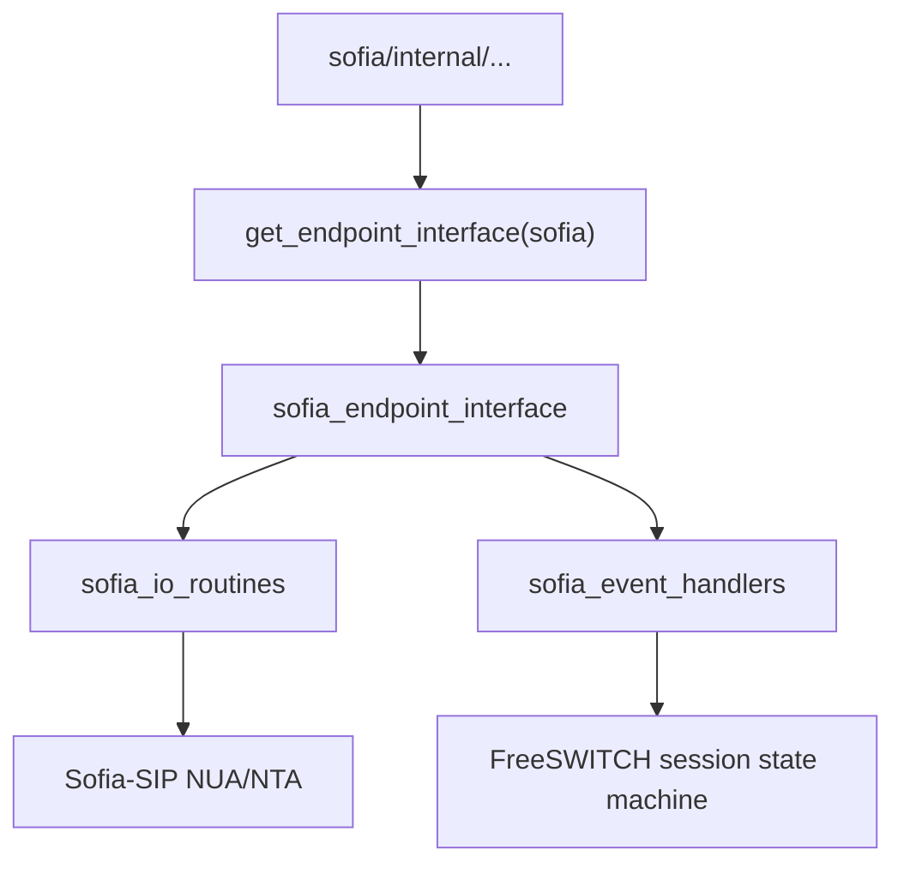
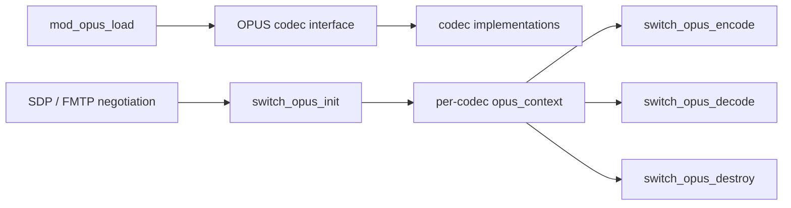

# 15. FreeSWITCH Modules

<!-- maintained-by: human+ai -->

This chapter explains how to build, load, initialize, run, and unload an
in-process FreeSWITCH module. It uses three modules as contrasting examples:

| Module | Category | Main extension point | Lifecycle shape |
|---|---|---|---|
| `mod_sofia` | `src/mod/endpoints/` | SIP endpoint, I/O routines, state handlers, APIs, applications | No core `runtime()` callback; starts and joins its own worker threads |
| `mod_xml_rpc` | `src/mod/xml_int/` | Embedded HTTP/XML-RPC service | Uses `runtime()` for the blocking Abyss server loop |
| `mod_opus` | `src/mod/codecs/` | Audio codec implementations | `load()` only; per-codec cleanup happens in codec callbacks |

The module contract is defined by `SWITCH_MODULE_DEFINITION` and the function
types in `src/include/switch_types.h`. The loader implementation is in
`src/switch_loadable_module.c`.

## 1. What a FreeSWITCH module is

A module is a shared library loaded into the `freeswitch` process. It compiles
against `src/include/switch.h`, shares the core address space, and extends one
or more registries owned by the module loader. It is not a separate process and
does not communicate with the core through RPC.

The module exports a function table whose symbol name is derived from the
module name:

```c
SWITCH_MODULE_LOAD_FUNCTION(mod_example_load);
SWITCH_MODULE_SHUTDOWN_FUNCTION(mod_example_shutdown);
SWITCH_MODULE_RUNTIME_FUNCTION(mod_example_runtime);

SWITCH_MODULE_DEFINITION(
    mod_example,
    mod_example_load,
    mod_example_shutdown,
    mod_example_runtime
);
```

This creates `mod_example_module_interface`, containing the API version and
the three function pointers. The loader uses `dlopen`/`LoadLibraryEx`, resolves
that symbol, checks `SWITCH_API_VERSION`, and calls the load function.

The module interface created by `switch_loadable_module_create_module_interface`
is the module's capability bag. Registration macros such as `SWITCH_ADD_API`,
`SWITCH_ADD_APP`, `SWITCH_ADD_CHAT`, and `SWITCH_ADD_CODEC` append entries to
that bag. After `load()` returns successfully, the core indexes those entries
in global hashes for runtime lookup.


## 2. Build and configuration model

### 2.1 Module directory

An in-tree module normally lives at:

```text
src/mod/<category>/mod_<name>/
├── Makefile.am
├── mod_<name>.c
└── conf/                         # optional sample configuration
    └── autoload_configs/
```

The category describes the primary capability: `endpoints`, `codecs`,
`applications`, `event_handlers`, `xml_int`, and so on. A module may register
additional interfaces, but its directory should still reflect its primary
role.

### 2.2 Autotools build files

`Makefile.am` declares sources, include flags, libraries, and the shared-module
link flags. For example, `mod_opus` has:

```make
MODNAME=mod_opus

if HAVE_OPUS

mod_LTLIBRARIES = mod_opus.la
mod_opus_la_SOURCES  = mod_opus.c opus_parse.c
mod_opus_la_CFLAGS   = $(AM_CFLAGS) $(OPUS_CFLAGS)
mod_opus_la_LIBADD   = $(switch_builddir)/libfreeswitch.la $(OPUS_LIBS)
mod_opus_la_LDFLAGS  = -avoid-version -module -no-undefined -shared -lm -lz

endif
```

The build list is controlled by `build/modules.conf.in`, copied to the
working-tree `modules.conf` by `bootstrap.sh` when needed:

```text
codecs/mod_opus
endpoints/mod_sofia
xml_int/mod_xml_rpc
```

This only determines whether a DSO is compiled. It does not load the DSO at
runtime.

### 2.3 Runtime configuration

The runtime load list is a different file:

```xml
<configuration name="modules.conf" description="Modules">
  <modules>
    <load module="mod_sofia"/>
    <load module="mod_opus"/>
    <load module="mod_xml_rpc"/>
  </modules>
</configuration>
```

The XML is normally under
`conf/<profile>/autoload_configs/modules.conf.xml`. A module must satisfy both
conditions:

```text
build/modules.conf.in                         -> compiled into mod/*.so
conf/<profile>/autoload_configs/modules.conf.xml -> loaded by freeswitch
```

`reloadxml` reparses XML but does not rebuild a module or automatically
re-walk the module load list. Use the module `load`, `unload`, or `reload`
commands for runtime module operations.

### 2.4 Build steps

For a new or newly enabled module:

```bash
./bootstrap.sh -j
# enable src/mod/<category>/mod_<name> in modules.conf
./configure --prefix="$HOME/fs" --disable-fhs
make mod_<name>
make mod_<name>-install
```

For example:

```bash
make mod_opus
make mod_opus-install
```

`mod_opus` additionally requires the external Opus development library. Its
`Makefile.am` deliberately fails with `You must install libopus-dev` when
`HAVE_OPUS` is not available. `mod_sofia` similarly depends on the out-of-tree
Sofia-SIP library; see [Tech Stack](02-tech-stack.md).

## 3. Module lifecycle

The lifecycle has three module callbacks, plus loader-owned registration and
DSO cleanup:



### 3.1 Load: initialization and registration

`load()` receives the module interface pointer and a module memory pool. The
usual order is:

1. Initialize module globals, mutexes, queues, hashes, and external library
   state.
2. Reserve event subclasses or bind event callbacks when needed.
3. Read module configuration.
4. Create the module interface with
   `switch_loadable_module_create_module_interface(pool, modname)`.
5. Register APIs, applications, endpoints, codecs, or other capabilities.
6. Return a failure status if a required initialization step failed.

The interface must be created before registration. Registered interfaces are
allocated from the module pool and are owned by the module loader.

### 3.2 Runtime: optional long-running work

`runtime()` is optional. When it is non-`NULL`, the loader starts a core thread
that calls it. A module runtime function normally blocks in a server loop or
waits for work and returns `SWITCH_STATUS_TERM` when the loop has ended.

This callback is different from module-owned worker threads. `mod_sofia` has no
core runtime callback but starts its own message and presence threads from
`mod_sofia_load`; therefore its shutdown function must stop and join those
threads itself.

### 3.3 Shutdown: stop before free

During unload, the loader:

1. Removes the module's interfaces from the global hashes.
2. Marks the module as shutting down.
3. Calls the module's `shutdown()` callback.
4. Joins the module runtime thread, if any.
5. Destroys the DSO and module memory pool.

The shutdown callback must signal all module-owned threads and wait for any
resources they use before freeing those resources. A module that is busy or
protected by `switch_loadable_module_protect()` may reject unloading. The
loader uses the module interface read/write lock to detect active users.

The callback order matters for `mod_xml_rpc`: its `shutdown()` calls
`ServerTerminate()` and waits for `ServerRun()` to finish before
`ServerFree()` releases the server state.

## 4. Example: `mod_sofia`

Source: `src/mod/endpoints/mod_sofia/mod_sofia.c`.

`mod_sofia` is the representative endpoint module. Its module table is:

```c
SWITCH_MODULE_LOAD_FUNCTION(mod_sofia_load);
SWITCH_MODULE_SHUTDOWN_FUNCTION(mod_sofia_shutdown);
SWITCH_MODULE_DEFINITION(mod_sofia, mod_sofia_load, mod_sofia_shutdown, NULL);
```

It has no module-level `runtime()` callback. That does not mean it is
single-threaded: `mod_sofia_load()` starts Sofia and its own message/presence
worker threads.

### Initialization

`mod_sofia_load()` performs substantially more initialization than a simple API
module:

- Clears and initializes `mod_sofia_globals`.
- Creates the module mutexes, profile hash, gateway hash, and queues.
- Reserves many custom event subclasses.
- Detects the local address and switch hostname.
- Calls `sofia_init()`.
- Reads SIP profile configuration with `config_sofia(SOFIA_CONFIG_LOAD, NULL)`.
- Starts the Sofia message thread.
- Binds event callbacks for presence, multicast, notifications, and related
  events.

It then creates and fills several FreeSWITCH interfaces:

```c
sofia_endpoint_interface =
    switch_loadable_module_create_interface(
        *module_interface, SWITCH_ENDPOINT_INTERFACE);

sofia_endpoint_interface->interface_name = "sofia";
sofia_endpoint_interface->io_routines = &sofia_io_routines;
sofia_endpoint_interface->state_handler = &sofia_event_handlers;
```

It also registers management, JSON APIs, applications such as `sofia_sla`,
APIs such as `sofia` and `sofia_contact`, and the Sofia chat protocol.

At runtime, a channel URL such as `sofia/internal/1000@example.com` is resolved
through the endpoint hash to the `sofia` interface. The core then calls the
endpoint's I/O routines and state handlers.



### Shutdown

`mod_sofia_shutdown()` delegates to `mod_sofia_shutdown_cleanup()`, which:

- Frees the custom event subclasses.
- Removes console completion callbacks.
- Unbinds event callbacks.
- Sets the running flag to false.
- Interrupts the presence and message queues.
- Joins message and presence threads.
- Deinitializes the Sofia parser/runtime.
- Destroys profile and gateway hashes.
- Destroys STIR/SHAKEN services when enabled.

The key lesson is that the endpoint has no core `runtime()` callback, but its
own threads still form part of the module lifecycle and must be stopped before
unload.

## 5. Example: `mod_xml_rpc`

Source: `src/mod/xml_int/mod_xml_rpc/mod_xml_rpc.c`.

`mod_xml_rpc` demonstrates a module that hosts a long-lived external service:

```c
SWITCH_MODULE_LOAD_FUNCTION(mod_xml_rpc_load);
SWITCH_MODULE_SHUTDOWN_FUNCTION(mod_xml_rpc_shutdown);
SWITCH_MODULE_RUNTIME_FUNCTION(mod_xml_rpc_runtime);
SWITCH_MODULE_DEFINITION(
    mod_xml_rpc,
    mod_xml_rpc_load,
    mod_xml_rpc_shutdown,
    mod_xml_rpc_runtime
);
```

### Load and configuration

`mod_xml_rpc_load()`:

- Reserves the `websocket::stophook` event subclass.
- Creates the FreeSWITCH module interface.
- Clears the module global state.
- Reads `xml_rpc.conf` using `switch_xml_open_cfg()`.
- Stores the HTTP port, authentication, virtual-host, WebSocket, and logging
  settings in `globals`.

It does not start the HTTP server. Delaying `ServerRun()` to `runtime()` keeps
the loader thread from being blocked during module initialization.

### Runtime server

`mod_xml_rpc_runtime()`:

1. Creates an XML-RPC registry.
2. Registers `freeswitch.api` and `freeswitch.management` methods.
3. Initializes MIME types.
4. Creates the Abyss HTTP server rooted at the configured `htdocs` directory.
5. Maps `/RPC2` to the XML-RPC registry.
6. Adds HTTP and authentication hooks.
7. Blocks in `ServerRun()`.

The HTTP and XML-RPC callbacks eventually call the existing core APIs rather
than reimplementing command execution:

```text
HTTP request -> handler_hook -> switch_api_execute()
XML-RPC call -> freeswitch_api() -> switch_api_execute()
```

`freeswitch_api()` also checks `is_authorized()` before executing a command.
Its output is converted into an XML-RPC string. HTTP API output uses a
`switch_stream_handle_t` whose write functions call `HTTPWrite()`.

### Shutdown

`mod_xml_rpc_shutdown()`:

- Frees the WebSocket stop-hook subclass.
- Fires the stop event for active WebSockets.
- Calls `ServerTerminate()` to make `ServerRun()` return.
- Waits for `globals.running` to become false.
- Calls `ServerFree()`.
- Frees the XML-RPC registry and MIME table.
- Frees authentication and domain strings.

This is the canonical pattern for a module whose runtime callback blocks in a
server loop: signal termination first, wait for the loop to leave, then free
the server object.

## 6. Example: `mod_opus`

Source: `src/mod/codecs/mod_opus/mod_opus.c`.

`mod_opus` is the smallest lifecycle shape of the three:

```c
SWITCH_MODULE_LOAD_FUNCTION(mod_opus_load);
SWITCH_MODULE_DEFINITION(mod_opus, mod_opus_load, NULL, NULL);
```

It has no module shutdown callback and no module runtime thread. Its external
dependency is libopus, and its build is conditional on `HAVE_OPUS`.

### Load and codec registration

`mod_opus_load()` first reads `opus.conf` through `opus_load_config()`. It then:

1. Creates the module interface.
2. Registers the codec named `OPUS (STANDARD)` with `SWITCH_ADD_CODEC`.
3. Registers the `opus_debug` API.
4. Installs `switch_opus_fmtp_parse` for SDP `fmtp` processing.
5. Adds multiple codec implementations for 48 kHz, 16 kHz, 8 kHz, mono,
   stereo, and supported packetization intervals.

Each implementation supplies the codec vtable:

```c
switch_opus_init,
switch_opus_encode,
switch_opus_decode,
switch_opus_destroy
```

The module registers codec metadata in the core, but encoder and decoder
objects are created per active codec instance. `switch_opus_init()` allocates
an `opus_context`, creates the libopus encoder/decoder, and applies negotiated
FMTP settings. `switch_opus_destroy()` destroys those per-call libopus objects.



There is no module-level cleanup because the module does not create a
long-lived worker or library-wide object that needs an explicit stop sequence.
The module pool owns the registered interface metadata; each codec instance
owns and destroys its own encoder and decoder.

## 7. Practical checklist

Before adding a module, answer these questions:

- What interface does it provide: API, application, endpoint, codec, dialplan,
  file, or another existing type?
- Does it need a core `runtime()` callback, or can synchronous callbacks handle
  all work?
- Does it create its own threads, queues, sockets, event bindings, or external
  library state?
- Which configuration file does it read, and what happens when that file is
  missing or invalid?
- Can it be unloaded while an interface callback is active?
- What exact operation signals each worker to stop, and where is each worker
  joined?
- Does `Makefile.am` fail clearly when an external dependency is absent?
- Are both the build list and runtime `<load>` entry present?

The shortest safe implementation is usually:

```text
load()     -> create module interface, initialize state, register capability
runtime()  -> only if a long-lived loop is required
shutdown() -> stop callbacks/workers, join workers, release external state
```

Do not add a runtime thread, reload framework, or custom registry unless the
module's actual resource model requires it.

## Related source and documentation

- [Architecture](01-architecture.md)
- [Build, Release, and Publish](../4.development/02-build.md)
- [C Runtime Framework](06-c-runtime.md)
- `src/include/switch_types.h`
- `src/switch_loadable_module.c`
- `src/mod/applications/mod_skel/mod_skel.c`
- `src/mod/endpoints/mod_sofia/mod_sofia.c`
- `src/mod/xml_int/mod_xml_rpc/mod_xml_rpc.c`
- `src/mod/codecs/mod_opus/mod_opus.c`

---
<!-- PKB-metadata
last_updated: 2026-09-17
commit: 2db0ee9a64
updated_by: human+ai
review_status: pending
review_score: 0
reviewed_by:
confidentiality: L1
-->
